# TallyG Tax Portal — Architecture & Product Blueprint

> **Working title:** TallyG Tax Portal (a.k.a. *Circulate Tax Filing Platform*)
> **What this is:** a complete, production-grade architecture, data, API, AI, security, product, and UX blueprint for an online Income Tax Return (ITR) filing SaaS for India — built for individuals, salaried, freelancers, professionals, traders, pensioners, and MSMEs. Comparable in workflow quality to ClearTax / TaxBuddy / Tax2Win, optimised for MSMEs and future Tally/TallyG ERP integration.
> **Status:** Design blueprint (no application code yet). This document set is the artifact you lock *before* writing code.

---

## 0. How to read this document set

This overview is the **map and the source of truth**. The detailed chapters are below it. Each chapter is deliberately deep and self-contained, and they cross-reference each other rather than repeating content.

| # | Chapter | What it answers |
|---|---------|-----------------|
| **00** | **Overview & Decision Log** (this file) | The canonical decisions, MVP scope, how the pieces fit, and the reconciliation of every cross-chapter conflict. |
| 01 | [System Architecture & Tech Stack](01-system-architecture.md) | Backend platform (.NET vs Node), modular-monolith → microservices, multi-tenancy, integration ACL, versioning, naming/coding standards, solution layout. |
| 02 | [Database Schema & ERD](02-database-schema.md) | ~45-table PostgreSQL schema, DDL for the hot tables, ERD, indexing, partitioning, JSONB, per-AY reproducibility, retention. |
| 03 | [Tax Domain & Computation Engine](03-tax-engine.md) | ITR-1/2/3/4 auto-selector, questionnaire DAG, AY-versioned data-driven tax engine, regime comparison, capital gains, HRA, 80C/80D recommender, AIS/TIS reconciliation, presumptive 44AD/ADA. |
| 04 | [API Design, Auth & RBAC](04-api-and-auth.md) | Full REST catalog (13 modules, `/api/v1`), OTP + JWT (rotating refresh), 8-role RBAC matrix, idempotency, RFC 7807 errors, session/device management. |
| 05 | [AI, OCR & Document Processing](05-ai-and-documents.md) | Secure vault, async OCR pipeline (Textract/Azure DI + Claude extraction), HITL review, RAG chatbot, AI pre-filing validation, fraud/risk scoring, recommendations. |
| 06 | [Security, Compliance, DevOps & Scalability](06-security-devops-scale.md) | KMS envelope encryption, DPDP Act 2023 consent/DSAR model, audit trails, OWASP ASVS L2, AWS ap-south-1 deployment, CI/CD, observability, 1-lakh-user capacity plan, cost optimisation. |
| 07 | [Product Strategy, Roadmap & Business Model](07-product-roadmap-business.md) | MVP vs enterprise split, Phase 0→V2 roadmap, Sprint 0–12 plan, team/effort, admin/CRM/lead-mgmt, pay-per-return + marketplace + franchise + white-label + wallet monetisation, KPIs. |
| 08 | [Frontend, UX & Folder Structure](08-frontend-ux.md) | Next.js App Router, mobile-first guided wizard, screen inventory, wireframes, design-system components, i18n (EN/HI), accessibility, feature-first folder structure. |
| 09 | [Document & Report Generation](09-document-generation.md) | *(Addendum)* Server-side PDF generation for the ITR-V acknowledgment, computation worksheet, and tax invoice; signed-URL downloads; tamper-evident hashing. |
| 10 | [AI/OCR Persistence Layer](10-ai-ocr-persistence.md) | *(Addendum)* The 16 tables that persist Chapter 5 (OCR jobs, extractions, RAG/pgvector, risk, recommendations, chat), reconciled into the Chapter 2 schema. |

**Precedence rule:** where this overview and a chapter disagree, **this overview wins** — it post-dates and reconciles the chapters (see §6, the Decision Log). The chapters remain the detailed rationale; the calls in §6 are binding.

---

## 1. Executive summary — the ten decisions that define the system

1. **Backend = ASP.NET Core 8 (C#), primary.** The OCR/AI inference runs in a Python/Node *sidecar worker* behind a clean interface. **Why:** tax math demands C#'s native base-10 `decimal` (no float rounding bugs in statutory calculations), India has the deepest .NET hiring pool, and the background-job ecosystem suits long-running OCR. The frontend keeps end-to-end type safety via a generated TypeScript client from the OpenAPI contract. *(Ch 1)*
2. **Frontend = Next.js (App Router), mobile-first**, served through a Next.js BFF that owns auth cookies. **Why:** SSR for trust/SEO landing pages + an app shell for the guided wizard; BFF keeps tokens out of JS. *(Ch 8)*
3. **One modular monolith now, microservices-ready.** Nine modules with clean seams (Auth, Filing, TaxEngine, Documents, Payments, Notifications, CA-Workflow, Admin/CRM, Integration) that map 1:1 to future services over a message bus with Outbox/Inbox/Idempotency and a `pay → file` saga. **Why:** ship the MVP without distributed-systems tax; split only the parts that need independent scaling at season peak. *(Ch 1)*
4. **PostgreSQL, multi-tenant by pooled Row-Level Security** (`tenant_id` on every row) for MVP; schema-per-tenant reserved for white-label/franchise. **Why:** one cheap, isolated database for B2C scale; physical isolation only where a partner contractually needs it. *(Ch 1, 2, 6)*
5. **The tax engine is pure, side-effect-free, and assessment-year-versioned, with all slabs/limits/rules stored as DATA** (`TaxRuleSet`), never hardcoded — every computation emits a line-by-line `trace` for explainability and reproducibility of past years. **Why:** Budget changes rates yearly; old AYs must stay reproducible for revisions and notices; correctness is auditable. *(Ch 3)*
6. **Auth = OTP (mobile/email) + RS256 JWT access (15 min) + rotating refresh** with reuse detection; **8-role RBAC** combining tenant scope (RLS) + role/permission policy + resource-ownership checks. *(Ch 4)*
7. **Documents go direct-to-S3 via pre-signed URLs, encrypted per-document (KMS envelope), virus-scanned, then OCR'd asynchronously**; low-confidence fields route to a human-in-the-loop review queue before they touch the return. **Why:** never proxy large encrypted files through the API; never let unverified OCR silently drive a tax filing. *(Ch 5, 10)*
8. **Cloud = AWS Mumbai (ap-south-1)** — Multi-AZ RDS PostgreSQL + Aurora read replicas, S3, ElastiCache (Redis), SQS, CloudFront/WAF, KMS, Secrets Manager — provisioned by Terraform, shipped by GitHub Actions with SAST/DAST/IaC scanning. **Why:** DPDP-aligned India data residency, managed HA, and a clear filing-season autoscaling story. *(Ch 6)*
9. **Compliance is designed in, not bolted on:** DPDP Act 2023 consent receipts + DSAR/erasure endpoints, tamper-evident audit + PII-access logs, PAN/Aadhaar encryption + masking, OWASP ASVS L2. *(Ch 6, 2, 4)*
10. **Business model is layered onto one filing engine:** pay-per-return tiers (MVP) → CA marketplace + assisted filing (V1) → franchise / white-label / tax-pro subscriptions / wallet & affiliates (V2). **Why:** prove the core filing funnel first; switch on each revenue stream as supply and trust mature. *(Ch 7)*

---

## 2. The MVP, in one screen

The single most important scope decision: **MVP files a real ITR-1 / ITR-4 return, end to end, for money.** Everything else waits.

| Capability | MVP | V1 | V2 / Enterprise |
|---|:---:|:---:|:---:|
| OTP auth, dashboard, document vault | ✅ | | |
| ITR-1 (salaried/pensioner) & ITR-4 (presumptive 44AD/ADA) | ✅ | | |
| Form 16 + 26AS OCR with HITL review | ✅ | | |
| Auto tax computation + **old-vs-new regime** comparison | ✅ | | |
| 80C/80D deduction recommender | ✅ | | |
| Razorpay/Cashfree pay-per-return | ✅ | | |
| **e-file + ITR-V acknowledgment + computation PDF** | ✅ | | |
| Self-file **or** basic in-house CA review | ✅ | | |
| Status tracking + email/SMS notifications | ✅ | | |
| ITR-2 (capital gains) & ITR-3 (business/F&O) | | ✅ | |
| AIS/TIS reconciliation, AI chatbot, fraud flags | | ✅ | |
| CA **marketplace** + assigned-review workflow | | ✅ | |
| Notices **management** (auto-track/workflow), WhatsApp | | | ✅ |
| Franchise, white-label, tax-pro subscriptions, wallet, affiliates | | | ✅ |
| GST **return** filing, Tally/TallyG import, MSME compliance suite | | | ✅ |

**Why this cut:** the riskiest, highest-value path is *upload → compute → pay → e-file → acknowledgment*. ITR-1/4 cover the largest, simplest taxpayer base (salaried, pensioners, presumptive freelancers/small business) and avoid the capital-gains/business-P&L complexity that makes ITR-2/3 a V1 problem. Avoiding overengineering here is the difference between launching in one filing season and missing it.

---

## 3. How a filing flows (the end-to-end happy path)

```mermaid
flowchart LR
  A[Register + OTP verify] --> B[Onboarding questionnaire]
  B --> C[Auto ITR-selector -> ITR-1/4]
  C --> D[Upload Form16/26AS -> pre-signed S3]
  D --> E[Async OCR + HITL review]
  E --> F[Prefill return + income/deductions]
  F --> G[Tax engine compute + old-vs-new regime]
  G --> H[Summary: refund / payable]
  H --> I[Pay filing fee Razorpay/Cashfree]
  I --> J{Self-file or CA review?}
  J -->|Self| K[e-file via ERI saga]
  J -->|CA| L[CA review -> approve] --> K
  K --> M[ITR-V + computation PDF in vault]
  M --> N[Status tracking + notifications]
```

The **`pay → file` saga** (Ch 1) guarantees a paid return either e-files or fully refunds/compensates — no money taken without a filing attempt, no filing without a recorded payment.

---

## 4. Cross-cutting standards (binding across all chapters)

- **Naming:** tables `snake_case` plural (`tax_returns`); entities/DTOs `PascalCase` (`TaxReturn`); FKs `<singular>_id`; .NET projects `TallyG.Tax.{Api,Application,Domain,TaxEngine,Infrastructure}`. *(Ch 1, 2)*
- **Money:** `NUMERIC(14,2)` in DB, C# `decimal` in code. **Time:** `timestamptz` UTC, rendered IST. **IDs:** `uuid`. **Soft-delete:** `deleted_at`. *(Ch 2)*
- **PAN/Aadhaar:** `*_enc` (AES-256-GCM, KMS envelope) + `*_masked` (`ABCDE****F`) + `*_hash` (HMAC for lookup); plaintext never stored. *(Ch 2, 6)*
- **API:** base `/api/v1`; resource-oriented REST; actions as `:verb` sub-resources (`/returns/{id}:submit`); cursor+offset pagination (max 100); `Idempotency-Key` on payments; `X-Correlation-Id` (ULID); envelope `{data, meta}`. *(Ch 4)*
- **Errors:** RFC 7807 `application/problem+json` with a namespaced code catalog (`AUTH.*`, `VALIDATION.*`, `TAX.*`, `PAYMENT.*`, `INTEGRATION.*`). *(Ch 4)*
- **Observability:** structured logs (Serilog), metrics, OpenTelemetry tracing, SLO-based alerting. *(Ch 6)*
- **Versioning:** URI major version, additive-only within a major, 6-month deprecation/sunset, Pact + OpenAPI schema-diff contract tests. *(Ch 1)*

---

## 5. Scaling to 1 lakh+ users (filing-season shape)

The load is **spiky** — concentrated in the weeks before the July/September deadlines. The plan (Ch 6): stateless API behind an autoscaling group; Redis for OTP/cache/idempotency/rate-limit; **read replicas** for the read-heavy dashboard/return-list traffic; **OCR workers autoscale independently on SQS queue depth** (the bursty, CPU-heavy part) with Spot instances for cost; `audit_logs`/`documents` **monthly RANGE partitioning**; CDN for static/landing. Capacity is sized for the peak week, not the average — and the async OCR queue acts as a shock absorber so a spike of uploads degrades to *slower extraction*, never *dropped filings*.

---

## 6. Decision Log — reconciling the cross-chapter conflicts ⭐

The multi-agent design surfaced **9 inconsistencies and 6 residual gaps** (the 2 high-severity gaps were already closed by Chapters 9 & 10). As architect I resolve them here; these calls are **binding** and supersede the individual chapters.

### 6.1 Inconsistencies — resolved

| # | Conflict | **Canonical decision** |
|---|----------|------------------------|
| D-1 | **Cloud / message bus** — Ch 1 treats Azure as co-equal and uses RabbitMQ/Azure Service Bus; Ch 6 commits to AWS + SQS. | **Commit to AWS ap-south-1.** Bus = **Amazon SQS/SNS**, accessed through a `MassTransit` transport so the `IEventBus` abstraction is preserved. Azure stays *possible* (for a future white-label that demands it) only behind `IEventBus`/`IBlobStore`/`ISecretStore` interfaces — it is **not** a launch target. Ch 1's "OR Azure" framing is downgraded to "portability seam." |
| D-2 | **Upload contract** — Ch 4 single `POST /documents`; Ch 5 two-step `:initiate-upload` → `:complete`. | **Two-step pre-signed wins** (`POST /api/v1/documents:initiate-upload` → client PUTs to S3 → `POST /api/v1/documents/{id}:complete`). Direct-to-S3 is mandatory for large encrypted files; the API must never proxy bytes. |
| D-3 | **Action verb style** — Ch 4 uses `:action` (colon); Ch 5 uses `/action` (slash) and `confirm` vs `approve`. | **Ch 4's `:action` sub-resource convention is canonical everywhere.** Canonical extraction-accept verb = **`:approve`** (matches review semantics): `POST /documents/{id}/extraction:approve`, `POST /returns/{id}:validate`. |
| D-4/D-5 | **Extraction model + entity casing** — Ch 2 has one `document_extractions`; Ch 5/10 split into `DocumentPages → Extractions → ExtractionFields` (+ OCR/RAG/risk tables); casing differs. | **Chapter 10 is canonical.** Replace `document_extractions` with the `document_pages → extractions → extraction_fields` lineage and adopt the 16 AI/OCR tables (incl. `pgvector` HNSW on `kb_chunks`). Naming rule (§4) settles casing: entity `Extraction` ↔ table `extractions`. |
| D-6 | **Notices phasing** — Ch 2/4/8 fully build Notices; Ch 7 puts the notices *tracker* in V2. | **Split the feature.** A **passive Notices vault** (upload a notice, view, manual status) ships in **V1** — tables, endpoints, and `/notices` UI exist. The **active notices-management workflow** (auto-fetch, reminders, response automation) is **V2**. Ch 7's V2 label applies only to the automation. |
| D-7 | **AIS/TIS sourcing** — pull (ERI) vs user-upload, left open in Ch 2/3/5. | **v1 is user-upload-based.** ITD exposes no partner pull API for AIS at design time, so `ais_tis_data.raw_line_json` is authoritative from uploaded AIS JSON/PDF. Pull-based retrieval is **V2**, contingent on ERI/AA capability (see D-9). |
| D-8 | **Refresh-token lifetime** — Ch 4 left staff/CA policy open; Ch 6 didn't close it. | **End users:** 30-day sliding, 90-day absolute cap. **Privileged roles (CA, Reviewer, Ops, Admin, SuperAdmin):** 12-hour sliding, 24-hour absolute, **step-up OTP** for sensitive cross-user actions. Privileged sessions touch other people's PII → tighter. |
| D-9 | **ERI access model** — repeated as an open question in Ch 1/3/4/6/7; the **top schedule risk**. | **Recommendation (business sign-off required):** for season 1, **e-file through an existing registered ERI/intermediary partner** to hit the launch window; pursue **direct ITD ERI (Type-2) registration in parallel** for V1. **Why:** ERI certification lead time — not engineering — is the critical-path risk for the S5 e-file sprint; partnering de-risks the date. *Owner: founders + compliance.* |

### 6.2 Residual gaps — dispositions

| Gap | Severity | Disposition |
|-----|:--------:|-------------|
| **ITR-V / computation / invoice PDFs** | high | **Closed** — see [Chapter 9](09-document-generation.md) (DocGen service, signed-URL downloads, tamper-evident hashing). |
| **AI/OCR persistence (RAG, risk, chat, review)** | high | **Closed** — see [Chapter 10](10-ai-ocr-persistence.md) (16 tables + pgvector, reconciled into Ch 2). |
| **Backup / DR policy** | medium | **Adopt now (binding):** RDS automated backups + **PITR (7-day window)**; daily snapshots **cross-region copied**; **S3 versioning + Object Lock (WORM)** on the document bucket aligned to **8-year statutory retention**; targets **RPO ≤ 15 min, RTO ≤ 2 h**; **quarterly restore drill**. Fold into Ch 6. |
| **Trader F&O / intraday** | medium | **In V1 scope (binding):** model **speculative (intraday)** vs **non-speculative (F&O)** business income, F&O turnover determination, and the set-off/carry-forward rules in `setoff_matrix`; the auto-selector routes F&O/intraday to **ITR-3**. Add to Ch 3 when ITR-3 lands. |
| **MSME compliance suite** | medium | **Consciously parked to V2.** Named future module: Udyam-registration linkage + an MSME compliance calendar, riding the Ch 1 `ITallyImportClient`/`IGstClient` adapters. Not in MVP/V1. |
| **GST *return* filing (GSTR-1/3B)** | low | **V2+, explicitly distinct** from the GST-turnover *import* used for ITR-4 presumptive linkage (which is in scope via `IGstClient`). |
| **Pensioner specifics** | low | **Confirmed handled in MVP:** pension income maps to the salary schedule; **family pension** to its specific deduction under "other sources"; a questionnaire branch flag distinguishes pensioners. |
| **WhatsApp notifications** | low | **V2 with operational detail:** via a WhatsApp Business Solution Provider (BSP), pre-approved message templates, and **opt-in captured through the Ch 6 consent model**. Email/SMS cover MVP/V1. |

---

## 7. Open decisions that need a human (not an architect) ⚠️

These are genuine business/legal/commercial calls — flagged, not silently defaulted:

1. **ERI route & certification timeline** (D-9) — *the* launch-gating decision. Owner: founders/compliance.
2. **Pricing** — pay-per-return tiers (₹499 / ₹999 / ₹2,999 are indicative) and CA-marketplace take-rate (20–30%) need willingness-to-pay validation vs ClearTax/TaxBuddy/Tax2Win. Owner: product/founders.
3. **Aadhaar handling** — confirm Aadhaar is **collected transiently for e-verification OTP and discarded**, never stored (storing it invokes UIDAI AUA/KUA licensing beyond DPDP). Owner: compliance.
4. **DPDP Rules operational specifics** — consent-manager registration and the exact breach-notification timeline to the Data Protection Board depend on the final notified Rules. Owner: legal.
5. **Self-host (K8s + YARP + RabbitMQ) vs AWS-managed (AKS-free, APIM/SQS)** — resolved to **AWS-managed** (D-1) unless ops capacity argues otherwise. Owner: engineering lead.

---

## 8. Recommended next steps (turning the blueprint into code)

The blueprint is ready to build against. A sensible first increment (≈ Sprint 0–1 from Ch 7):

1. **Scaffold the repo** — `TallyG.Tax` .NET solution (Api/Application/Domain/TaxEngine/Infrastructure) + Next.js frontend + Terraform skeleton, matching the folder structures in Ch 1 & 8.
2. **Walking skeleton** — OTP login → empty dashboard → create a draft `tax_returns` row, with RLS, the response envelope, and RFC 7807 errors wired in. Proves the auth + tenancy + API spine end to end.
3. **Tax engine as a pure library first** — `Compute(InternalReturn, TaxRuleSet, Regime)` with **golden test vectors** for ITR-1, before any UI. Correctness is the moat.
4. **Pre-signed upload + one OCR path (Form 16)** with the HITL review queue.
5. **Razorpay sandbox + the `pay → file` saga** stubbed against a sandbox ERI.

> I can scaffold any of these on request — say the word (e.g. *"scaffold the .NET solution and Next.js app per Ch 1 and Ch 8"*) and I'll generate the starter repo with the folder structures, base classes, and a walking skeleton.

---

*Generated as a multi-agent architecture package: 8 parallel design chapters + a completeness/consistency critic + 2 gap-closing addenda. The Decision Log (§6) is the reconciliation layer and is binding over the individual chapters.*
