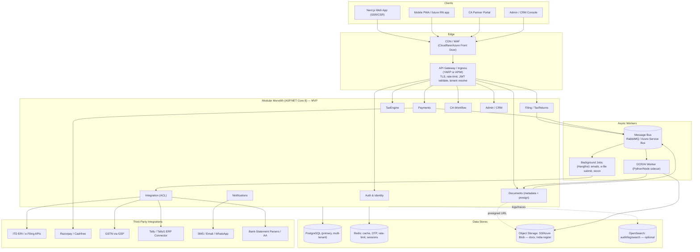
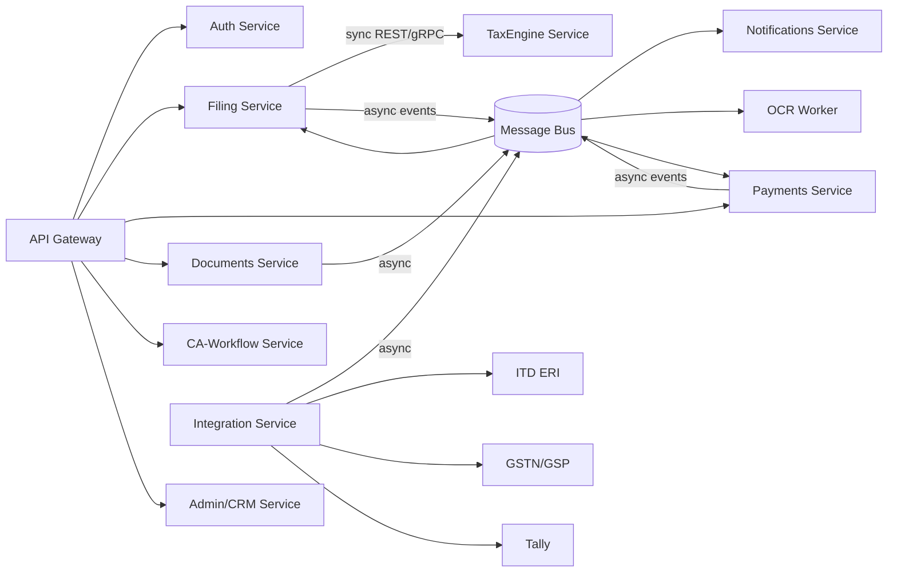
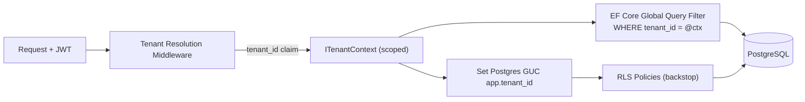
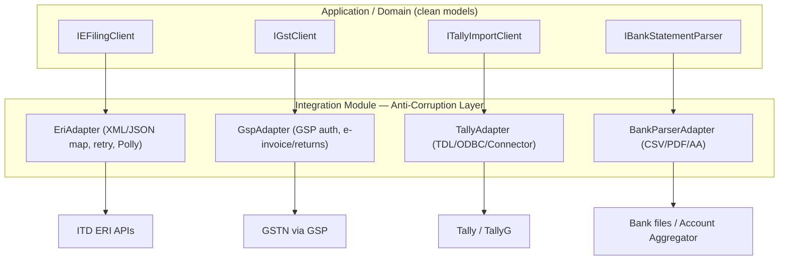

# Chapter 1 — System Architecture & Tech Stack

This chapter fixes the foundational technical decisions for TallyG Tax Portal: the backend platform, the macro-architecture (modular monolith now, microservices later), multi-tenancy model, integration strategy, versioning, and code organization. Every major decision carries a **Why:** note. Downstream chapters reference these decisions rather than restating them: data model details live in Chapter 2, the tax computation internals in Chapter 3, endpoint/RBAC contracts in Chapter 4, OCR pipelines in Chapter 5, security/DevOps in Chapter 6, and the frontend in Chapter 8.

---

## 1.1 Backend Platform Decision: ASP.NET Core Web API vs Node.js (NestJS)

### Verdict

**Primary backend = ASP.NET Core 8 Web API (C#, LTS).** NestJS is the runner-up and is explicitly retained for *one* bounded role only: the **OCR/AI extraction worker** (Chapter 5), where the Python/JS ML ecosystem and lightweight async fan-out are stronger. Everything else — Auth, Filing, TaxEngine, Payments, CA-Workflow, Admin/CRM, Integration — is .NET.

### Decision matrix

| Criterion | ASP.NET Core 8 | NestJS (Node 20) | Weight | Winner |
|---|---|---|---|---|
| **Tax-domain numeric correctness** | Native `decimal` (128-bit, base-10) — exact for `NUMERIC(14,2)` money & rounding u/s 288A/288B | `number` is IEEE-754 float; needs `decimal.js`/`big.js` discipline everywhere, easy to get wrong | High | **.NET** |
| **Long-running OCR / batch jobs** | First-class background processing (Hangfire, `IHostedService`, channels), strong threading | Single-threaded event loop; CPU-bound OCR needs worker threads/child processes | High | **.NET** (for orchestration) |
| **India hiring market** | Very deep .NET/C# talent pool (enterprise, BFSI, Tally ecosystem in Bengaluru/NCR/Pune/Hyderabad); cheaper senior supply | Strong but more startup/frontend-skewed; senior backend Node scarcer than .NET enterprise | Med | **.NET** |
| **Tally / .NET affinity** | Tally is a Windows/.NET-adjacent world; Tally Connector/TDL/ODBC integrations map naturally to a .NET host | Possible but less idiomatic; more glue | Med | **.NET** |
| **Ecosystem maturity for SaaS plumbing** | EF Core, FluentValidation, MediatR, Polly, OpenTelemetry, Serilog, Quartz/Hangfire — batteries included | Excellent: TypeORM/Prisma, class-validator, BullMQ; very productive | Med | Tie |
| **Type safety end-to-end** | Strong static typing; nullable reference types | TypeScript shares types with the Next.js frontend (DX win) | Med | **NestJS** (shared FE types) |
| **Raw I/O throughput** | Kestrel is among the fastest managed servers; great for our I/O-bound API mix | Excellent for I/O-bound JSON APIs | Low | Tie |
| **Cold start / container size** | Larger images; AOT improving but not free | Smaller, faster cold start | Low | **NestJS** |
| **PDF/Excel/crypto libraries** | QuestPDF, ClosedXML, EPPlus, BouncyCastle, native crypto for PAN encryption | pdfkit, exceljs, node crypto — fine | Low | **.NET** (richer fiscal tooling) |

### Why ASP.NET Core wins for *this* product

- **Why (correctness first):** This is a *tax* product. A regime comparison or a 234B/234C interest calc that is off by a paisa is a correctness and trust failure. C#'s native `decimal` removes an entire class of floating-point bugs that NestJS would force us to defend against in every calculation site. For a domain governed by statutory rounding rules, this single factor dominates.
- **Why (OCR orchestration):** Form 16 / AIS / 26AS extraction is long-running and bursty. .NET gives us a robust in-process *and* out-of-process background-job story (Hangfire dashboards, retries, idempotent jobs) without bolting on extra infrastructure on day one. We still hand the *ML inference* to a Python/Node sidecar — orchestration in .NET, inference where the models live.
- **Why (people & cost):** Hiring a 6–10 person senior backend team in India is materially easier and cheaper in .NET than in senior NestJS. Lower bus-factor risk for a regulated product with long maintenance horizons.
- **Why (Tally future):** TallyG/Tally ERP integration is a roadmap headline (Chapter 7). A .NET host keeps that integration first-class rather than a foreign appendage.
- **Why not NestJS as primary:** Its biggest advantage — shared TypeScript types with the Next.js frontend — is real but solvable. We close that gap by **publishing an OpenAPI/Swagger contract** from .NET and generating a typed TS client (NSwag/`openapi-typescript`) for the frontend (Chapters 4, 8). So we keep type safety at the boundary without giving up `decimal`.

> **Net:** Use .NET for the system of record and money math; use the JS/Python ecosystem only inside the OCR/AI worker behind a clean interface.

---

## 1.2 High-Level Architecture



**Why this shape:**
- **Why a gateway in front of a monolith:** Even before microservices, a thin gateway (YARP for self-host, Azure API Management for managed) gives us one place for TLS termination, global rate limiting, JWT signature validation, and **tenant resolution** — so the app focuses on business logic. It also makes the later monolith→microservices cut invisible to clients.
- **Why Redis from day one:** OTP storage with TTL, refresh-token/rotation tracking, idempotency keys, rate-limit counters, and hot caches (tax slabs, deduction limits) all need a fast shared store. Cheap insurance against future horizontal scaling.
- **Why object storage for documents, not the DB:** Form 16/AIS/bank PDFs are large and immutable; they belong in S3/Azure Blob (India region, per DPDP residency — Chapter 6), with only metadata + presigned-URL issuance in `Documents`.

---

## 1.3 API-First Modular Monolith (MVP)

For the MVP we ship a **single deployable ASP.NET Core process** internally partitioned into modules with hard boundaries. API-first means the OpenAPI contract is the source of truth (Chapter 4), and the Next.js frontend consumes a generated typed client.

**Why modular monolith over microservices for MVP:**
- **Why:** A 6–10 person team filing the first ITR season cannot afford distributed-systems tax (network failures, eventual consistency, multi-service deploys, distributed tracing setup) while also chasing a hard tax deadline (Jul 31). One process = one deploy, in-process calls, transactional consistency on PostgreSQL.
- **Why boundaries still matter:** We enforce module separation *in code* (separate projects/namespaces, no cross-module entity references — only via interfaces/contracts), so each module can be lifted into its own service later **without a rewrite**. This is the "monolith-first, microservices-ready" discipline.

### Modules and responsibilities

| Module | Responsibility | Key entities (Ch. 2) | Notes |
|---|---|---|---|
| **Auth & Identity** | Registration, OTP (SMS/email), JWT issue + refresh rotation, RBAC, sessions, tenant membership | `Tenants`, `Users`, `Roles`, `RefreshTokens` | RBAC contract in Ch. 4 |
| **Filing** | ITR lifecycle: create return, pick ITR-1/2/3/4, AY/FY, draft→ready→filed→processed status machine, e-file orchestration | `TaxReturns`, `IncomeSources`, `Deductions` | Owns the saga (1.4) |
| **TaxEngine** | Pure computation: slabs, old-vs-new regime, deductions caps, surcharge/cess, 234A/B/C, advance tax | (stateless; reads return data) | Library, no DB writes; details Ch. 3 |
| **Documents** | Upload presign, classification routing, extraction status, linking to a return | `Documents` | Hands payload to OCR worker; Ch. 5 |
| **Payments** | Filing-fee orders, Razorpay/Cashfree, webhooks, wallet, coupons, refunds, invoices | `Payments`, `Wallets`, `Coupons` | Idempotent webhooks |
| **Notifications** | Templated SMS/email/WhatsApp/in-app, delivery tracking, preferences | (notification log) | Async only |
| **CA-Workflow** | Route return to CA, assignment queues, review/approve/reject, comments, SLA | `CaAssignments`, `Tickets` | Ch. 4 RBAC scopes |
| **Admin / CRM** | Internal ops: tenant mgmt, user support, plan/pricing, coupon admin, dashboards | `Coupons`, `Tickets`, `AuditLogs` | Staff-only |
| **Integration (ACL)** | All outbound third-party calls behind anti-corruption layer: ERI, GSTN/GSP, Tally, bank parsers | (adapter DTOs) | The only module that talks to vendors (1.6) |

> **Cross-cutting (not modules):** `AuditLogs`, multi-tenant filtering, soft-delete (`deleted_at`), PAN encryption/masking, structured logging, and outbox publishing are implemented as shared infrastructure/middleware so every module inherits them uniformly.

---

## 1.4 Enterprise Microservices Decomposition

When volume/team grows (post-product-market-fit, multi-season), the modules promote to independently deployable services. The seams already exist, so the cut is mechanical.



### Sync vs async rules

- **Synchronous (REST/gRPC), request-scoped, must be fast & consistent:**
  - Filing → TaxEngine (compute liability for a return) — **gRPC**, because it is a tight, high-frequency, latency-sensitive internal call with a strict numeric contract. **Why gRPC here:** typed contracts + low overhead for a hot path; the rest of the system stays REST/JSON for external simplicity.
  - Any external client → service is REST/JSON via the gateway.
- **Asynchronous (message bus), eventual consistency, decoupled:**
  - `DocumentUploaded` → OCR worker; `PaymentCaptured` → Filing; `ReturnFiled` → Notifications; `EFilingAcknowledged` → Filing/Notifications; integration recon jobs.
  - **Bus choice:** **RabbitMQ** for self-hosted/cost-sensitive deployments, **Azure Service Bus** when on Azure (sessions, dead-letter queues, scheduled messages out of the box). Abstract behind `IEventBus` (MassTransit) so the broker is swappable. **Why MassTransit:** uniform consumer model, built-in retry/redelivery, outbox, and saga state machines.

### Idempotency

- **Why:** Bus delivery is at-least-once and clients retry on timeouts; duplicate "pay" or "file" actions are unacceptable (double charge, double submission).
- **How:**
  - **Inbound API idempotency:** clients send `Idempotency-Key` header on POST `/payments/orders`, `/filings/{id}/submit`; we persist the key + first response (Redis + DB) and replay the stored response on retry.
  - **Message idempotency:** each consumer records processed `messageId` (inbox table) and no-ops on duplicates.
  - **Reliable publish:** **transactional outbox** — events are written in the same DB transaction as the state change, then relayed to the bus; prevents "DB committed but event lost."

### Saga: "pay → file"

A distributed transaction across Payments, Filing, Integration (ERI), and Notifications, coordinated by a **Filing Saga** (MassTransit state machine). Compensations handle failures.

```mermaid
sequenceDiagram
    autonumber
    participant U as User (Web)
    participant GW as Gateway
    participant PAY as Payments
    participant SAGA as Filing Saga
    participant FIL as Filing
    participant TAX as TaxEngine
    participant INT as Integration (ERI)
    participant NOT as Notifications

    U->>GW: POST /payments/orders (Idempotency-Key)
    GW->>PAY: create order (Razorpay/Cashfree)
    PAY-->>U: order + checkout token
    U->>PAY: pay on gateway → webhook
    PAY->>PAY: verify signature (idempotent)
    PAY-->>SAGA: PaymentCaptured(returnId, amount)
    SAGA->>TAX: compute final liability (gRPC, sync)
    TAX-->>SAGA: computation snapshot
    SAGA->>FIL: lock return → status=ReadyToFile
    SAGA->>INT: SubmitToERI(returnJson)
    alt ERI accepted
        INT-->>SAGA: EFilingAcknowledged(ackNo)
        SAGA->>FIL: status=Filed, store ack
        SAGA-->>NOT: send "Filed" (email/SMS/WhatsApp)
    else ERI rejected / timeout
        INT-->>SAGA: EFilingFailed(reason)
        SAGA->>FIL: status=ReadyToFile (unlock, store error)
        SAGA-->>NOT: send "Action needed"
        Note over SAGA,PAY: Payment NOT auto-refunded — filing retto retried; refund only on user cancel (compensating tx)
    end
```

**Why a saga, not a DB transaction:** the steps span an external payment gateway and the government ERI endpoint — neither is enrollable in a local ACID transaction. The saga makes each step independently retryable with explicit compensations (e.g., refund via Payments only when the user abandons), and the outbox guarantees no event is silently dropped mid-flow.

---

## 1.5 Multi-Tenant Readiness

### Recommendation

- **MVP & default: Pooled model — shared schema, every tenant row carries `tenant_id` (uuid), enforced by row-level isolation.**
- **White-label / franchise / large-CA-firm tier: Schema-per-tenant (silo) on the *same* PostgreSQL cluster**, selected per tenant at onboarding.

| Aspect | Pooled (shared schema + `tenant_id`) | Silo (schema/DB per tenant) |
|---|---|---|
| Cost at N small tenants | Low (one schema) | High (migrations × N) |
| Isolation/blast radius | Logical only | Strong physical |
| Noisy-neighbor | Possible | Contained |
| Ops/migration effort | Single migration | Per-tenant migration fan-out |
| Best for | Mass self-serve individual & MSME filers | White-label partners, franchises, big CA firms wanting data isolation |

**Why pooled for MVP:** TallyG's core market is thousands of individual/MSME filers — the per-tenant footprint is tiny, so a row per tenant is far cheaper to operate and migrate than thousands of schemas. **Why offer silo at the top tier:** a white-label CA franchise selling under its own brand (Chapter 7) will demand contractual data isolation; schema-per-tenant satisfies that without changing application code — only the connection/schema resolver differs.

### Enforcement (defense in depth)

1. **Gateway/middleware resolves tenant** from the validated JWT's `tenant_id` claim (never from a client-supplied body) and pushes it into an `ITenantContext` (scoped, `AsyncLocal`-backed).
2. **EF Core global query filter** auto-appends `WHERE tenant_id = @currentTenant AND deleted_at IS NULL` to every query. **Why:** developers cannot *forget* the filter — it is opt-out, not opt-in.
3. **PostgreSQL Row-Level Security (RLS)** as a backstop: a session GUC (`app.tenant_id`) plus RLS policies enforce isolation even if the ORM filter is bypassed by raw SQL. **Why two layers:** a single missed `WHERE` clause must not leak another tenant's PAN/financials — unacceptable under DPDP.
4. **Silo path:** for schema-per-tenant, a `ITenantSchemaResolver` swaps the `search_path`/connection per request; same application code.



---

## 1.6 Integration Architecture (Adapter + Anti-Corruption Layer)

All external systems are reached **only** through the **Integration module/service**, which exposes clean domain interfaces and hides every vendor quirk behind an **adapter** + **anti-corruption layer (ACL)**.

**Why ACL:** ITD ERI XML schemas, GSTN/GSP envelopes, Tally TDL/ODBC shapes, and bank-statement formats are messy, versioned, and outside our control. The ACL translates these foreign models into our clean domain models so vendor changes never ripple into Filing/TaxEngine.



- **ITD ERI:** ERI-registered-intermediary submission, ack/status polling; resilient with **Polly** (timeout, retry-with-jitter, circuit breaker). Idempotent submit keyed by return + AY. (e-filing specifics in Chapter 6.)
- **GSTN/GSP:** for MSME GST data pull (returns, e-invoice) feeding ITR-3/4 turnover/44AD/44ADA inputs.
- **Tally/TallyG:** import trial balance/P&L/ledgers for business returns; adapter isolates TDL/ODBC/Tally-Connector mechanics.
- **Bank statements:** pluggable parsers (per-bank CSV/PDF) and future **Account Aggregator** consent flow; output normalized transactions for capital-gain/interest income.

**Why a single Integration module owns all egress:** one place for credentials/secrets, retries, circuit breakers, request/response audit logging, and rate-limit compliance with each vendor — and the one component to mock in tests so the rest of the system stays vendor-agnostic.

---

## 1.7 API Versioning Strategy

- **Scheme: URI versioning — `/api/v1/...`** (per shared conventions), implemented with `Asp.Versioning.Http`. **Why URI over header/media-type:** it is the most explicit, cache-friendly, and debuggable for an external partner/CA ecosystem; trivially visible in logs and curl. Header-based versioning is harder for third parties to adopt correctly.
- **Compatibility rule:** within a major version, **only additive, backward-compatible changes** (new optional fields, new endpoints). Breaking changes ⇒ new major (`/v2`). Tax-law changes per AY are modeled as **data/config (AY-scoped slab & limit tables in Chapter 3), not API versions** — a new assessment year does **not** bump the API version. **Why:** annual tax changes are routine; bumping the API yearly would churn every client needlessly.
- **Deprecation policy:** announce → `Deprecation` + `Sunset` HTTP headers + changelog → **minimum 6-month** overlap where `v1` and `v2` run in parallel → remove. Off-boarding seasons avoided (no removals during Apr–Jul filing peak).
- **Contract testing:** OpenAPI is the contract. CI runs (a) **schema diff** to fail builds on accidental breaking changes within a major, and (b) **consumer-driven contract tests (Pact)** between the Next.js client / CA portal and the API. **Why Pact:** the frontend and partners depend on stable shapes; CDC tests catch breakage before deploy, not in production during tax season.

---

## 1.8 Naming Conventions & Coding Standards

### Naming

| Artifact | Convention | Example |
|---|---|---|
| Solution | `TallyG.Tax.sln` | — |
| Projects | `TallyG.Tax.<Layer>[.<Module>]` | `TallyG.Tax.Api`, `TallyG.Tax.Application.Filing`, `TallyG.Tax.Domain`, `TallyG.Tax.Infrastructure` |
| Namespaces | mirror project/folder path | `TallyG.Tax.Application.Filing.Commands` |
| Classes/Interfaces | PascalCase; interfaces `I`-prefixed | `TaxReturn`, `IEFilingClient`, `ComputeTaxHandler` |
| DTOs / contracts | suffix `Request`/`Response`/`Dto` | `CreateTaxReturnRequest`, `RegimeComparisonResponse` |
| Async methods | suffix `Async` | `SubmitReturnAsync` |
| Files | one top-level type per file, file = type name | `TaxReturn.cs` |
| **Entities (docs/domain)** | **PascalCase** (shared convention) | `Tenants`, `TaxReturns`, `CaAssignments` |
| **DB tables/columns** | **snake_case**, plural tables | `tax_returns`, `tenant_id`, `created_at` |
| DB PK / FK | `id` (uuid); FK `<entity>_id` | `id`, `user_id` |
| Money / time columns | `NUMERIC(14,2)` / `timestamptz` (UTC) | `total_tax`, `filed_at` |
| Git branches | `type/short-desc` | `feat/regime-comparison`, `fix/234c-interest`, `chore/ci` |
| Commits | Conventional Commits | `feat(taxengine): add surcharge marginal relief` |

### Coding standards

- **Why analyzers + StyleCop:** consistency at 6–10 devs and a regulated codebase is non-negotiable; the build *enforces* it rather than relying on review.
  - `.editorconfig` is the single style source of truth; **`TreatWarningsAsErrors=true`** in CI.
  - **StyleCop.Analyzers** + **Roslyn/.NET analyzers** at `AnalysisLevel=latest-recommended`; `dotnet format` gate in CI.
- **Nullable reference types: enabled solution-wide** (`<Nullable>enable</Nullable>`). **Why:** null-safety matters most where optional tax fields (e.g., absent capital gains) flow through computation.
- **Async all the way:** no `.Result`/`.Wait()`; pass `CancellationToken` end to end. **Why:** Kestrel scalability and clean cancellation of long ERI/OCR calls.
- **DTO vs entity separation: strict.** Controllers never accept or return EF entities — only DTOs mapped (Mapster/AutoMapper). **Why:** prevents over-posting (e.g., a client setting `tenant_id` or `total_tax`), decouples API contract from schema, and keeps PAN masking at the boundary.
- **Validation:** **FluentValidation** on every inbound DTO (PAN format, AY ranges, amounts ≥ 0).
- **CQRS-lite with MediatR:** commands/queries per use case; thin controllers. **Why:** clean module boundaries and testable handlers that lift cleanly into microservices later.
- **Errors:** RFC 7807 `ProblemDetails` everywhere (contract detail in Chapter 4).
- **Money:** always `decimal`; statutory rounding centralized in TaxEngine (Chapter 3) — never ad hoc.
- **Tests:** xUnit + FluentAssertions; Testcontainers-PostgreSQL for integration; TaxEngine has golden-master tests per AY.

---

## 1.9 Backend Solution / Folder Structure (Clean Architecture)

Four conceptual layers; dependencies point **inward** (Api → Application → Domain; Infrastructure → Application/Domain). **Why Clean Architecture:** the Domain + TaxEngine (the crown jewels) stay free of EF, ASP.NET, and vendor SDKs, so tax logic is independently testable and the same Application layer can sit behind a monolith host today or per-service hosts tomorrow.

```text
TallyG.Tax.sln
├── src/
│   ├── TallyG.Tax.Api/                     # ASP.NET Core host (Web API)
│   │   ├── Controllers/                    # thin; /api/v1, ProblemDetails
│   │   ├── Middleware/                     # TenantResolution, Exception, Audit, RateLimit
│   │   ├── Extensions/                     # DI module registration, Swagger/OpenAPI
│   │   └── Program.cs
│   │
│   ├── TallyG.Tax.Application/             # use cases (MediatR), interfaces, DTOs, validators
│   │   ├── Common/                         # ITenantContext, IEventBus, IClock, Result<T>
│   │   ├── Auth/  Filing/  Payments/       # one folder per module
│   │   ├── Documents/  CaWorkflow/  Crm/
│   │   └── Abstractions/                   # IEFilingClient, IGstClient, ITallyImportClient ...
│   │
│   ├── TallyG.Tax.Domain/                  # entities, value objects, enums, domain events
│   │   ├── Entities/                       # Tenant, User, TaxReturn, Document, Payment ...
│   │   ├── ValueObjects/                   # Pan (encrypt/mask), Money, AssessmentYear
│   │   └── Enums/                          # ItrType, ReturnStatus, Regime
│   │
│   ├── TallyG.Tax.TaxEngine/               # pure computation (no infra deps) — Chapter 3
│   │   ├── Slabs/  Deductions/  Surcharge/  Interest234/
│   │   └── RegimeComparison/
│   │
│   └── TallyG.Tax.Infrastructure/          # implementations of Application interfaces
│       ├── Persistence/                    # EF Core DbContext, configs, migrations, RLS
│       ├── Identity/                       # JWT, OTP, refresh-token rotation
│       ├── Integration/                    # ACL adapters: Eri, Gsp, Tally, BankParser (1.6)
│       ├── Payments/                       # Razorpay/Cashfree gateways
│       ├── Messaging/                      # MassTransit + RabbitMQ/ASB, Outbox/Inbox
│       ├── Storage/                        # S3/Azure Blob, presigned URLs
│       └── BackgroundJobs/                 # Hangfire jobs, saga state machines
│
├── workers/
│   └── TallyG.Tax.OcrWorker/               # Python/Node sidecar (Chapter 5) behind IEventBus
│
├── tests/
│   ├── TallyG.Tax.UnitTests/
│   ├── TallyG.Tax.TaxEngine.Tests/         # golden-master per AY
│   ├── TallyG.Tax.IntegrationTests/        # Testcontainers-PostgreSQL
│   └── TallyG.Tax.ContractTests/           # Pact consumer/provider
│
├── .editorconfig    Directory.Build.props   # nullable, analyzers, warnings-as-errors
└── docker-compose.yml                       # api, postgres, redis, rabbitmq, ocr-worker
```

> **Module promotion path:** because each module is a self-contained `Application.<Module>` slice with its own contracts and the only shared write surface is the DbContext + outbox, extracting (say) Payments into `TallyG.Tax.Payments.Api` later means hosting that slice + its tables behind the gateway and replacing in-process MediatR calls with bus messages — no domain rewrite. This is the concrete payoff of the modular-monolith discipline chosen in 1.3.