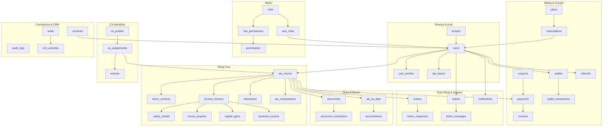
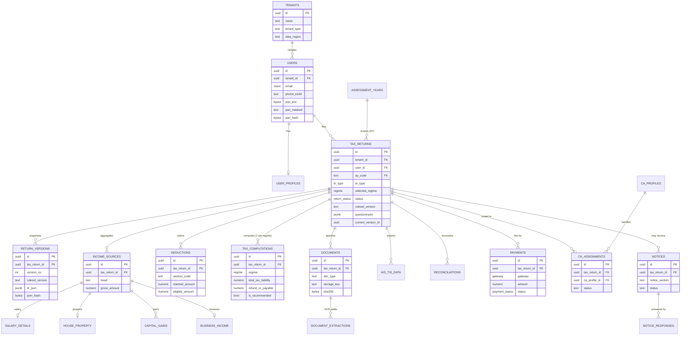
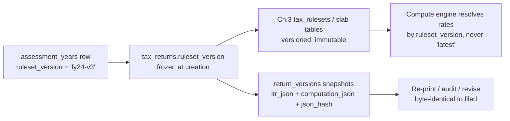

# Chapter 2 — Database Schema & ERD (PostgreSQL)

This chapter specifies the persistent data model for the modular monolith described in **Chapter 1**. It is the single source of truth for table names, column types, keys, and the cross-cutting storage strategies (indexing, partitioning, JSONB, multi-year reproducibility, retention). The tax computation logic that *reads/writes* these tables lives in **Chapter 3**; the API surface that exposes them in **Chapter 4**; OCR/extraction internals in **Chapter 5**; encryption-at-rest, RLS and retention enforcement in **Chapter 6**.

## 2.1 Conventions enforced at the schema level

| Rule | Implementation | Why |
|------|----------------|-----|
| PK = `uuid` | `id uuid PRIMARY KEY DEFAULT gen_random_uuid()` (pgcrypto) | UUIDv4 avoids cross-tenant ID guessing and lets the client/edge generate IDs idempotently for retry-safe writes. We accept the index-bloat tradeoff; hot append tables (`audit_logs`) use a `bigint` surrogate *plus* a uuid (see 2.9). |
| Money = `NUMERIC(14,2)` | Every rupee column | Tax math must be exact to the paisa; `float` rounding is unacceptable when reconciling against ITD. 14 digits covers ₹999 crore line items. |
| Time = `timestamptz` (UTC) | `created_at`, `updated_at` | Store UTC, render IST (`Asia/Kolkata`) in the app. Avoids DST-free but offset confusion in logs/audits. |
| Soft delete | `deleted_at timestamptz NULL` | Tax records are legally retained; hard deletes are forbidden except on DPDP erasure (Chapter 6). All read paths filter `deleted_at IS NULL` via views/RLS. |
| Tenancy | `tenant_id uuid NOT NULL` on every tenant-scoped row | Multi-tenant isolation via Postgres **Row-Level Security** (Chapter 6). `tenant_id` is the leading column of most composite indexes. |
| PAN/Aadhaar | `pan_enc bytea`, `pan_masked text`, `pan_hash bytea` | Plaintext PAN never stored. `pan_enc` = app-layer AES-256-GCM (envelope key in KMS); `pan_masked` = `ABCDE****F` for display; `pan_hash` = HMAC-SHA256 for dedupe/lookups without decryption. |
| Enums | Postgres `ENUM` types for closed sets, `text + CHECK` for sets that evolve yearly | Stable taxonomy (return status) → ENUM (fast, type-safe). Tax-section codes change with Finance Acts → `text` + reference table, no DDL migration each Budget. |
| Naming | tables = snake_case **plural** (`tax_returns`); FK = `<singular>_id` | Predictable joins; PascalCase entity names (`TaxReturns`) are used only in docs/code DTOs per shared conventions. |

**Required extensions:** `pgcrypto` (gen_random_uuid, digest/hmac), `pg_trgm` (fuzzy name/email search in CRM & CA console), `btree_gin` (mixed JSONB + scalar indexes), `pg_partman` (automated monthly partition management for `audit_logs`/`documents`), and `citext` (case-insensitive email).

## 2.2 Module map → table inventory



**Full inventory (45 tables).** Bold = DDL shown in 2.4–2.8; the rest are condensed column lists.

`tenants`, **`users`**, `user_profiles`, **`otp_tokens`**, `roles`, `permissions`, `role_permissions`, **`user_roles`**, **`tax_returns`**, **`return_versions`**, **`income_sources`**, `salary_details`, `house_property`, **`capital_gains`**, `business_income`, **`deductions`**, **`tax_computations`**, **`documents`**, **`document_extractions`**, `ais_tis_data`, **`reconciliations`**, **`payments`**, `invoices`, `wallets`, `wallet_transactions`, `coupons`, `referrals`, `ca_profiles`, **`ca_assignments`**, `reviews`, **`notices`**, `notice_responses`, `tickets`, `ticket_messages`, `notifications`, `subscriptions`, `plans`, **`audit_logs`**, `consents`, `leads`, `crm_activities`.

## 2.3 Shared enum & reference types

```sql
CREATE TYPE return_status AS ENUM (
  'draft','documents_pending','computed','review_pending','ca_review',
  'awaiting_payment','ready_to_file','filed','e_verified','processed',
  'defective','revised','rejected'
);
CREATE TYPE itr_type AS ENUM ('ITR1','ITR2','ITR3','ITR4');
CREATE TYPE regime AS ENUM ('old','new');
CREATE TYPE residential_status AS ENUM ('resident','rnor','non_resident');
CREATE TYPE payment_status AS ENUM ('created','authorized','captured','failed','refunded','partial_refund');
CREATE TYPE gateway AS ENUM ('razorpay','cashfree','wallet');

-- assessment_years: one immutable row per AY; the anchor for reproducibility (2.10)
CREATE TABLE assessment_years (
  ay_code        text PRIMARY KEY,          -- 'AY2025-26'
  fy_code        text NOT NULL,             -- 'FY2024-25'
  fy_start       date NOT NULL,             -- 2024-04-01
  fy_end         date NOT NULL,             -- 2025-03-31
  due_date_nonaudit date NOT NULL,          -- 2025-07-31
  due_date_audit    date,                   -- 2025-10-31
  is_filing_open boolean NOT NULL DEFAULT true,
  ruleset_version text NOT NULL             -- FK-by-convention to Ch.3 tax_rulesets
);
```
**Why a table, not an enum, for AY:** new assessment years appear annually and carry data (due dates, ruleset pointer). Modelling as rows lets us open/close filing windows and pin each return to a frozen `ruleset_version` without a migration every April.

## 2.4 Tenancy, Auth & RBAC (DDL)

```sql
-- TENANTS — top of the isolation hierarchy; B2C self-serve users sit under a
-- system "retail" tenant, B2B partners (CA firms, MSME aggregators) get their own.
CREATE TABLE tenants (
  id            uuid PRIMARY KEY DEFAULT gen_random_uuid(),
  name          text NOT NULL,
  slug          citext NOT NULL,
  tenant_type   text NOT NULL DEFAULT 'retail'
                  CHECK (tenant_type IN ('retail','ca_firm','enterprise','reseller')),
  status        text NOT NULL DEFAULT 'active'
                  CHECK (status IN ('active','suspended','closed')),
  data_region   text NOT NULL DEFAULT 'in-central',  -- DPDP residency (Ch.6)
  settings      jsonb NOT NULL DEFAULT '{}'::jsonb,   -- branding, feature flags
  created_at    timestamptz NOT NULL DEFAULT now(),
  updated_at    timestamptz NOT NULL DEFAULT now(),
  deleted_at    timestamptz,
  CONSTRAINT uq_tenants_slug UNIQUE (slug)
);

-- USERS — authenticable identity; one human per (tenant_id, email/phone).
CREATE TABLE users (
  id              uuid PRIMARY KEY DEFAULT gen_random_uuid(),
  tenant_id       uuid NOT NULL REFERENCES tenants(id),
  email           citext,
  phone_e164      text,                                  -- '+9198XXXXXXXX'
  email_verified  boolean NOT NULL DEFAULT false,
  phone_verified  boolean NOT NULL DEFAULT false,
  password_hash   text,                                  -- Argon2id; NULL = OTP-only
  pan_enc         bytea,                                 -- AES-256-GCM ciphertext
  pan_masked      text,                                  -- 'ABCDE****F'
  pan_hash        bytea,                                 -- HMAC-SHA256 for lookup/dedupe
  status          text NOT NULL DEFAULT 'active'
                    CHECK (status IN ('active','locked','disabled','deleted')),
  last_login_at   timestamptz,
  created_at      timestamptz NOT NULL DEFAULT now(),
  updated_at      timestamptz NOT NULL DEFAULT now(),
  deleted_at      timestamptz,
  CONSTRAINT uq_users_tenant_email UNIQUE (tenant_id, email),
  CONSTRAINT uq_users_tenant_phone UNIQUE (tenant_id, phone_e164),
  CONSTRAINT uq_users_pan_hash     UNIQUE (tenant_id, pan_hash),
  CONSTRAINT chk_users_contact CHECK (email IS NOT NULL OR phone_e164 IS NOT NULL)
);

-- OTP_TOKENS — short-lived SMS/email OTP challenges; hashed, never plaintext.
CREATE TABLE otp_tokens (
  id            uuid PRIMARY KEY DEFAULT gen_random_uuid(),
  tenant_id     uuid NOT NULL REFERENCES tenants(id),
  user_id       uuid REFERENCES users(id),               -- NULL during signup
  channel       text NOT NULL CHECK (channel IN ('sms','email','whatsapp')),
  destination   text NOT NULL,                            -- phone/email targeted
  purpose       text NOT NULL CHECK (purpose IN
                  ('signup','login','reset_password','efile_evc','sensitive_action')),
  code_hash     bytea NOT NULL,                           -- HMAC of 6-digit code
  attempts      smallint NOT NULL DEFAULT 0,
  max_attempts  smallint NOT NULL DEFAULT 5,
  expires_at    timestamptz NOT NULL,                     -- now() + 10 min
  consumed_at   timestamptz,
  created_at    timestamptz NOT NULL DEFAULT now()
);
CREATE INDEX ix_otp_active ON otp_tokens (destination, purpose)
  WHERE consumed_at IS NULL;   -- partial index: only live challenges

-- USER_ROLES — assigns RBAC roles; scope_tenant_id lets a CA-firm admin hold a
-- role scoped to a sub-tenant. Composite PK prevents duplicate grants.
CREATE TABLE user_roles (
  user_id          uuid NOT NULL REFERENCES users(id),
  role_id          uuid NOT NULL REFERENCES roles(id),
  scope_tenant_id  uuid REFERENCES tenants(id),
  granted_by       uuid REFERENCES users(id),
  granted_at       timestamptz NOT NULL DEFAULT now(),
  PRIMARY KEY (user_id, role_id, scope_tenant_id)
);
```

Condensed companions:

- **`user_profiles`** — `id, user_id (uq FK), tenant_id, first_name, last_name, dob date, gender, father_name, aadhaar_last4, address_line1/2, city, state_code, pincode, fy_residential_status residential_status, occupation_type (salaried/freelancer/trader/professional/pensioner/msme), bank_account_no_enc, bank_ifsc, is_govt_employee bool, created_at, updated_at`. *Why split from `users`:* PII profile fields are read far less often than auth fields and are the unit of DPDP export/erasure — separating them keeps the auth hot path lean and the privacy boundary clean.
- **`roles`** — `id, tenant_id NULL (NULL = system/global role), code (taxpayer, ca, ca_firm_admin, reviewer, support_agent, ops, tenant_admin, super_admin), name, is_system bool, created_at`.
- **`permissions`** — `id, code (e.g. return.read, return.file, payment.refund, ca.assign, audit.read), description`. Seeded, immutable.
- **`role_permissions`** — `role_id, permission_id` (composite PK). Many-to-many join.

## 2.5 Filing Core (DDL)

```sql
-- TAX_RETURNS — one row per (user, AY, attempt). The aggregate root of a filing.
-- Mutable "working" header; immutable snapshots live in return_versions.
CREATE TABLE tax_returns (
  id                uuid PRIMARY KEY DEFAULT gen_random_uuid(),
  tenant_id         uuid NOT NULL REFERENCES tenants(id),
  user_id           uuid NOT NULL REFERENCES users(id),
  ay_code           text NOT NULL REFERENCES assessment_years(ay_code),
  itr_type          itr_type,                       -- NULL until classified
  selected_regime   regime,                          -- NULL until chosen/auto
  status            return_status NOT NULL DEFAULT 'draft',
  ruleset_version   text NOT NULL,                   -- frozen at creation (2.10)
  filing_mode       text NOT NULL DEFAULT 'self'
                      CHECK (filing_mode IN ('self','ca_assisted','ca_full')),
  questionnaire     jsonb NOT NULL DEFAULT '{}'::jsonb,  -- flexible Q&A (2.11)
  is_revised        boolean NOT NULL DEFAULT false,
  original_return_id uuid REFERENCES tax_returns(id),    -- self-ref for revisions
  ack_number        text,                            -- ITD acknowledgement no.
  filed_at          timestamptz,
  e_verified_at     timestamptz,
  current_version_id uuid,                            -- FK set after first snapshot
  created_at        timestamptz NOT NULL DEFAULT now(),
  updated_at        timestamptz NOT NULL DEFAULT now(),
  deleted_at        timestamptz,
  CONSTRAINT uq_return_user_ay_attempt
    UNIQUE (tenant_id, user_id, ay_code, is_revised, original_return_id)
);
CREATE INDEX ix_returns_tenant_status ON tax_returns (tenant_id, status)
  WHERE deleted_at IS NULL;
CREATE INDEX ix_returns_user_ay ON tax_returns (user_id, ay_code);
CREATE INDEX ix_returns_questionnaire ON tax_returns USING gin (questionnaire jsonb_path_ops);

-- RETURN_VERSIONS — append-only, immutable snapshots of the full return payload
-- at each meaningful transition (computed, ca_approved, filed). Reproducibility core.
CREATE TABLE return_versions (
  id              uuid PRIMARY KEY DEFAULT gen_random_uuid(),
  tenant_id       uuid NOT NULL REFERENCES tenants(id),
  tax_return_id   uuid NOT NULL REFERENCES tax_returns(id),
  version_no      integer NOT NULL,
  reason          text NOT NULL,                    -- 'computed','ca_edit','pre_file'
  ruleset_version text NOT NULL,                    -- which Ch.3 rules produced it
  itr_json        jsonb NOT NULL,                   -- canonical ITR payload (ITD schema)
  computation_json jsonb NOT NULL,                  -- full computed breakdown
  json_hash       bytea NOT NULL,                   -- SHA-256 of itr_json (tamper-evidence)
  created_by      uuid REFERENCES users(id),
  created_at      timestamptz NOT NULL DEFAULT now(),
  CONSTRAINT uq_version_no UNIQUE (tax_return_id, version_no)
);
-- No deleted_at: versions are never mutated or removed. Updates are forbidden by trigger.

-- INCOME_SOURCES — polymorphic header for each income head on a return; detail
-- rows hang off it in the head-specific child tables.
CREATE TABLE income_sources (
  id              uuid PRIMARY KEY DEFAULT gen_random_uuid(),
  tenant_id       uuid NOT NULL REFERENCES tenants(id),
  tax_return_id   uuid NOT NULL REFERENCES tax_returns(id),
  head            text NOT NULL CHECK (head IN
                    ('salary','house_property','capital_gains','business_profession',
                     'other_sources','exempt')),
  label           text,                              -- 'Infosys Ltd', 'Flat-2 Pune'
  gross_amount    numeric(14,2) NOT NULL DEFAULT 0,
  source_meta     jsonb NOT NULL DEFAULT '{}'::jsonb,
  created_at      timestamptz NOT NULL DEFAULT now(),
  updated_at      timestamptz NOT NULL DEFAULT now(),
  deleted_at      timestamptz
);
CREATE INDEX ix_income_return_head ON income_sources (tax_return_id, head)
  WHERE deleted_at IS NULL;

-- DEDUCTIONS — one row per claimed deduction line, keyed by section code.
CREATE TABLE deductions (
  id              uuid PRIMARY KEY DEFAULT gen_random_uuid(),
  tenant_id       uuid NOT NULL REFERENCES tenants(id),
  tax_return_id   uuid NOT NULL REFERENCES tax_returns(id),
  section_code    text NOT NULL,                     -- '80C','80D','80CCD(1B)','80TTA','24b'
  sub_type        text,                              -- 'lic','elss','self_health'
  claimed_amount  numeric(14,2) NOT NULL DEFAULT 0,
  eligible_amount numeric(14,2),                     -- after Ch.3 caps applied
  regime_applicable regime,                          -- many vanish under 'new'
  proof_document_id uuid REFERENCES documents(id),
  created_at      timestamptz NOT NULL DEFAULT now(),
  updated_at      timestamptz NOT NULL DEFAULT now(),
  deleted_at      timestamptz
);
CREATE INDEX ix_deductions_return ON deductions (tax_return_id, section_code)
  WHERE deleted_at IS NULL;

-- TAX_COMPUTATIONS — the computed result, one row PER regime so old-vs-new is a
-- simple two-row compare. Recommended regime flagged. Engine details in Ch.3.
CREATE TABLE tax_computations (
  id                  uuid PRIMARY KEY DEFAULT gen_random_uuid(),
  tenant_id           uuid NOT NULL REFERENCES tenants(id),
  tax_return_id       uuid NOT NULL REFERENCES tax_returns(id),
  return_version_id   uuid REFERENCES return_versions(id),
  regime              regime NOT NULL,
  gross_total_income  numeric(14,2) NOT NULL,
  total_deductions    numeric(14,2) NOT NULL,
  total_income        numeric(14,2) NOT NULL,        -- rounded to nearest ₹10 (s.288A)
  tax_before_rebate   numeric(14,2) NOT NULL,
  rebate_87a          numeric(14,2) NOT NULL DEFAULT 0,
  surcharge           numeric(14,2) NOT NULL DEFAULT 0,
  cess_4pct           numeric(14,2) NOT NULL,
  total_tax_liability numeric(14,2) NOT NULL,
  tds_tcs_paid        numeric(14,2) NOT NULL DEFAULT 0,
  advance_self_assess numeric(14,2) NOT NULL DEFAULT 0,
  interest_234abc     numeric(14,2) NOT NULL DEFAULT 0,
  refund_or_payable   numeric(14,2) NOT NULL,        -- +ve = refund, -ve = payable
  is_recommended      boolean NOT NULL DEFAULT false,
  breakdown_json      jsonb NOT NULL DEFAULT '{}'::jsonb,   -- slab-wise detail
  computed_at         timestamptz NOT NULL DEFAULT now(),
  CONSTRAINT uq_comp_return_regime_ver UNIQUE (tax_return_id, regime, return_version_id)
);
```
**Why one `tax_computations` row per regime (not columns):** the product's headline feature is old-vs-new comparison. Two rows let the API return `ORDER BY total_tax_liability` and mark `is_recommended` trivially, and the same shape extends if ITD adds a third regime. **Why `total_income` rounds to ₹10:** s.288A of the Income-tax Act mandates rounding total income to the nearest ten rupees; storing the rounded value keeps us byte-identical to the ITD return.

Condensed companions (child detail tables under `income_sources`):

- **`salary_details`** — `id, tenant_id, income_source_id (FK), employer_name, tan, gross_salary, perquisites_17_2, profits_in_lieu_17_3, exempt_allowances numeric, std_deduction numeric, professional_tax numeric, hra_exemption numeric, form16_document_id, created_at`. Maps directly to Form 16 Part B.
- **`house_property`** — `id, tenant_id, income_source_id, property_type (self_occupied/let_out/deemed_let_out), address, annual_rent, municipal_tax_paid, std_deduction_30pct numeric, interest_on_loan_24b numeric, co_owner_share_pct, tenant_pan_enc, net_income numeric`.
- **`capital_gains`** — DDL below (it is one of the 12).
- **`business_income`** — `id, tenant_id, income_source_id, nature_of_business_code, accounting_method (cash/mercantile), is_presumptive bool, presumptive_section (44AD/44ADA/44AE), gross_turnover, gross_receipts_digital, gross_receipts_cash, presumptive_rate_pct, net_profit numeric, balance_sheet_json jsonb, pl_json jsonb, gst_turnover_reported numeric`. *Why JSONB for BS/P&L:* ITR-3 balance-sheet/P&L schedules have 100+ optional lines that differ by business; a rigid table would be mostly nulls. JSONB stores only what's present and mirrors the ITD schedule keys.

```sql
-- CAPITAL_GAINS — per-transaction or per-scrip-bucket gains; STCG/LTCG split with
-- the holding rules that drive Ch.3 tax rates (111A/112A/etc.).
CREATE TABLE capital_gains (
  id                 uuid PRIMARY KEY DEFAULT gen_random_uuid(),
  tenant_id          uuid NOT NULL REFERENCES tenants(id),
  income_source_id   uuid NOT NULL REFERENCES income_sources(id),
  asset_type         text NOT NULL CHECK (asset_type IN
                       ('listed_equity','equity_mf','debt_mf','unlisted_shares',
                        'immovable_property','bonds','gold','crypto_vda','other')),
  gain_term          text NOT NULL CHECK (gain_term IN ('stcg','ltcg')),
  tax_section        text,                              -- '111A','112A','112','115BBH'
  acquisition_date   date,
  transfer_date      date,
  sale_consideration numeric(14,2) NOT NULL,
  cost_of_acquisition numeric(14,2) NOT NULL DEFAULT 0,
  indexed_cost       numeric(14,2),                     -- if indexation applies
  cost_of_improvement numeric(14,2) NOT NULL DEFAULT 0,
  expenses_on_transfer numeric(14,2) NOT NULL DEFAULT 0,
  exemption_section  text,                              -- '54','54F','54EC'
  exemption_amount   numeric(14,2) NOT NULL DEFAULT 0,
  net_gain           numeric(14,2) NOT NULL,
  isin               text,
  source_statement_id uuid REFERENCES documents(id),    -- broker P&L upload
  created_at         timestamptz NOT NULL DEFAULT now(),
  deleted_at         timestamptz
);
CREATE INDEX ix_capgains_source ON capital_gains (income_source_id, gain_term)
  WHERE deleted_at IS NULL;
```

## 2.6 Documents, AIS/TIS & Reconciliation (DDL)

```sql
-- DOCUMENTS — metadata for every uploaded artefact (object bytes live in S3-
-- compatible storage, India region). Partitioned monthly by created_at (2.9).
CREATE TABLE documents (
  id              uuid NOT NULL DEFAULT gen_random_uuid(),
  tenant_id       uuid NOT NULL REFERENCES tenants(id),
  user_id         uuid NOT NULL REFERENCES users(id),
  tax_return_id   uuid REFERENCES tax_returns(id),       -- NULL = unattached upload
  doc_type        text NOT NULL CHECK (doc_type IN
                    ('form16','form16a','ais','tis','form26as','salary_slip',
                     'bank_statement','capital_gain_stmt','gst_return','rent_receipt',
                     'investment_proof','pan_card','aadhaar','other')),
  storage_key     text NOT NULL,                         -- s3://bucket/tenant/.../uuid
  storage_region  text NOT NULL DEFAULT 'in-central',
  file_name       text NOT NULL,
  mime_type       text NOT NULL,
  size_bytes      bigint NOT NULL,
  sha256          bytea NOT NULL,                         -- content hash; dedupe + integrity
  is_encrypted    boolean NOT NULL DEFAULT true,          -- SSE-KMS at rest (Ch.6)
  ocr_status      text NOT NULL DEFAULT 'pending'
                    CHECK (ocr_status IN ('pending','processing','done','failed','skipped')),
  uploaded_at     timestamptz NOT NULL DEFAULT now(),
  created_at      timestamptz NOT NULL DEFAULT now(),
  deleted_at      timestamptz,
  PRIMARY KEY (id, created_at)                            -- partition key in PK
) PARTITION BY RANGE (created_at);
CREATE INDEX ix_documents_return ON documents (tax_return_id, doc_type)
  WHERE deleted_at IS NULL;
CREATE INDEX ix_documents_sha ON documents (tenant_id, sha256);   -- dedupe lookup

-- DOCUMENT_EXTRACTIONS — OCR/AI output per document; payload is JSONB because the
-- shape differs wildly by doc_type. Confidence drives the "verify" UX (Ch.5).
CREATE TABLE document_extractions (
  id               uuid PRIMARY KEY DEFAULT gen_random_uuid(),
  tenant_id        uuid NOT NULL REFERENCES tenants(id),
  document_id      uuid NOT NULL,                         -- FK to documents(id)
  document_created_at timestamptz NOT NULL,               -- to satisfy partitioned FK
  engine           text NOT NULL,                         -- 'textract','llm-gpt4o','regex-form16'
  engine_version   text NOT NULL,
  status           text NOT NULL DEFAULT 'extracted'
                     CHECK (status IN ('extracted','validated','rejected','superseded')),
  confidence       numeric(5,4),                          -- 0.0000–1.0000
  extracted_json   jsonb NOT NULL,                        -- normalized fields (2.11)
  raw_ocr_json     jsonb,                                 -- raw engine response (audit)
  reviewed_by      uuid REFERENCES users(id),
  created_at       timestamptz NOT NULL DEFAULT now(),
  CONSTRAINT fk_extraction_doc
    FOREIGN KEY (document_id, document_created_at) REFERENCES documents(id, created_at)
);
CREATE INDEX ix_extractions_doc ON document_extractions (document_id);
CREATE INDEX ix_extractions_fields ON document_extractions USING gin (extracted_json);

-- RECONCILIATIONS — line-by-line match between what the user/return claims and
-- what AIS/TIS/26AS report; surfaces mismatches before filing.
CREATE TABLE reconciliations (
  id               uuid PRIMARY KEY DEFAULT gen_random_uuid(),
  tenant_id        uuid NOT NULL REFERENCES tenants(id),
  tax_return_id    uuid NOT NULL REFERENCES tax_returns(id),
  category         text NOT NULL CHECK (category IN
                     ('salary','interest','dividend','tds','capital_gains',
                      'gst_turnover','sft_high_value')),
  source           text NOT NULL CHECK (source IN ('ais','tis','form26as','user_entry')),
  counterparty     text,                                  -- deductor name / bank
  counterparty_tan text,
  reported_amount  numeric(14,2) NOT NULL DEFAULT 0,      -- from AIS/TIS/26AS
  return_amount    numeric(14,2) NOT NULL DEFAULT 0,      -- from the user's return
  variance         numeric(14,2) GENERATED ALWAYS AS
                     (reported_amount - return_amount) STORED,
  status           text NOT NULL DEFAULT 'open'
                     CHECK (status IN ('matched','minor_variance','mismatch','resolved','ignored')),
  resolution_note  text,
  ais_tis_data_id  uuid REFERENCES ais_tis_data(id),
  created_at       timestamptz NOT NULL DEFAULT now(),
  updated_at       timestamptz NOT NULL DEFAULT now()
);
CREATE INDEX ix_recon_return_status ON reconciliations (tax_return_id, status);
```
**Why a partitioned-table FK needs the composite key:** Postgres requires a foreign key to reference the full PK of a partitioned parent. Since `documents` is `PARTITION BY RANGE (created_at)`, its PK is `(id, created_at)`, so `document_extractions` carries `document_created_at` to point at the right partition. **Why `variance` is a `GENERATED` stored column:** the recon screen sorts and filters by mismatch size constantly; computing it once on write and indexing it beats recomputing on every read.

Condensed companion:

- **`ais_tis_data`** — `id, tenant_id, tax_return_id, user_id, ay_code, source (ais/tis), section (sft/tds/interest/dividend/securities), information_code, counterparty_name, counterparty_tan_pan_enc, amount numeric, raw_line_json jsonb, imported_from_document_id, fetched_via (upload/eri_pull), fetched_at, created_at`. Raw ITD-reported rows; `reconciliations` is the *diff* layer on top.

## 2.7 Billing, Wallet & Growth

```sql
-- PAYMENTS — a gateway payment intent/charge tied to a return (the filing fee)
-- or a subscription. Idempotent on gateway order id.
CREATE TABLE payments (
  id                uuid PRIMARY KEY DEFAULT gen_random_uuid(),
  tenant_id         uuid NOT NULL REFERENCES tenants(id),
  user_id           uuid NOT NULL REFERENCES users(id),
  tax_return_id     uuid REFERENCES tax_returns(id),
  subscription_id   uuid REFERENCES subscriptions(id),
  gateway           gateway NOT NULL,
  gateway_order_id  text,                                 -- razorpay order_id
  gateway_payment_id text,                                -- razorpay payment_id
  amount            numeric(14,2) NOT NULL,
  currency          char(3) NOT NULL DEFAULT 'INR',
  tax_gst           numeric(14,2) NOT NULL DEFAULT 0,     -- 18% GST on our fee
  discount_amount   numeric(14,2) NOT NULL DEFAULT 0,
  coupon_id         uuid REFERENCES coupons(id),
  wallet_applied    numeric(14,2) NOT NULL DEFAULT 0,
  status            payment_status NOT NULL DEFAULT 'created',
  webhook_payload   jsonb,                                 -- last verified webhook
  idempotency_key   text,
  created_at        timestamptz NOT NULL DEFAULT now(),
  updated_at        timestamptz NOT NULL DEFAULT now(),
  CONSTRAINT uq_pay_gateway_order UNIQUE (gateway, gateway_order_id),
  CONSTRAINT uq_pay_idem UNIQUE (tenant_id, idempotency_key)
);
CREATE INDEX ix_payments_return ON payments (tax_return_id);
CREATE INDEX ix_payments_status ON payments (tenant_id, status, created_at);
```
**Why `UNIQUE (gateway, gateway_order_id)` + `idempotency_key`:** payment webhooks from Razorpay/Cashfree are delivered at-least-once. The unique constraints make webhook handling and retried "create order" calls naturally idempotent — a duplicate insert errors out instead of double-charging or double-crediting.

Condensed companions:

- **`invoices`** — `id, tenant_id, user_id, payment_id (uq), invoice_no (gapless per FY, generated), gstin_seller, gstin_buyer NULL, place_of_supply (state code), line_items jsonb, taxable_value, cgst, sgst, igst, total numeric, pdf_document_id, issued_at, created_at`. *Why gapless invoice_no:* GST law requires a continuous serial per financial year; generated via a dedicated sequence table under advisory lock, not `SERIAL` (which leaves gaps on rollback).
- **`wallets`** — `id, tenant_id, user_id (uq), balance numeric NOT NULL DEFAULT 0 CHECK (balance >= 0), currency, updated_at`. One per user.
- **`wallet_transactions`** — `id, tenant_id, wallet_id, type (credit/debit/refund/referral_bonus/cashback), amount numeric, balance_after numeric, reference_type (payment/referral/manual), reference_id, note, created_at`. Append-only ledger; `balance_after` snapshots make audits O(1).
- **`coupons`** — `id, tenant_id NULL, code (uq), discount_type (percent/flat), discount_value numeric, max_discount numeric, min_order numeric, applicable_plan_ids uuid[], valid_from, valid_to, usage_limit_total int, usage_limit_per_user int, times_used int DEFAULT 0, is_active bool, created_at`.
- **`referrals`** — `id, tenant_id, referrer_user_id, referred_user_id, referral_code, status (pending/qualified/rewarded), reward_amount numeric, reward_wallet_txn_id, qualified_at, created_at`.
- **`plans`** — `id, code (self_itr1, assisted_itr2, ca_full_itr3, msme_annual), name, itr_types itr_type[], base_price numeric, billing_period (one_time/annual), features jsonb, is_active bool, created_at`.
- **`subscriptions`** — `id, tenant_id, user_id, plan_id, status (active/cancelled/expired), current_period_start, current_period_end, auto_renew bool, gateway_sub_id, created_at`.

## 2.8 CA Workflow, Post-Filing & Support

```sql
-- CA_ASSIGNMENTS — routes a return to a CA/reviewer; tracks the review SLA lifecycle.
CREATE TABLE ca_assignments (
  id              uuid PRIMARY KEY DEFAULT gen_random_uuid(),
  tenant_id       uuid NOT NULL REFERENCES tenants(id),
  tax_return_id   uuid NOT NULL REFERENCES tax_returns(id),
  ca_profile_id   uuid REFERENCES ca_profiles(id),        -- NULL = unassigned queue
  assigned_by     uuid REFERENCES users(id),
  assignment_type text NOT NULL DEFAULT 'review'
                    CHECK (assignment_type IN ('review','full_prep','consultation')),
  status          text NOT NULL DEFAULT 'queued'
                    CHECK (status IN ('queued','assigned','in_progress',
                                      'changes_requested','approved','filed','cancelled')),
  priority        smallint NOT NULL DEFAULT 5,            -- 1=highest
  sla_due_at      timestamptz,
  assigned_at     timestamptz,
  completed_at    timestamptz,
  created_at      timestamptz NOT NULL DEFAULT now(),
  updated_at      timestamptz NOT NULL DEFAULT now(),
  CONSTRAINT uq_active_assignment UNIQUE (tax_return_id, ca_profile_id)
);
CREATE INDEX ix_ca_queue ON ca_assignments (tenant_id, status, priority, created_at)
  WHERE status IN ('queued','assigned','in_progress');   -- the CA worklist index

-- NOTICES — ITD notices received post-filing (defective u/s 139(9), 143(1), etc.).
CREATE TABLE notices (
  id              uuid PRIMARY KEY DEFAULT gen_random_uuid(),
  tenant_id       uuid NOT NULL REFERENCES tenants(id),
  user_id         uuid NOT NULL REFERENCES users(id),
  tax_return_id   uuid REFERENCES tax_returns(id),
  ay_code         text NOT NULL REFERENCES assessment_years(ay_code),
  notice_section  text NOT NULL,                          -- '143(1)','139(9)','142(1)','148'
  din             text,                                    -- ITD Document ID Number
  notice_date     date NOT NULL,
  response_due_date date,
  summary         text,
  demand_amount   numeric(14,2),
  refund_amount   numeric(14,2),
  status          text NOT NULL DEFAULT 'open'
                    CHECK (status IN ('open','in_progress','responded','closed','escalated')),
  notice_document_id uuid REFERENCES documents(id),
  created_at      timestamptz NOT NULL DEFAULT now(),
  updated_at      timestamptz NOT NULL DEFAULT now(),
  deleted_at      timestamptz
);
CREATE INDEX ix_notices_user_status ON notices (user_id, status)
  WHERE deleted_at IS NULL;
```

Condensed companions:

- **`ca_profiles`** — `id, tenant_id, user_id (uq), membership_no (ICAI), firm_name, specializations text[], states_served text[], max_concurrent_returns int, rating numeric(3,2), total_reviews int, is_verified bool, is_available bool, created_at`.
- **`reviews`** — `id, tenant_id, ca_assignment_id, tax_return_id, reviewer_user_id, decision (approved/changes_requested/rejected), checklist_json jsonb, comments text, rating_by_customer smallint, created_at`.
- **`notice_responses`** — `id, tenant_id, notice_id, responded_by, response_type (agree/disagree/rectification/revised_return), response_text, attached_document_id, submitted_to_itd_at, acknowledgement_no, created_at`.
- **`tickets`** — `id, tenant_id, user_id, tax_return_id NULL, category (filing/payment/technical/refund/notice), subject, status (open/pending/resolved/closed), priority, assigned_agent_id, sla_due_at, created_at, updated_at`.
- **`ticket_messages`** — `id, tenant_id, ticket_id, sender_user_id, sender_type (customer/agent/system), body text, attachments jsonb, is_internal_note bool, created_at`.
- **`notifications`** — `id, tenant_id, user_id, channel (in_app/email/sms/whatsapp/push), template_code, title, body, payload jsonb, status (queued/sent/delivered/read/failed), read_at, created_at`. High-volume → cheap to partition later by `created_at` if needed.

## 2.9 Compliance & CRM + the partitioned audit log

```sql
-- AUDIT_LOGS — immutable, append-only trail of every sensitive action (auth,
-- PAN decrypt, return file, payment refund, CA access). Monthly RANGE partitions.
CREATE TABLE audit_logs (
  id            bigint GENERATED ALWAYS AS IDENTITY,      -- cheap monotonic surrogate
  event_uuid    uuid NOT NULL DEFAULT gen_random_uuid(),  -- external reference
  tenant_id     uuid,                                     -- NULL for system events
  actor_user_id uuid,
  actor_role    text,
  action        text NOT NULL,                            -- 'return.filed','pan.decrypt'
  entity_type   text NOT NULL,                            -- 'tax_returns'
  entity_id     uuid,
  ip_address    inet,
  user_agent    text,
  before_json   jsonb,                                    -- prev state (for mutations)
  after_json    jsonb,
  metadata      jsonb NOT NULL DEFAULT '{}'::jsonb,
  created_at    timestamptz NOT NULL DEFAULT now(),
  PRIMARY KEY (id, created_at)
) PARTITION BY RANGE (created_at);

-- pg_partman maintains rolling monthly children, e.g.:
CREATE TABLE audit_logs_2026_05 PARTITION OF audit_logs
  FOR VALUES FROM ('2026-05-01') TO ('2026-06-01');
CREATE INDEX ix_audit_2026_05_entity ON audit_logs_2026_05 (entity_type, entity_id);
CREATE INDEX ix_audit_2026_05_actor  ON audit_logs_2026_05 (actor_user_id, created_at);
```
**Why `bigint IDENTITY` PK here (not uuid):** `audit_logs` is the highest-write table and queried mostly by time range; a monotonic `bigint` keeps the index tight and append-friendly, while `event_uuid` still gives an unguessable external handle. **Why monthly RANGE partitions:** retention is time-based (Chapter 6 mandates 8-year retention then archival), so we drop/detach whole months in O(1) instead of `DELETE`-ing billions of rows, and queries hit one or two partitions via partition pruning.

Condensed companions:

- **`consents`** — `id, tenant_id, user_id, consent_type (terms, privacy, dpdp_processing, ais_pull, ca_share, marketing), purpose text, version text, status (granted/withdrawn), granted_at, withdrawn_at, ip_address inet, created_at`. *Why versioned + immutable:* DPDP Act 2023 requires provable, purpose-specific, withdrawable consent; each grant/withdrawal is a new row, never an update.
- **`leads`** — `id, tenant_id, name, email citext, phone_e164, source (organic/referral/ad/partner), itr_interest itr_type, stage (new/contacted/qualified/converted/lost), assigned_to, converted_user_id, score int, created_at, updated_at`.
- **`crm_activities`** — `id, tenant_id, lead_id NULL, user_id NULL, activity_type (call/email/whatsapp/note/status_change), subject, body, performed_by, occurred_at, created_at`. Drives the sales/ops timeline.

## 2.10 ERD — core filing flow



## 2.11 Cross-cutting strategies

### Indexing strategy

| Pattern | Index | Rationale |
|---------|-------|-----------|
| Tenant-scoped list screens | Composite **`(tenant_id, status, …)`** with `tenant_id` leading | Matches the RLS predicate + the most common filter; one index serves both isolation and sorting. |
| Soft-deleted rows | **Partial** indexes `WHERE deleted_at IS NULL` | Indexes stay small (only live rows) and the planner uses them for the default "active" queries. |
| Live OTP / queue rows | **Partial** indexes (`WHERE consumed_at IS NULL`, `WHERE status IN (...)`) | The CA worklist and OTP validation only ever scan a tiny active subset. |
| Email/name fuzzy search (CRM, CA search) | **GIN `pg_trgm`** on `email`, `firm_name` | Powers `ILIKE '%foo%'` and typo-tolerant lookups without table scans. |
| JSONB containment (questionnaire, extractions) | **GIN** (`jsonb_path_ops` for `@>`, plain GIN where key existence matters) | Enables "find returns where questionnaire `@> {"has_foreign_income": true}`" and field lookups in extracted payloads. |
| PAN dedupe/lookup | B-tree on **`pan_hash`** | Find an existing taxpayer without ever decrypting `pan_enc`. |
| FK columns | B-tree on every FK | Postgres does **not** auto-index FKs; missing indexes here cause slow cascades and lock contention on parent updates. |

### Partitioning

- **`audit_logs`** and **`documents`** → `PARTITION BY RANGE (created_at)`, **monthly** children via `pg_partman`. These are the two unbounded-growth tables; time-range pruning keeps hot queries on recent partitions and lets retention detach/drop old months cheaply (2.12).
- **`notifications`** is a candidate for the same treatment once volume warrants; deferred to avoid premature complexity. **Why not partition `tax_returns`:** it grows ~linearly with users per AY and is almost always queried by `tenant_id`/`user_id`/`ay_code` (already indexed) — partitioning would add operational overhead without a pruning win. If a single huge enterprise tenant emerges, we revisit with **LIST partition by `tenant_id`** for that tenant only.

### JSONB usage (deliberate, bounded)

JSONB is used for genuinely variable shapes, never as a dumping ground for columns we should model:

1. **`tax_returns.questionnaire`** — the dynamic interview ("do you own foreign assets?", "any crypto?", "84+ presumptive eligible?"). Questions evolve every AY; storing answers as `{question_key: answer}` keyed by the AY's question set means no schema change when the interview changes. Indexed via GIN.
2. **`document_extractions.extracted_json` / `raw_ocr_json`** — OCR/LLM output (Chapter 5). `extracted_json` is the *normalized* field map our mappers write into typed tables; `raw_ocr_json` is the verbatim engine response kept for audit/reprocessing.
3. **`business_income.balance_sheet_json` / `pl_json`** — sparse ITR-3 schedules (100+ optional lines).
4. **`return_versions.itr_json` / `computation_json`** — the canonical ITD-schema payload and full computed breakdown, frozen per snapshot.
5. **`settings` / `metadata` / `breakdown_json`** — tenant feature flags, audit metadata, slab-wise tax detail.

**Rule of thumb:** if a value is queried/aggregated relationally or constrained, it gets a typed column; if it is a flexible, schema-on-read payload or an audit artefact, it goes in JSONB with a GIN index where filtered.

### AY/FY modeling & multi-year reproducibility

This is the highest-stakes design point: **a return filed for AY 2024-25 must remain computable and re-printable exactly, even after the AY 2026-27 rules ship.**



- Every **`tax_returns`** row pins a **`ruleset_version`** at creation, copied from its `assessment_years` row. The Chapter 3 engine *always* resolves slabs, rebate (s.87A), surcharge thresholds, cess, and deduction caps **by that version**, never "current".
- Each meaningful state produces an immutable **`return_versions`** snapshot with a **`json_hash`** (SHA-256) → tamper-evident and reproducible. Revisions create a *new* `tax_returns` row linked via `original_return_id`, preserving the original filing intact.
- The slab/rate tables themselves (in Chapter 3, e.g. `tax_rulesets`, `slab_rates`, `deduction_limits`) are **append-only and version-stamped**; we never UPDATE last year's rates. Re-running compute for an old return with its frozen `ruleset_version` yields identical numbers years later.

## 2.12 Data retention & archival (ties to Chapter 6)

| Data class | Hot retention (primary PG) | Archive | Hard-delete trigger |
|------------|---------------------------|---------|---------------------|
| Filed returns, `return_versions`, `tax_computations`, `invoices` | Current + 8 prior AYs | Cold object storage (India region), Parquet export of detached partitions | Only on legal direction; otherwise retained 8 yrs per IT Act s.149 reassessment window |
| `documents` (Form 16/AIS/bank statements) | 8 yrs, then object-storage lifecycle → Glacier-equivalent (India) | S3 lifecycle rule moves objects; PG metadata partition detached | DPDP erasure request (see below) |
| `audit_logs` | 8 yrs online (monthly partitions); older detached to compressed archive | Detached partitions exported & dropped | Never deleted within window; legal hold pins partitions |
| `otp_tokens` | Purged after **24 h** (cron deletes `consumed_at`/expired rows) | none | Auto |
| `notifications`, `crm_activities` | 18 months hot | Archived/exported | Auto after window |
| `consents` | Lifetime of account + 8 yrs (proof of lawful processing) | Archived | Never auto-deleted |

**DPDP erasure ("right to be forgotten"):** on a verified erasure request we **crypto-shred** PII rather than break referential integrity — destroy the user's envelope key so `pan_enc`/`bank_account_no_enc`/document bytes become unrecoverable, null out `user_profiles` direct identifiers, and write a `consents` withdrawal + `audit_logs` event. Statutory records (filed returns, invoices, audit trail) are *retained but de-identified* where the law requires retention, which DPDP permits. **Why crypto-shred over row deletion:** filed-return and financial records are legally non-deletable for 8 years; destroying the key satisfies "erasure" of personal data while keeping the immutable filing/audit chain intact. Full key-management, RLS policies, encryption envelope design, and legal-hold mechanics are specified in **Chapter 6**.