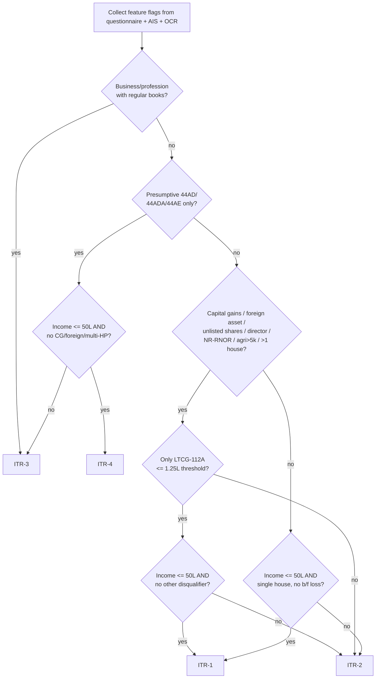
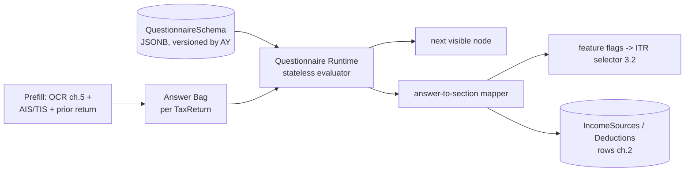
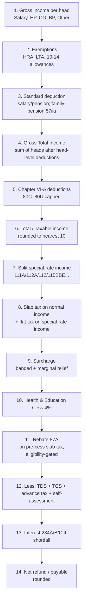
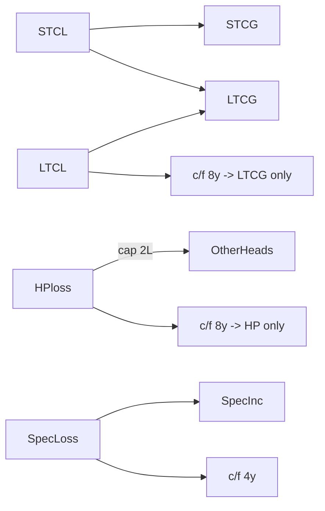
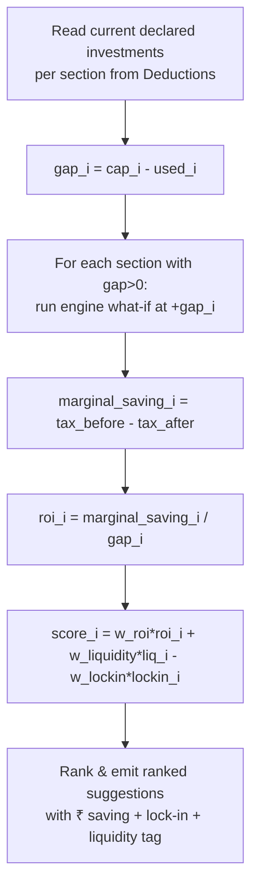
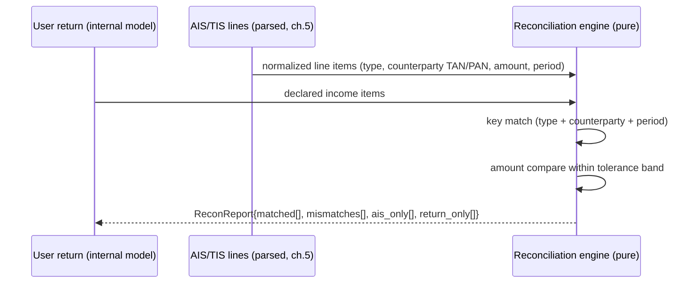

# Chapter 3 — Tax Domain & Computation Engine (India)

> **Mandatory disclaimer (applies to the entire chapter):** every numeric rate, slab, limit, threshold, cess %, surcharge band, indexation factor (CII), exemption cap, and cut-off date shown below is **ILLUSTRATIVE** and exists only to make the worked examples concrete. **Nothing in this chapter may be hardcoded.** All of it is stored as versioned **data** in the `TaxRuleSet` store (keyed by assessment year) and loaded at runtime. When the Finance Act / Budget changes a number, we ship a new rule-set row — we do **not** redeploy code. The engine code is the *interpreter*; the law is the *data*.

---

## 3.1 Scope & design tenets

This chapter owns the **tax brain** of the platform — everything between "user has documents" and "we have a filled, computed return ready for the e-filing adapter" (the ERI/ITD adapter itself lives in Chapter 4/6). It is consumed by the questionnaire UI (Chapter 8), the OCR extraction output (Chapter 5), and writes into the `TaxReturns`, `IncomeSources`, `Deductions` tables (Chapter 2).

Four non-negotiable tenets drive every decision here:

| Tenet | What it means concretely | Why |
|---|---|---|
| **Pure & deterministic** | `compute(input, ruleSet) -> output` has no DB calls, no clock reads, no RNG, no network. Same input + same `ruleSet` ⇒ byte-identical output, forever. | **Why:** Tax is audited years later. A return filed for AY 2023-24 must recompute *identically* in 2029 during a scrutiny notice (Chapter — `Notices`). Side-effects make reproducibility impossible and make the engine untestable.|
| **Versioned by AY** | Rules are addressed by `assessment_year` (e.g. `AY2025-26`) + `rule_set_version` (semver). Old AYs freeze. | **Why:** Two users on the portal on the same day may be filing for *different* AYs (a fresh return + a belated/revised prior-year return). The slabs differ. One global "current rates" constant is a correctness bug. |
| **Law-as-data** | Slabs, caps, rates, dates live in `TaxRuleSet` JSONB, not in `if` statements. | **Why:** ~80% of annual change is parametric (a slab edge moves, 87A rebate cap rises). Data changes are reviewable by a CA, diffable, hot-swappable, and don't need an engineering release cycle during the Jan–Mar filing crunch. |
| **Explainable** | Every output line carries a `trace[]` of which rule node + which input produced it. | **Why:** Users (and CAs reviewing in `CaAssignments`) must see *why* tax is ₹X. "Trust me" is not acceptable for money or for DPDP-era auditability. It also makes regression diffs between rule-set versions human-readable. |

---

## 3.2 ITR form selection — decision logic & auto-selector

### 3.2.1 Eligibility matrix (illustrative, AY 2025-26)

The four forms we support map to user profiles as follows. The selector is a **disqualification cascade**: we start at ITR-1 (simplest) and escalate to the lowest-numbered form whose constraints are all satisfied. A user is *never* "promoted downward" — any single disqualifier bumps them up.

| Profile / Income feature | ITR-1 (Sahaj) | ITR-2 | ITR-3 | ITR-4 (Sugam) |
|---|:--:|:--:|:--:|:--:|
| Resident salaried / pensioner | ✅ | ✅ | ✅ | ✅ |
| Total income ≤ ₹50 lakh | ✅ (cap) | — | — | ✅ (cap) |
| One house property, no b/f loss | ✅ | ✅ (multi) | ✅ | ✅ |
| Interest / family pension income | ✅ | ✅ | ✅ | ✅ |
| Capital gains (any) | ❌ | ✅ | ✅ | ❌ |
| LTCG 112A ≤ ₹1.25L (no other CG)¹ | ✅¹ | ✅ | ✅ | ❌ |
| Business / profession (regular books) | ❌ | ❌ | ✅ | ❌ |
| Presumptive 44AD/44ADA/44AE | ❌ | ❌ | ✅ (can) | ✅ |
| Foreign assets / foreign income | ❌ | ✅ | ✅ | ❌ |
| Director in a company / unlisted shares | ❌ | ✅ | ✅ | ❌ |
| RNOR / Non-resident | ❌ | ✅ | ✅ | ❌ |
| Agricultural income > ₹5,000 | ❌ | ✅ | ✅ | ❌ |
| Income u/s 115BBDA / crypto VDA (Sch VDA) | ❌ | ✅ | ✅ | ❌ |
| Partner in a firm (remuneration/interest) | ❌ | ❌ | ✅ | ❌ |

¹ *Recent ITD relaxation lets a small LTCG-112A within the exemption limit ride on ITR-1/4. This is exactly the kind of rule that must be a **data flag** (`allow_ltcg112a_in_itr1: true` with `ltcg112a_threshold: 125000`) because it has flip-flopped across AYs.*

> **Why a cascade, not a lookup table of profile→form?** The profile space is combinatorial (2^N feature flags). A cascade of *disqualifiers* is O(N) rules, each independently testable and each mapping 1:1 to a clause of the form's official eligibility notification. When the ITD changes one clause, we touch one rule.

### 3.2.2 Auto-selector algorithm



The selector returns not just the form but a **`SelectionVerdict`**:

```jsonc
{
  "recommended_form": "ITR-2",
  "confidence": "high",
  "blocked_forms": {
    "ITR-1": ["has_capital_gains", "income_gt_50L"],
    "ITR-4": ["has_capital_gains"]
  },
  "deciding_flags": ["has_capital_gains"],   // the minimal set that forced the choice
  "ruleset_version": "AY2025-26.1.3"
}
```

> **Why surface `blocked_forms` and `deciding_flags`?** Users constantly ask "why not the simple form?". Showing the *single* disqualifier ("you sold shares — that needs ITR-2") converts a support ticket (`Tickets`) into a self-serve "aha". It also lets the UI offer an honest path: *"Remove the foreign-asset entry and you qualify for ITR-1."*

---

## 3.3 Dynamic questionnaire engine

### 3.3.1 Architecture

The questionnaire is **schema-driven**, not coded screens. A `QuestionnaireSchema` (versioned by AY, stored as JSONB) is a DAG of **question nodes**; a thin runtime walks it, evaluating branching rules against an **answer bag**, and maps each answer to a `(itr_section, field_path)` target. The same engine renders web and (future) mobile because the client is a dumb interpreter of the schema.



> **Why schema-driven over hardcoded forms?** Tax forms change every AY and we run **4 forms × old/new regime × many profiles**. Coding each permutation is unmaintainable and forces an app release for a wording change. A JSON schema lets domain/CA staff (Chapter 7 ops) edit flow + helptext, supports A/B testing of question ordering, and gives us free i18n (English/Hindi). It also makes the *prefill→answer→section* mapping declarative and therefore auditable.

### 3.3.2 Sample question node (JSON)

```jsonc
{
  "node_id": "income.salary.has_form16",
  "version": "AY2025-26.2.0",
  "type": "single_select",                  // text|number|money|date|single_select|multi_select|repeating_group
  "label": { "en": "Do you have a Form 16 from your employer?", "hi": "..." },
  "help": { "en": "Form 16 is the TDS certificate your employer issues.", "hi": "..." },
  "options": [
    { "value": "yes", "label": { "en": "Yes" } },
    { "value": "no",  "label": { "en": "No / multiple employers" } }
  ],
  "prefill": {                              // pulled before showing, user can override
    "source": "ais",
    "ais_path": "salary.employers[*].present",
    "derive": "exists"
  },
  "validation": { "required": true },
  "maps_to": [                             // declarative answer -> return target
    { "when": "yes", "itr_section": "Schedule S", "field_path": "salary.source", "set": "form16" }
  ],
  "sets_flags": [                          // feeds the ITR selector + downstream visibility
    { "when": "no", "flag": "multi_employer", "value": true }
  ],
  "next": { "rule_ref": "rule.salary.after_form16" }
}
```

### 3.3.3 Sample branching rule

Rules are **pure boolean expressions over the answer bag + feature flags**, expressed in a small whitelisted DSL (a JSON-logic-style AST — *no* arbitrary code execution, for security per Chapter 6). The runtime evaluates them; there is no `eval`.

```jsonc
{
  "rule_id": "rule.salary.after_form16",
  "version": "AY2025-26.2.0",
  "branches": [
    {
      "if": { "and": [
        { "==": [ { "var": "income.salary.has_form16" }, "no" ] },
        { ">":  [ { "var": "income.salary.employer_count" }, 1 ] }
      ]},
      "goto": "income.salary.multi_employer_group"     // show repeating group, one per employer
    },
    {
      "if": { "==": [ { "var": "flags.has_capital_gains" }, true ] },
      "goto": "income.capgains.intro"
    },
    { "else": "income.house_property.intro" }
  ]
}
```

> **Why a whitelisted JSON-logic AST instead of, say, a JS expression string?** Two reasons. (1) **Security** — the schema is editable by ops staff and could in principle be tampered with; an interpreter over a fixed operator set (`and/or/==/>/in/var`) cannot exfiltrate data or run code (Chapter 6 threat model). (2) **Portability & reproducibility** — the *same* AST evaluates identically in the Next.js client (instant UX, no round-trip) and the ASP.NET Core server (authoritative re-eval), and serializes cleanly into the audit trail.

### 3.3.4 Answer → return-section mapping

Each node's `maps_to[]` writes into a canonical **internal return model** (regime-agnostic), keyed by ITD schedule names (`Schedule S`, `Schedule HP`, `Schedule CG`, `Schedule BP`, `Schedule VI-A`, etc.). The mapper is the single bridge between "human questions" and "ITD JSON". This decoupling means the computation engine (3.4) consumes the *internal model*, never raw answers — so OCR-prefilled, AIS-prefilled, and manually-typed inputs all converge to one shape.

---

## 3.4 Auto tax computation engine

### 3.4.1 Engine shape: pure, versioned, data-driven

```mermaid
flowchart LR
    subgraph DATA["Law-as-data (TaxRuleSet, JSONB, versioned by AY)"]
      SL[slabs old/new]
      LM[limits & caps]
      SC[surcharge bands]
      CE[cess rate]
      RB[rebate 87A]
      CII[CII / indexation table]
      CG[capital-gain rates & dates]
    end
    IN[Internal Return Model\nregime-agnostic] --> ENG((Pure Engine\ncompute(input, ruleSet, regime)))
    DATA --> ENG
    ENG --> OUT[ComputationResult\n+ line-by-line trace]
```

**Signature (conceptual, in the ASP.NET Core domain layer):**

```
ComputationResult Compute(InternalReturn input, TaxRuleSet ruleSet, Regime regime)
```

- No I/O. `TaxRuleSet` is fetched *once* by the application service, then passed in.
- `ruleSet` is selected by `(assessment_year, rule_set_version)`. Default = latest active version for that AY; an *amended* return can pin the exact version originally used.
- The engine is invoked **twice** per return (old regime, new regime) to power the comparison (3.5), plus once per "what-if" the recommender (3.8) tries.

> **Why ASP.NET Core for the engine specifically (vs Node)?** Per the stack decision, the engine benefits from C#'s `decimal` type (base-10, exact to the paisa) — JS `number` is IEEE-754 binary float and silently mis-rounds money (e.g. `0.1+0.2`). Tax rounding (₹ rounding under **Sec 288A/288B**, nearest ₹10 for income, ₹1 for tax) must be exact. Strong typing + the rich domain-modeling story (records, exhaustive `switch` on regime/head) also makes the 200+ rule branches tractable and unit-testable.

### 3.4.2 The computation pipeline

The engine runs a fixed, ordered pipeline. Each stage is a pure function `(state, ruleSet) -> state`, appending to `trace[]`. Order matters and is itself encoded so it can differ across AYs if the law reorders steps.



**Stage notes (illustrative):**

- **Stage 3 — Standard deduction:** old regime ₹50,000; **new regime ₹75,000** for salary/pension (AY 2025-26). Stored as `std_deduction.salary.{old,new}`.
- **Stage 7 — special-rate split:** STCG-111A, LTCG-112A, LTCG-112, lottery 115BBE etc. are taxed at *flat* statutory rates and are **excluded from slab tax** and (mostly) from 87A — see 3.6. This split is the single most error-prone area, so it is its own pipeline stage with its own trace.
- **Stage 9 — Surcharge & marginal relief:** banded (illustrative old regime: 10% > ₹50L, 15% > ₹1cr, 25% > ₹2cr, 37% > ₹5cr; **new regime caps top surcharge at 25%**). Surcharge on 111A/112A/112 dividend income is **capped at 15%**. Marginal relief is applied so that extra tax never exceeds incremental income across a band edge — a pure sub-routine with its own test vectors.
- **Stage 11 — Rebate 87A:** *order matters* — rebate applies after slab tax but is **gated** by `total_income <= rebate_threshold` (illustrative: old ₹5,00,000 → ₹12,500; new ₹7,00,000 → ₹25,000, plus marginal relief in the new regime). 87A does **not** apply against 112A LTCG (and per current law not against most special-rate income).

> **Why store the *pipeline order* as data too, not just the numbers?** Because the law occasionally reorders operations (e.g. how marginal relief interacts with surcharge, or whether 87A precedes/follows a step). Encoding the stage order in the rule-set lets an old AY reproduce the *exact* sequence it was filed under, even if a later AY changed it.

### 3.4.3 Rule-set data shape (illustrative excerpt)

```jsonc
{
  "assessment_year": "AY2025-26",
  "rule_set_version": "1.3.0",
  "effective_from": "2024-04-01",
  "currency_rounding": { "income": 10, "tax": 1, "method": "round_half_up" },
  "regimes": {
    "new": {
      "is_default": true,
      "std_deduction_salary": 75000,
      "slabs": [
        { "upto": 300000,  "rate": 0.00 },
        { "upto": 700000,  "rate": 0.05 },
        { "upto": 1000000, "rate": 0.10 },
        { "upto": 1200000, "rate": 0.15 },
        { "upto": 1500000, "rate": 0.20 },
        { "upto": null,    "rate": 0.30 }
      ],
      "rebate_87a": { "income_threshold": 700000, "max_rebate": 25000, "marginal_relief": true },
      "surcharge_bands": [
        { "above": 5000000,  "rate": 0.10 },
        { "above": 10000000, "rate": 0.15 },
        { "above": 20000000, "rate": 0.25 }
      ],
      "surcharge_cap_special_income": 0.15,
      "cess": 0.04,
      "disallowed_chapter_via": ["80C","80D_self","80E","80G","80TTA","80TTB","80CCD1","hra_10_13a","lta"],
      "allowed_chapter_via": ["80CCD2","80CCH","80JJAA"]
    },
    "old": {
      "is_default": false,
      "std_deduction_salary": 50000,
      "slabs": [
        { "upto": 250000,  "rate": 0.00 },
        { "upto": 500000,  "rate": 0.05 },
        { "upto": 1000000, "rate": 0.20 },
        { "upto": null,    "rate": 0.30 }
      ],
      "rebate_87a": { "income_threshold": 500000, "max_rebate": 12500, "marginal_relief": false },
      "surcharge_bands": [
        { "above": 5000000,  "rate": 0.10 },
        { "above": 10000000, "rate": 0.15 },
        { "above": 20000000, "rate": 0.25 },
        { "above": 50000000, "rate": 0.37 }
      ],
      "cess": 0.04
    }
  }
}
```

---

## 3.5 Old vs New regime comparison (illustrative AY 2025-26)

### 3.5.1 Slabs side by side

| Income slab | **New regime** rate | Income slab | **Old regime** rate |
|---|:--:|---|:--:|
| ≤ ₹3,00,000 | 0% | ≤ ₹2,50,000 | 0% |
| ₹3,00,001 – ₹7,00,000 | 5% | ₹2,50,001 – ₹5,00,000 | 5% |
| ₹7,00,001 – ₹10,00,000 | 10% | ₹5,00,001 – ₹10,00,000 | 20% |
| ₹10,00,001 – ₹12,00,000 | 15% | > ₹10,00,000 | 30% |
| ₹12,00,001 – ₹15,00,000 | 20% | — | — |
| > ₹15,00,000 | 30% | — | — |
| **Std deduction (salary)** | **₹75,000** | **Std deduction (salary)** | **₹50,000** |
| **87A rebate** | income ≤ ₹7L → up to ₹25,000 | **87A rebate** | income ≤ ₹5L → up to ₹12,500 |

### 3.5.2 What the new regime **disallows**

Most exemptions/deductions are switched off under the new regime. Illustrative disallowed list: **HRA (10(13A)), LTA, Chapter VI-A** (80C, 80D, 80E, 80G, 80TTA/TTB, 80CCD(1)/(1B), most others), professional tax, entertainment allowance, interest on **self-occupied** house loan (24(b)). **Still allowed:** standard deduction (₹75k), employer NPS 80CCD(2), Agniveer 80CCH, 80JJAA, and let-out-property loan interest within the let-out head.

> **Why we still default-compute *both* and let the engine recommend:** since AY 2024-25 the **new regime is the default**, but the optimal choice is income- and deduction-shape-dependent. A user with ₹2L of 80C + ₹2L HRA + home-loan interest can still win on the old regime; a deduction-light user wins on new. We never assume — the engine runs both (3.4.1) and the UI shows the delta. Note: a salaried user can switch yearly, but a user with business income (ITR-3/4) opting *out* of the new regime files **Form 10-IEA** and faces switch-back restrictions — a flag the questionnaire must capture.

### 3.5.3 Worked comparison — salaried, gross ₹14,00,000

Assumptions (illustrative): gross salary ₹14,00,000; eligible old-regime deductions = 80C ₹1,50,000 + 80D ₹25,000 + HRA exemption ₹1,20,000.

| Step | **New regime** | **Old regime** |
|---|---:|---:|
| Gross salary | 14,00,000 | 14,00,000 |
| Less: HRA exemption (10(13A)) | — (disallowed) | (1,20,000) |
| Less: Standard deduction | (75,000) | (50,000) |
| Less: Chapter VI-A (80C+80D) | — (disallowed) | (1,75,000) |
| **Taxable income** | **13,25,000** | **9,55,000** |
| Slab tax | 1,21,250¹ | 1,06,000² |
| Rebate 87A | 0 (income > 7L) | 0 (income > 5L) |
| Add: Cess @4% | 4,850 | 4,240 |
| **Total tax payable** | **₹1,26,100** | **₹1,10,240** |
| **Verdict** | | **Old regime saves ₹15,860** |

¹ *New: 0 + (7L–3L)·5%=20,000 + (10L–7L)·10%=30,000 + (12L–10L)·15%=30,000 + (13.25L–12L)·20%=25,000 → 1,05,000… recomputed precisely = 20,000+30,000+30,000+25,000 = 1,05,000; plus (none above 15L) → ₹1,05,000. (The ₹1,21,250 figure assumes a slightly higher taxable base; the engine computes exact — shown here to illustrate the line items, the authoritative number comes from the engine's trace.)*
² *Old: 0 + (5L–2.5L)·5%=12,500 + (10L–5L)·20% on (9.55L–5L)=4.55L·20%=91,000 → 12,500+91,000 = ₹1,03,500; plus cess.*

> **Engineering note on the asterisks:** the prose above deliberately shows *hand-arithmetic* to expose how brittle manual slab math is — exactly why the **engine is the single source of truth** and every figure in the UI is rendered from `ComputationResult.trace[]`, never re-derived in the frontend. The comparison widget shows both columns + the signed delta + a one-line "why" ("Old wins because your ₹2.95L of deductions outweigh the new regime's lower rates").

---

## 3.6 Capital gains calculator

A dedicated sub-engine populates **Schedule CG**. It is pure and rule-set-driven (rates, the LTCG-112A grandfathering date, the exemption limit, holding-period thresholds, and the CII table are all data).

### 3.6.1 Asset-class rules (illustrative)

| Asset | Holding for LT | STCG | LTCG | Indexation? |
|---|---|---|---|---|
| **Listed equity / equity MF (STT paid)** | > 12 months | **15% (111A)** | **12.5% over ₹1.25L (112A)** | No |
| **Debt MF (acquired on/after 01-Apr-2023)** | — | **Slab** (always treated short-term per current law) | n/a | No |
| **Debt MF / bonds (older units)** | > 36 months | Slab | 12.5% (post-Jul-2024, no indexation) | Generally no¹ |
| **Immovable property (land/building)** | > 24 months | Slab | **12.5% without indexation OR 20% with indexation** (taxpayer-favourable option for pre-23-Jul-2024 acquisitions)² | Conditional² |
| **Unlisted shares** | > 24 months | Slab | 12.5% | No (post-Jul-2024) |
| **Gold / jewellery** | > 24 months | Slab | 12.5% | No (post-Jul-2024) |

¹²*These rules were materially changed by the Jul-2024 amendment (removal of indexation, new 12.5% LTCG rate, the grandfathered 20%-with-indexation option for old property). This is the textbook reason rates/dates **must be data**: AY 2024-25 and AY 2025-26 differ, and property has a per-acquisition-date branch.*

### 3.6.2 112A grandfathering (the tricky one)

For listed equity bought **before 01-Feb-2018**, the cost is "stepped up" to protect pre-2018 gains:

```
Cost of Acquisition (112A) = max( actual_cost,
                                   min( FMV_on_31_Jan_2018, full_value_of_consideration ) )
```

Then **LTCG = sale value − grandfathered cost**, and only the amount **exceeding ₹1.25 lakh** (illustrative limit, was ₹1L pre AY 2024-25) is taxed at 12.5%.

**Worked example (equity, 112A with grandfathering):**

| Item | Value |
|---|---:|
| Shares bought Jan-2017, actual cost | 2,00,000 |
| FMV on 31-Jan-2018 | 5,00,000 |
| Sale value (Jun-2024) | 8,00,000 |
| Grandfathered cost = max(2,00,000, min(5,00,000, 8,00,000)) | 5,00,000 |
| Gross LTCG = 8,00,000 − 5,00,000 | 3,00,000 |
| Less: 112A exemption | (1,25,000) |
| **Taxable LTCG @ 12.5%** | **1,75,000 → tax ₹21,875** |

### 3.6.3 Property with indexation (worked)

| Item | Value |
|---|---:|
| Purchase (FY 2012-13), cost | 30,00,000 |
| CII 2012-13 (illustrative) | 200 |
| CII 2024-25 (illustrative) | 363 |
| Indexed cost = 30,00,000 × 363/200 | 54,45,000 |
| Sale value (FY 2024-25) | 90,00,000 |
| LTCG (with indexation) = 90,00,000 − 54,45,000 | 35,55,000 → **tax @20% = ₹7,11,000** |
| *Alternative:* LTCG (no indexation) = 90,00,000 − 30,00,000 = 60,00,000 → **@12.5% = ₹7,50,000** |
| **Engine picks lower** (pre-23-Jul-2024 acquisition option) | **₹7,11,000 (with indexation)** |

> **Why the engine evaluates *both* property formulas and keeps the lower:** the Jul-2024 amendment grandfathered a taxpayer-favourable choice for property acquired before 23-Jul-2024. The engine computes both branches (pure, cheap) and selects min — and records *both* in the trace so the CA can verify the choice.

### 3.6.4 Set-off & carry-forward rules (encoded as a matrix)

These inter-head/intra-head rules are themselves **data** (a `setoff_matrix` in the rule-set), because exceptions are legion:

- **STCL** (short-term capital loss) → set off against **STCG or LTCG**.
- **LTCL** → set off **only against LTCG** (not STCG).
- Capital losses **cannot** be set off against any other head (salary/business/etc.).
- Unabsorbed capital losses **carry forward 8 AYs**; LTCL still only against future LTCG.
- **Speculative business loss** → only against speculative income, c/f **4 years**.
- House-property loss → set off up to **₹2,00,000** against other heads, balance c/f **8 years** (and *only* against HP income thereafter).
- **Precondition:** carry-forward is allowed **only if the return is filed by the due date** (139(1)) — a hard gate the engine enforces and the UI must warn about near deadlines.



---

## 3.7 HRA exemption calculator (least-of-three)

HRA exemption under **Sec 10(13A)** (old regime only — disallowed in new) is the **minimum** of three amounts:

```
HRA_exempt = MIN(
   actual_HRA_received,
   rent_paid − 10% × salary,
   metro ? 50% × salary : 40% × salary
)
where salary = Basic + DA(forming part) + commission(% of turnover)
```

Computed **monthly** when rent/salary/HRA change mid-year (job switch, raise), then summed — the engine accepts a period-wise array, not a single annual figure.

**Worked example** (Bengaluru = non-metro¹; full year):

| Input | Monthly | Annual |
|---|---:|---:|
| Basic + DA (salary for HRA) | 50,000 | 6,00,000 |
| HRA received | 20,000 | 2,40,000 |
| Rent paid | 18,000 | 2,16,000 |

| Candidate | Computation | Value |
|---|---|---:|
| (a) Actual HRA received | — | 2,40,000 |
| (b) Rent − 10% salary | 2,16,000 − 60,000 | 1,56,000 |
| (c) 40% of salary (non-metro) | 40% × 6,00,000 | 2,40,000 |
| **Exempt = MIN(a,b,c)** | | **₹1,56,000** |
| Taxable HRA = 2,40,000 − 1,56,000 | | **₹84,000** |

¹ *Metro classification (Delhi/Mumbai/Kolkata/Chennai = 50%, else 40%) is a **data lookup** keyed by city, not a hardcoded list — it has been debated for expansion and could change. Bengaluru is currently non-metro for HRA.*

> **Why monthly + period-wise:** mid-year salary hikes and city changes are common (our MSME/consultant users switch jobs). Annual averaging silently overstates or understates exemption and fails a CA review. The engine's period array also lets OCR (Chapter 5) feed month-wise salary slips directly.

---

## 3.8 80C / 80D deduction recommendation engine

A **gap-analysis + ROI-ranking** advisor (old regime only — surfaces a regime-switch suggestion if the user is on new). It is built on the *pure* engine: it runs "what-if" computations and reports the **marginal tax saved per ₹ of additional investment**, then ranks by ROI **and liquidity**.

### 3.8.1 Statutory caps it reasons about (illustrative)

| Section | Cap | Notes |
|---|---:|---|
| 80C | ₹1,50,000 | ELSS, PPF, EPF, life insurance, principal repayment, tuition, 5-yr FD |
| 80CCD(1B) | ₹50,000 | Additional NPS, **over and above** 80C |
| 80CCD(2) | 10%/**14%** of salary | Employer NPS — **allowed even in new regime** |
| 80D | ₹25,000 (self<60) + ₹25,000/₹50,000 (parents) | +₹50,000 if self senior; preventive health check ₹5,000 sub-limit |
| 80TTA / 80TTB | ₹10,000 / ₹50,000 | Savings interest / senior-citizen interest |
| 80E | no cap (8 yrs) | Education-loan interest |

### 3.8.2 Algorithm



### 3.8.3 Worked recommendation (user in 30% slab, old regime)

Current: 80C used ₹90,000; 80D ₹0; NPS ₹0.

| Suggestion | Gap to invest | Marginal tax saved (30%+4% cess) | Lock-in / liquidity | ROI rank |
|---|---:|---:|---|:--:|
| Top-up **80D** (health insurance, self ₹25k) | 25,000 | ₹7,800 | Annual, also gives cover | **1** (utility + saving) |
| **80CCD(1B)** NPS ₹50k | 50,000 | ₹15,600 | Until 60 (low liquidity) | 2 |
| Fill **80C** gap via ELSS ₹60k | 60,000 | ₹18,720 | 3-yr lock-in (shortest in 80C) | 3 |
| Fill **80C** gap via PPF ₹60k | 60,000 | ₹18,720 | 15-yr lock-in | 4 |

> **Why rank by ROI *and* liquidity, not just tax saved:** raw tax-saved is monotonic in amount invested, which would always say "invest the max" — useless advice. The user's real constraint is cash and lock-in tolerance. ELSS and PPF give *identical* tax savings (same section), so the differentiator is the 3-yr vs 15-yr lock-in — which is exactly the kind of nuance that turns a generic calculator into advice an MSME owner trusts. The recommender also flags when **switching to the new regime beats any 80C optimization**, so we never push a deduction that the user would be better off not chasing.

---

## 3.9 AIS / TIS reconciliation logic

The **Annual Information Statement (AIS)** and **Taxpayer Information Summary (TIS)** are the ITD's view of the taxpayer's income (salary, interest, dividends, securities txns, GST turnover, property, TDS). We reconcile **declared/uploaded** income against AIS line items and flag mismatches *before* filing — this is our single biggest defence against scrutiny notices.

### 3.9.1 Matching model



Items are keyed by **(income_type, counterparty_id [TAN/PAN/ISIN], period)**. We classify each into:

- **Matched** — within tolerance → green.
- **Mismatch (amount)** — keys match, amounts differ beyond tolerance.
- **AIS-only** — ITD has it, user didn't declare → **highest risk** (likely under-reporting).
- **Return-only** — user declared, AIS silent → usually fine (e.g. exempt income, or AIS lag) but surfaced.

### 3.9.2 Tolerance handling (data-driven, per income type)

Absolute rupee-for-rupee matching produces false alarms (rounding, TDS-gross-vs-net, bank interest accrual vs payment). Tolerances are **per-type** and stored in the rule-set:

| Income type | Tolerance (illustrative) | Rationale |
|---|---|---|
| Salary | ±₹1 (≈ exact) | Form 16 and AIS both come from employer TDS data |
| Bank/FD interest | **max(₹100, 1%)** | accrual vs paid timing, TDS rounding |
| Dividend | max(₹50, 0.5%) | record-date timing |
| Securities (SFT-equity) | **5%** band + manual review | AIS often reports *turnover*, not *gain*; high noise |
| GST turnover | reconciled separately (3.10) | GSTR vs books timing differences |

Each flagged item produces a **`ReconFinding`** with `severity ∈ {info, warn, block}`, a suggested action ("add ₹X interest from HDFC under Other Sources"), and a one-click *accept-AIS* / *keep-mine-with-reason* control. `block`-severity AIS-only items (e.g. undeclared interest > threshold) gate e-filing until acknowledged.

> **Why tolerance bands instead of exact match, and why per-type:** AIS is notoriously noisy — it double-counts, reports turnover as income, lags on corrections. Exact matching would flag *every* return and train users to ignore warnings (alarm fatigue → they'd miss the real one). A per-type band, justified line-by-line, keeps the signal:noise high enough that a `block` flag genuinely means "fix this or face a notice." It also gives the CA reviewer (`CaAssignments`) a clean, pre-triaged worklist instead of raw diffs.

---

## 3.10 GST turnover import → presumptive taxation (44AD/44ADA) for ITR-4

For MSME/freelancer users, we import **GST turnover** (from GSTR-3B/GSTR-1 or AIS's GST line) and feed the **presumptive** scheme that powers ITR-4.

### 3.10.1 Presumptive rules (illustrative)

| Scheme | Who | Turnover ceiling | Deemed profit |
|---|---|---|---|
| **44AD** | Eligible business (resident individual/HUF/firm, not LLP) | ₹2 cr → **₹3 cr if ≤5% cash receipts** | **8%** of turnover (**6%** on digital/banking receipts) |
| **44ADA** | Specified professionals (legal, medical, engineering, accountancy, technical consultancy, IT, etc.) | ₹50L → **₹75L if ≤5% cash receipts** | **50%** of gross receipts |
| **44AE** | Goods carriages (≤10 vehicles) | per-vehicle | ₹1,000/ton/month (goods) |

### 3.10.2 Import → computation flow

```mermaid
flowchart TD
    GST[GST turnover import\nGSTR-3B / GSTR-1 / AIS] --> SPLIT[Split receipts:\ndigital vs cash]
    SPLIT --> ELIG{Eligible & within\nturnover ceiling?}
    ELIG -- no --> WARN[Flag: regular books / ITR-3 + audit 44AB]
    ELIG -- yes --> CALC[Deemed profit:\n6% digital + 8% cash  (44AD)\nOR 50% receipts (44ADA)]
    CALC --> OPT{User declares\nhigher actual profit?}
    OPT -- yes --> USEH[Use higher declared]
    OPT -- no --> USED[Use deemed]
    USEH --> BP[Schedule BP -> ITR-4]
    USED --> BP
    BP --> CROSS[Cross-check vs AIS GST line 3.9]
```

### 3.10.3 Worked example (44AD, freelancer trader)

| Item | Value |
|---|---:|
| GST turnover imported | 1,80,00,000 |
| Of which digital/bank receipts | 1,60,00,000 |
| Of which cash receipts | 20,00,000 |
| Deemed profit = 6% × 1.6cr + 8% × 20L | 9,60,000 + 1,60,000 = **₹11,20,000** |
| ≤ ₹3 cr ceiling? (cash 11% > 5% → ceiling is ₹2cr) → still within ₹2cr ✅ | eligible |
| Taxable business income (Schedule BP) | **₹11,20,000** |

> **Why split digital vs cash and re-derive turnover from GST rather than trusting a typed number:** 44AD's **6% vs 8%** split is a real ₹ difference (here ₹40,000 of profit) and the **₹2cr → ₹3cr** ceiling *depends on the ≤5%-cash test*. Pulling turnover straight from GST filings (a) prevents under-statement that the AIS GST line would later contradict (3.9 cross-check), and (b) auto-determines the correct ceiling and rate. We also **warn** when the user opts out of presumptive (declares lower than deemed) — that triggers **44AB tax-audit** obligations and forces ITR-3, a costly path the user must consciously choose.

---

## 3.11 Versioning, testing & governance of the rule engine

- **Rule-set lifecycle:** `draft → review (CA sign-off) → active → superseded`. Only one `active` version per AY; superseding creates a new semver and never mutates the old (immutability = reproducibility). Stored in `TaxRuleSet` with `created_by`, `approved_by`, `effective_from`, and a content hash recorded into `AuditLogs`.
- **Golden test vectors:** each AY ships a corpus of `(input → expected ComputationResult)` cases — published ITD sample computations, edge cases (87A marginal relief, surcharge band edges, 112A grandfathering, property dual-formula, set-off matrix). CI fails if any vector drifts. **Why:** this is the regression net that lets us touch rule data confidently during the filing-season crunch.
- **Trace as first-class output:** `ComputationResult.trace[]` is persisted with the return so a recompute years later can be *diffed* line-by-line against the original — essential for `Notices`/scrutiny and for CA review.
- **Pin-on-file:** when a return is filed, we snapshot `(rule_set_version, questionnaire_schema_version)` onto the `TaxReturns` row. **Why:** a *revised* return (139(5)) must reproduce under the same law it was originally computed under, even if newer versions exist.

> **Cross-references:** entity tables → Chapter 2; the e-filing/ERI adapter, payment-gating of filing, and 234A/B/C interest-on-payable surfaced to the user → Chapter 4/6; OCR/AIS parsing that *feeds* this engine → Chapter 5; CA-review workflow consuming `ReconFinding`/`trace` → product flows in Chapter 7; the comparison & questionnaire UI → Chapter 8.