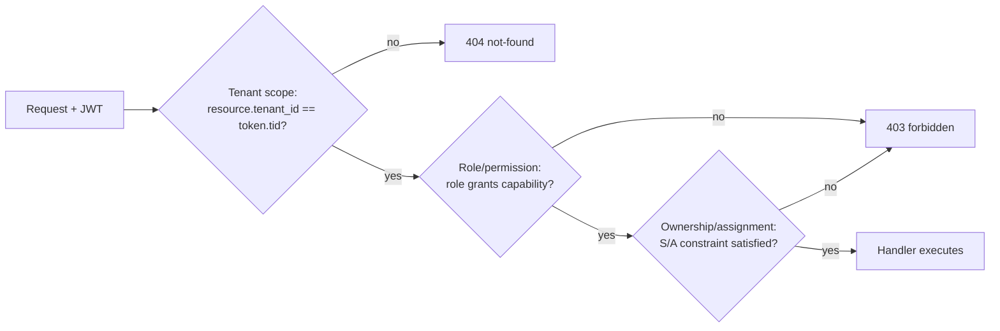

# Chapter 4 — API Design, Authentication & RBAC

This chapter specifies the externally-facing contract of the TallyG Tax Portal: every REST endpoint, how callers authenticate, how authorization is enforced across tenants and roles, and the cross-cutting conventions (pagination, idempotency, rate limits, errors) that every endpoint obeys. The implementation is ASP.NET Core Web API (see Chapter 1); the persistence model and entity names referenced here are defined in Chapter 2; tax-computation endpoints delegate to the engine in Chapter 3.

**Why ASP.NET Core for the API tier (vs Node.js):** the tax-compute and money paths are CPU-bound and correctness-critical. Statically-typed C# with `decimal` (true base-10 fixed point) eliminates an entire class of floating-point rounding defects that JS `number` invites on `NUMERIC(14,2)` money, and Kestrel + minimal-API/controllers gives first-class structured logging, model validation, and `IProblemDetails` out of the box. Node is retained only for the OCR/streaming workers (Chapter 5) where the ecosystem is stronger.

---

## 4.1 API Surface Conventions

| Concern | Decision |
|---|---|
| Base path | `/api/v1` — version in path, not header. **Why:** trivially cacheable, visible in logs, lets us run v1/v2 side-by-side during ITD schema migrations across assessment years. |
| Style | Resource-oriented REST, plural nouns (`/returns`, `/documents`). Verbs only for non-CRUD actions as sub-resources (`/returns/{id}:submit`). |
| Format | JSON only (`application/json`); file upload via `multipart/form-data`; file download streams `application/octet-stream` or `application/pdf`. |
| Casing | JSON `camelCase` on the wire; maps to PascalCase C# DTOs and snake_case SQL (Chapter 2). |
| Dates | ISO-8601 UTC (`2025-07-31T18:30:00Z`). AY expressed as string `"2025-26"`; FY derived server-side (Apr 1–Mar 31). |
| Money | String-serialized decimals (`"125000.00"`) to preserve `NUMERIC(14,2)` precision across JS clients. **Why:** JSON numbers are IEEE-754 doubles; a string round-trips paise exactly. |
| Auth | `Authorization: Bearer <jwt>` for mobile/server; httpOnly cookie pair for the Next.js web SPA (see §4.7). |
| Tenancy | `tenant_id` is **never** a client-supplied body/query field; it is derived from the token. Cross-tenant access is impossible by construction. |

### Standard response envelope

Every **success** (2xx) response uses one envelope so clients have a single parse path:

```jsonc
// Single resource
{ "data": { "id": "…", "type": "taxReturn", … }, "meta": { "correlationId": "01J…" } }

// Collection
{
  "data": [ … ],
  "meta": {
    "correlationId": "01J…",
    "pagination": { "page": 1, "pageSize": 25, "totalItems": 312, "totalPages": 13, "hasNext": true }
  }
}
```

**Errors** do **not** use this envelope — they use RFC 7807 `application/problem+json` (§4.6). **Why split:** mixing success and error shapes forces clients to branch on a `success: bool` flag; HTTP status + a dedicated problem media type is the standards-compliant, framework-native (`ProblemDetails`) path and is understood by API gateways and observability tools.

### Pagination, filtering, sorting

- **Pagination:** default `?page=1&pageSize=25`, `pageSize` max **100** (hard cap; 422 above). Cursor pagination (`?cursor=…`) offered on append-only high-volume reads (`/audit-logs`, `/notifications`). **Why offer both:** offset is fine for human-browsed admin grids; cursor avoids skip-cost and duplicate/skipped rows on the large, constantly-growing audit and notification streams.
- **Filtering:** explicit whitelisted params per resource, e.g. `GET /returns?ay=2025-26&status=submitted&itrType=ITR-3`. A generic `filter[field]=op:value` grammar (`gte`, `lte`, `like`, `in`) is allowed only on admin/CRM list endpoints. **Why whitelist:** prevents arbitrary-column query injection and uncontrolled table scans on un-indexed columns.
- **Sorting:** `?sort=-createdAt,lastName` (leading `-` = desc). Only indexed columns are sortable; others → `422 invalid-sort-field`.

### Idempotency (mutations & payments)

- All `POST` that create money movement or external side-effects (`/payments`, `/payments/{id}/refund`, `/returns/{id}:submit` to ITD, `/wallet/transactions`) **require** an `Idempotency-Key` header (client-generated UUID/ULID).
- Server stores `(tenant_id, idempotency_key, request_fingerprint, response_snapshot, status)` for **24h**. Replays with the same key + same body → original response (same status). Same key + **different** body → `422 idempotency-key-reused`.
- **Why:** Razorpay/Cashfree webhooks and flaky mobile networks cause retries; without keys a user could be charged twice or a return double-submitted to the Income Tax Department. This is the single most important reliability control on the money path.

### Rate limiting

ASP.NET Core fixed/sliding-window limiter, partitioned by principal then IP:

| Bucket | Limit | Applies to |
|---|---|---|
| `otp-request` | 5 / 10 min / mobile+IP, hard daily cap 15 | `/auth/otp/request` |
| `otp-verify` | 5 attempts / OTP, then OTP invalidated | `/auth/otp/verify` |
| `auth-sensitive` | 20 / min / IP | login, refresh, password reset |
| `authenticated` | 600 / min / user | general API |
| `anonymous` | 60 / min / IP | public marketing/calc endpoints |
| `upload` | 30 / min / user | `/documents` upload |

Responses include `RateLimit-Limit`, `RateLimit-Remaining`, `RateLimit-Reset`; breach → `429` problem with `Retry-After`. **Why per-OTP attempt caps:** OTP brute-force is the highest-probability attack on an Indian fintech onboarding flow; 6-digit OTP × 5 attempts keeps guess probability at 5/10⁶.

### Correlation / request IDs

- Gateway injects `X-Correlation-Id` (ULID) if absent; echoed in every response, every log line, and every `problem+json` (`correlationId`). A second `X-Request-Id` identifies the single hop.
- **Why ULID over UUIDv4:** lexicographically sortable by time — log search and DB clustering on correlation become range scans, not random lookups.

---

## 4.2 Endpoint Catalog

Notation: `🔓` public/anonymous, `🔑` requires access token, `🛡️` requires elevated role (see matrix §4.5). All paths prefixed `/api/v1`.

### Auth (`/auth`)
| Method & Path | Purpose |
|---|---|
| 🔓 `POST /auth/register` | Create User + provision/attach Tenant; returns pending-verification state |
| 🔓 `POST /auth/otp/request` | Send OTP to mobile or email (`{channel, identifier, purpose}`; purposes: `login`,`register`,`reset`,`add-channel`) |
| 🔓 `POST /auth/otp/verify` | Verify OTP; on success issues token pair (or marks channel verified) |
| 🔓 `POST /auth/login/password` | Optional password login (CA/Ops/Admin); always 2FA-gated |
| 🔑 `POST /auth/token/refresh` | Rotate refresh token, issue new access (see §4.4) |
| 🔑 `POST /auth/logout` | Revoke current session/refresh token |
| 🔑 `POST /auth/logout/all` | Revoke all sessions for the user (global sign-out) |
| 🔓 `POST /auth/password/forgot` | Begin reset (OTP/email link) |
| 🔓 `POST /auth/password/reset` | Complete reset with reset token |
| 🔑 `GET /auth/sessions` | List active devices/sessions |
| 🔑 `DELETE /auth/sessions/{id}` | Revoke a specific session/device |
| 🔑 `GET /auth/me` | Current principal: user, tenant, roles, permissions, feature flags |

### Users & Profile (`/users`, `/me`)
| Method & Path | Purpose |
|---|---|
| 🔑 `GET /me` | Own profile |
| 🔑 `PATCH /me` | Update own profile (name, address, preferences) |
| 🔑 `POST /me/pan` | Submit/replace PAN (stored encrypted, returned masked `ABCDE****F`) |
| 🔑 `POST /me/pan:verify` | Verify PAN via ITD/NSDL lookup |
| 🔑 `GET /me/bank-accounts` · `POST` · `DELETE /{id}` | Manage refund bank accounts |
| 🔑 `POST /me/bank-accounts/{id}:prevalidate` | Pre-validate account with ITD (refund prerequisite) |
| 🛡️ `GET /users` | Tenant/Admin: list users (filter by role, status) |
| 🛡️ `GET /users/{id}` · `PATCH /users/{id}` | Read/update a user (scope-checked) |
| 🛡️ `POST /users/{id}:deactivate` / `:reactivate` | Soft-disable (sets `deleted_at` / clears) |
| 🛡️ `POST /users/{id}/roles` · `DELETE /users/{id}/roles/{role}` | Grant/revoke roles |

### Tax Returns (`/returns`)
| Method & Path | Purpose |
|---|---|
| 🔑 `GET /returns` | List own (or scoped) returns; filter `ay`, `status`, `itrType` |
| 🔑 `POST /returns` | Create a draft return (`{ay, itrType?}`; type may be auto-suggested) |
| 🔑 `GET /returns/{id}` | Full return detail (income, deductions, computation snapshot) |
| 🔑 `PATCH /returns/{id}` | Update draft fields |
| 🔑 `DELETE /returns/{id}` | Soft-delete a draft |
| 🔑 `POST /returns/{id}:suggest-type` | AI/rule suggestion of ITR-1/2/3/4 from sources |
| 🔑 `GET /returns/{id}/income-sources` · `POST` · `PATCH /{srcId}` · `DELETE /{srcId}` | Manage IncomeSources (salary, house-property, capital-gains, business, other) |
| 🔑 `GET /returns/{id}/deductions` · `POST` · `PATCH /{dedId}` · `DELETE /{dedId}` | Manage Deductions (80C/80D/80CCD(1B)/24(b)…) |
| 🔑 `POST /returns/{id}:validate` | Run schema + business-rule validation (pre-file) |
| 🔑 `POST /returns/{id}:submit` | Submit to ITD ERI (idempotent; → CA review if routed) |
| 🔑 `GET /returns/{id}/status` | E-filing lifecycle status (draft→under-review→filed→e-verified→processed) |
| 🔑 `POST /returns/{id}:everify` | Trigger e-verification (Aadhaar OTP / EVC / DSC) |
| 🔑 `GET /returns/{id}/acknowledgement` | Download ITR-V / acknowledgement PDF |
| 🔑 `POST /returns/{id}:revise` | Create a revised return linked to original |
| 🔑 `GET /returns/{id}/history` | Audit timeline of the return |

### Documents (`/documents`)
| Method & Path | Purpose |
|---|---|
| 🔑 `POST /documents` | Upload (multipart); `{returnId?, docType}` — Form16, AIS, TIS, 26AS, salarySlip, bankStmt, capGainStmt, gstData |
| 🔑 `GET /documents` | List own/scoped docs |
| 🔑 `GET /documents/{id}` | Metadata + extraction status |
| 🔑 `GET /documents/{id}/download` | Signed-URL stream of original |
| 🔑 `DELETE /documents/{id}` | Soft-delete |
| 🔑 `POST /documents/{id}:extract` | (Re)trigger OCR/AI extraction (Chapter 5) |
| 🔑 `GET /documents/{id}/extraction` | Structured extracted fields + confidence |
| 🔑 `POST /documents/{id}/extraction:confirm` | User confirms/corrects extracted values → merges into return |
| 🔑 `POST /documents:import-26as` / `:import-ais` | Pull directly from ITD AIS/26AS connector |

### Tax Engine (`/tax`) — delegates to Chapter 3
| Method & Path | Purpose |
|---|---|
| 🔑 `POST /tax/compute` | Compute tax for a return payload (stateless preview) |
| 🔑 `GET /returns/{id}/computation` | Persisted computation for a return |
| 🔑 `POST /tax/regime-compare` | Old-vs-new regime side-by-side for a return/payload |
| 🔓 `POST /tax/calculator` | Public anonymous quick calculator (lead magnet) |
| 🔑 `GET /tax/slabs?ay=2025-26&regime=new` | Slab/rate reference data |
| 🔑 `POST /tax/advance-tax` | Advance-tax / 234B/234C interest estimate |

### Payments (`/payments`)
| Method & Path | Purpose |
|---|---|
| 🔑 `GET /pricing/plans` | Filing-fee plans/SKUs for the tenant |
| 🔑 `POST /payments/orders` | Create payment order (idempotent); returns gateway order token |
| 🔑 `POST /payments/{id}:verify` | Verify client-side payment signature |
| 🔑 `GET /payments` · `GET /payments/{id}` | List / detail of own payments |
| 🔑 `GET /payments/{id}/invoice` | GST invoice PDF |
| 🛡️ `POST /payments/{id}/refund` | Initiate refund (idempotent; Ops/Admin) |
| 🔓 `POST /webhooks/razorpay` | Razorpay webhook (HMAC-verified, unauth principal) |
| 🔓 `POST /webhooks/cashfree` | Cashfree webhook (signature-verified) |

**Why webhooks are `🔓` but not unprotected:** they carry no user token; authenticity is proven by provider HMAC signature verification against the raw body, and they are idempotent on the gateway event id. Treating them as authenticated endpoints would be wrong (the caller is the PSP, not a user).

### Wallet & Coupons (`/wallet`, `/coupons`)
| Method & Path | Purpose |
|---|---|
| 🔑 `GET /wallet` | Wallet balance |
| 🔑 `GET /wallet/transactions` | Ledger (cursor-paginated) |
| 🔑 `POST /wallet/transactions` | Credit/debit (idempotent; system/Ops driven) |
| 🔑 `POST /coupons:validate` | Validate coupon against a plan (returns discounted price) |
| 🔑 `POST /coupons:apply` | Apply coupon to an order |
| 🛡️ `GET /coupons` · `POST` · `PATCH /{id}` · `DELETE /{id}` | Admin coupon management |

### CA Workflow (`/ca`, `/assignments`)
| Method & Path | Purpose |
|---|---|
| 🛡️ `GET /ca/queue` | CA/Reviewer work queue (returns awaiting review) |
| 🛡️ `POST /returns/{id}/assignment` | Assign return to a CA (CaAssignments) |
| 🛡️ `GET /assignments` · `GET /assignments/{id}` | List/detail assignments (scoped to CA/firm) |
| 🛡️ `POST /assignments/{id}:accept` / `:reject` / `:reassign` | Assignment lifecycle |
| 🛡️ `POST /returns/{id}/review:approve` | CA approves → eligible to file |
| 🛡️ `POST /returns/{id}/review:request-changes` | Send back to user with notes |
| 🔑 `GET /returns/{id}/review/comments` · `POST` | Threaded review comments (user ↔ CA) |
| 🛡️ `GET /ca/firms/{id}/members` · `POST` · `DELETE /{memberId}` | CaFirmAdmin manages firm CAs |

### Notices (`/notices`)
| Method & Path | Purpose |
|---|---|
| 🔑 `GET /notices` | ITD notices for the user (139(9), 143(1), 245…) |
| 🔑 `GET /notices/{id}` | Notice detail + suggested action |
| 🔑 `POST /notices/{id}/responses` | Draft/file a response |
| 🔑 `POST /notices:sync` | Sync notices from ITD inbox connector |
| 🛡️ `POST /notices/{id}/assignment` | Route notice to a CA |

### Support Tickets (`/tickets`)
| Method & Path | Purpose |
|---|---|
| 🔑 `GET /tickets` · `POST /tickets` | List / open tickets |
| 🔑 `GET /tickets/{id}` · `PATCH /tickets/{id}` | Detail / update |
| 🔑 `GET /tickets/{id}/messages` · `POST` | Threaded messages + attachments |
| 🛡️ `POST /tickets/{id}:assign` / `:escalate` / `:close` | Ops ticket lifecycle |

### Admin / CRM (`/admin`)
| Method & Path | Purpose |
|---|---|
| 🛡️ `GET /admin/tenants` · `POST` · `PATCH /{id}` · `POST /{id}:suspend` | SuperAdmin tenant management |
| 🛡️ `GET /admin/users` | Cross-tenant user search (SuperAdmin) / tenant-scoped (Admin) |
| 🛡️ `GET /admin/leads` · `POST` · `PATCH /{id}` | CRM lead pipeline |
| 🛡️ `GET /admin/dashboards/returns` | Filing funnel & status analytics |
| 🛡️ `GET /admin/affiliates` · `GET /admin/affiliates/{id}/commissions` | Affiliate/Franchise payouts |
| 🛡️ `GET /admin/audit-logs` | Tamper-evident audit trail (cursor-paginated, read-only) |
| 🛡️ `GET /admin/feature-flags` · `PATCH /{key}` | Per-tenant feature toggles |
| 🛡️ `POST /admin/impersonation` | Support impersonation (audited, time-boxed, scope-limited) |

### Notifications (`/notifications`)
| Method & Path | Purpose |
|---|---|
| 🔑 `GET /notifications` | In-app notifications (cursor-paginated) |
| 🔑 `POST /notifications/{id}:read` · `POST /notifications:read-all` | Mark read |
| 🔑 `GET /notifications/preferences` · `PATCH` | Channel prefs (email/SMS/WhatsApp/push) |
| 🔑 `POST /devices` · `DELETE /devices/{id}` | Register/unregister push device tokens |

### Integrations (`/integrations`)
| Method & Path | Purpose |
|---|---|
| 🔑 `GET /integrations` | Connected integrations for tenant/user |
| 🔑 `POST /integrations/itd:connect` | Link ITD ERI / e-filing portal credentials |
| 🔑 `POST /integrations/tally:connect` · `POST /integrations/tally:sync` | TallyG/Tally ERP linkage & ledger sync |
| 🔑 `POST /integrations/gst:connect` · `POST /integrations/gst:sync` | GSTN data pull |
| 🔑 `POST /integrations/bank:connect` (AA) · `POST /integrations/bank:fetch` | Account-Aggregator bank-statement import |
| 🛡️ `POST /integrations/{provider}/credentials` | Store provider creds (encrypted, vault-backed) |
| 🔓 `POST /webhooks/itd` | ITD status callbacks (signature-verified) |

---

## 4.3 Authentication Flows

### Registration
1. `POST /auth/register {mobile, email, name, tenantContext?}` → creates User (status `pending`), provisions a Tenant for self-serve signups or attaches to an existing tenant for invited CA-firm members.
2. Server triggers OTP to the **primary** channel.
3. User verifies (`/auth/otp/verify`) → status `active`, token pair issued. The second channel is verified later via `add-channel`.

**Why OTP-first, password-optional for end-users:** Indian consumers expect mobile-OTP onboarding (Aadhaar/UPI norm); passwords add friction and breach liability. Staff roles (CA/Ops/Admin) **do** carry passwords + mandatory 2FA because they hold elevated, cross-user scope.

### JWT model
- **Access token (JWT):** TTL **15 min**, signed **RS256**. Claims: `sub` (user id), `tid` (tenant id), `roles[]`, `perms[]` (or a compact `scope`), `sid` (session id), `jti`, `iat/exp`, `amr` (auth method: `otp`/`pwd`/`mfa`). Validated statelessly at the gateway.
- **Refresh token:** opaque 256-bit random (not a JWT), TTL **30 days** sliding, stored **hashed** (SHA-256) in `refresh_tokens` with `session_id`, `device_fingerprint`, `expires_at`, `rotated_to`, `revoked_at`.
- **Rotation:** every refresh issues a new refresh token and marks the old `rotated_to`. **Reuse detection:** presenting an already-rotated (consumed) refresh token revokes the entire token family/session and forces re-login — the canonical defense against refresh-token theft.

**Why RS256 (asymmetric) over HS256:** the API signs with a private key; gateways, the Next.js BFF, and future microservices verify with the public JWKS without holding signing material. **Why opaque refresh, not JWT:** refresh tokens must be revocable server-side; a stateless JWT refresh token cannot be invalidated before expiry.

### OTP login sequence

```mermaid
sequenceDiagram
    autonumber
    actor U as User
    participant FE as Next.js (BFF)
    participant API as ASP.NET Core API
    participant OTP as OTP Service
    participant SMS as SMS/Email Gateway
    participant DB as PostgreSQL

    U->>FE: Enter mobile/email
    FE->>API: POST /auth/otp/request {channel, identifier, purpose:login}
    API->>API: Rate-limit check (otp-request bucket)
    API->>OTP: Generate 6-digit OTP, hash + store (TTL 5m, attempts=0)
    OTP->>SMS: Dispatch OTP
    SMS-->>U: OTP code
    API-->>FE: 202 {challengeId, expiresIn:300}

    U->>FE: Enter OTP
    FE->>API: POST /auth/otp/verify {challengeId, code}
    API->>DB: Load challenge; check attempts<5, not expired
    API->>API: Constant-time compare hash
    alt Valid
        API->>DB: Create session + refresh token (hashed)
        API->>API: Mint RS256 access JWT (15m)
        API-->>FE: 200 {accessToken} + Set-Cookie refresh (httpOnly)
        FE-->>U: Authenticated
    else Invalid / expired / locked
        API->>DB: attempts++ (invalidate at 5)
        API-->>FE: 401 problem+json (auth.otp_invalid)
    end
```

### Device & session management
Each successful auth creates a `sessions` row (`device_fingerprint`, `user_agent`, `ip`, `last_seen_at`). `GET /auth/sessions` lists them; `DELETE /auth/sessions/{id}` revokes one; `POST /auth/logout/all` revokes the family. Mobile push tokens live in `devices` and are detached on logout. **Why explicit sessions:** users on shared/family devices (common in MSME contexts) need visible, revocable login control — also a DPDP Act expectation around access transparency.

---

## 4.4 Token Refresh & Logout

| Action | Endpoint | Server behavior |
|---|---|---|
| Refresh | `POST /auth/token/refresh` (cookie or body) | Validate hash + not revoked/rotated → rotate, new pair; reuse → revoke family |
| Logout (this device) | `POST /auth/logout` | Revoke current refresh + session, clear cookie |
| Logout (all) | `POST /auth/logout/all` | Revoke all sessions for `sub` |
| Forced revoke | (admin) `DELETE /auth/sessions/{id}` | Ops/Admin can kill a session during incident response |

Access tokens are **not** individually revocable (stateless by design); their 15-min TTL bounds exposure. For immediate kill (compromise/impersonation abuse), a short-lived **session-revocation blocklist** keyed by `sid` is checked at the gateway. **Why a `sid` blocklist instead of stateful access tokens:** keeps the hot path stateless for 99.9% of requests while still allowing instant lockout when it matters.

---

## 4.5 RBAC — Roles & Permission Matrix

### Roles
| Role | Scope | Description |
|---|---|---|
| **User** | Own resources within tenant | Taxpayer (salaried, freelancer, MSME, etc.) |
| **CA** | Assigned returns within firm/tenant | Reviews/files returns assigned to them |
| **CaFirmAdmin** | Their CA firm (a tenant) | Manages firm CAs, distributes assignments |
| **Reviewer** | Assigned returns | QA second-check before filing (no firm admin rights) |
| **Ops** | Tenant-wide operational | Support, tickets, refunds, manual interventions |
| **Admin** | Single tenant, full | Tenant owner/admin (users, pricing, flags) |
| **SuperAdmin** | All tenants (platform) | Platform operator; cross-tenant |
| **Affiliate/Franchise** | Own referrals/commissions | Partner channel; no taxpayer PII beyond own leads |

**Why both CaFirmAdmin and Admin:** a CA *firm* is itself a tenant whose admin (CaFirmAdmin) manages CAs but is not a platform operator; **Admin** is the generic tenant owner role. Keeping them distinct prevents a firm admin from inheriting platform-tenant controls.

### Permission matrix (excerpt — `✓` allowed, `S` self/owned only, `A` assigned only, `T` tenant-scoped, `✗` denied)

| Capability | User | CA | CaFirmAdmin | Reviewer | Ops | Admin | SuperAdmin | Affiliate |
|---|:--:|:--:|:--:|:--:|:--:|:--:|:--:|:--:|
| Manage own profile/PAN | ✓ | ✓ | ✓ | ✓ | ✓ | ✓ | ✓ | ✓ |
| CRUD own returns/docs | S | ✗ | ✗ | ✗ | ✗ | ✗ | ✗ | ✗ |
| View assigned returns | — | A | T | A | T | T | ✓ | ✗ |
| Review/approve return | ✗ | A | A | A | ✗ | ✗ | ✗ | ✗ |
| Submit/e-file to ITD | S | A | A | ✗ | ✗ | ✗ | ✗ | ✗ |
| Assign return to CA | ✗ | ✗ | T | ✗ | T | T | ✓ | ✗ |
| Manage firm members | ✗ | ✗ | T | ✗ | ✗ | ✗ | ✓ | ✗ |
| Process payments | S | ✗ | ✗ | ✗ | T | T | ✓ | ✗ |
| Initiate refund | ✗ | ✗ | ✗ | ✗ | T | T | ✓ | ✗ |
| Manage coupons/pricing | ✗ | ✗ | ✗ | ✗ | ✗ | T | ✓ | ✗ |
| Tickets: handle/escalate | own | ✗ | ✗ | ✗ | T | T | ✓ | own |
| Manage tenant users/roles | ✗ | ✗ | firm | ✗ | ✗ | T | ✓ | ✗ |
| Manage tenants | ✗ | ✗ | ✗ | ✗ | ✗ | ✗ | ✓ | ✗ |
| View audit logs | ✗ | ✗ | firm | ✗ | T | T | ✓ | ✗ |
| Impersonate user | ✗ | ✗ | ✗ | ✗ | T* | T* | ✓ | ✗ |
| View affiliate commissions | ✗ | ✗ | ✗ | ✗ | T | T | ✓ | S |

`*` Impersonation is time-boxed, consent/policy-gated, and fully audited.

### How tenant + role + ownership combine
Authorization is a **three-layer AND**:



1. **Tenant scope** — enforced globally via PostgreSQL Row-Level Security (`tenant_id = current_setting('app.tenant_id')`) **plus** an EF Core global query filter. A cross-tenant id returns **404, not 403**. **Why 404:** never confirm existence of another tenant's resources (prevents enumeration / information leak).
2. **Role/permission** — policy-based authorization; endpoints declare required permission (e.g. `returns:submit`), evaluated against the token's `perms[]`.
3. **Ownership/assignment** — resource handlers assert `S` (owner = `sub`) or `A` (active CaAssignment links `sub` to the return). **Why a defense-in-depth layer below RLS:** RLS isolates tenants, but *within* a tenant a User must not read another User's return — ownership checks close that gap.

---

## 4.6 Error Handling — RFC 7807 problem+json

All errors return `Content-Type: application/problem+json`:

```jsonc
{
  "type": "https://api.tallygtax.com/problems/validation-error",
  "title": "One or more validation errors occurred.",
  "status": 422,
  "detail": "Deduction under 80C exceeds the permitted ceiling.",
  "instance": "/api/v1/returns/8f3a…/deductions",
  "code": "TAX.DEDUCTION_LIMIT_EXCEEDED",
  "correlationId": "01JABCD…",
  "errors": [
    { "field": "deductions.section80C.amount", "code": "max", "message": "80C capped at 150000.00 for AY 2025-26", "rejectedValue": "220000.00" }
  ]
}
```

**Why RFC 7807:** it is the IETF standard problem format, natively produced by ASP.NET Core `ProblemDetails`, machine-parseable via stable `type`/`code`, and avoids inventing a bespoke error schema. We extend it only with `code` (stable, namespaced), `correlationId`, and `errors[]` (field-level).

### Error-code catalog (namespaced `DOMAIN.REASON`)
| HTTP | Code | Meaning |
|---|---|---|
| 400 | `REQUEST.MALFORMED` | Unparseable / bad JSON |
| 401 | `AUTH.UNAUTHENTICATED` | Missing/invalid/expired access token |
| 401 | `AUTH.OTP_INVALID` | Wrong/expired OTP |
| 401 | `AUTH.OTP_LOCKED` | OTP attempts exhausted |
| 401 | `AUTH.REFRESH_REUSE` | Rotated refresh token replayed → family revoked |
| 403 | `AUTH.FORBIDDEN` | Authenticated but role/permission denied |
| 404 | `RESOURCE.NOT_FOUND` | Absent or out-of-tenant (intentionally indistinguishable) |
| 409 | `RESOURCE.CONFLICT` | State conflict (e.g. submit an already-filed return) |
| 422 | `VALIDATION.FAILED` | Field validation (see `errors[]`) |
| 422 | `TAX.DEDUCTION_LIMIT_EXCEEDED` | Domain rule violated (Chapter 3) |
| 422 | `IDEMPOTENCY.KEY_REUSED` | Same key, different body |
| 422 | `RETURN.ITR_TYPE_MISMATCH` | Income profile incompatible with chosen ITR type |
| 429 | `RATE.LIMITED` | Rate limit exceeded (`Retry-After` set) |
| 402 | `PAYMENT.REQUIRED` | Filing fee unpaid |
| 422 | `PAYMENT.SIGNATURE_INVALID` | Gateway signature verification failed |
| 502 | `INTEGRATION.ITD_UNAVAILABLE` | ITD/ERI upstream error |
| 503 | `SERVICE.DEGRADED` | Dependency down / maintenance |
| 500 | `INTERNAL.UNEXPECTED` | Unhandled — `detail` suppressed, `correlationId` returned |

**Why stable codes alongside HTTP status:** HTTP status is coarse (many distinct failures map to 422); clients localize and branch on `code`, while the human `correlationId` ties a user-reported error to exact server logs.

---

## 4.7 Session Management & Token Storage

| Client | Access token | Refresh token | Rationale |
|---|---|---|---|
| **Next.js web SPA** | Held by the BFF/route handler, **not** in JS-accessible storage | `httpOnly`, `Secure`, `SameSite=Strict` cookie | Eliminates XSS token theft; cookie is invisible to JS. **Why BFF pattern:** the Next.js server holds/refreshes tokens and proxies to the API, so the browser never touches a bearer token. |
| **Mobile (future RN/Flutter)** | In-memory; persisted in secure enclave (Keychain/Keystore) | Secure storage | No browser → no XSS; bearer header is the natural fit, OS keystore is hardware-backed. |
| **Server-to-server / partners** | Client-credentials JWT (separate OAuth2 flow) | n/a | Machine clients use scoped service tokens, not user sessions. |

**Cookie vs bearer decision:** web → cookies (XSS-resistant, CSRF mitigated by `SameSite=Strict` + double-submit token on state-changing requests); mobile/server → bearer. **Why not localStorage for the SPA:** any XSS would exfiltrate a localStorage token instantly; httpOnly cookies + BFF remove that attack surface entirely — the single highest-leverage front-end security decision, and appropriate for a platform holding PAN and financial data under the DPDP Act 2023.

CSRF: state-changing requests from the web client carry an `X-CSRF-Token` (double-submit) validated against a non-httpOnly companion cookie; bearer (mobile/API) clients are CSRF-exempt by construction (no ambient credentials).

---

## 4.8 Cross-references
- Token claims `tid`/tenant isolation, `sessions`, `refresh_tokens`, `audit_logs` schemas → **Chapter 2**.
- `/tax/*`, `/returns/{id}/computation`, regime comparison logic → **Chapter 3**.
- OCR/extraction behind `/documents/{id}:extract` → **Chapter 5**.
- Gateway, RLS, secrets/vault for integration credentials, rate-limit infra → **Chapter 6**.