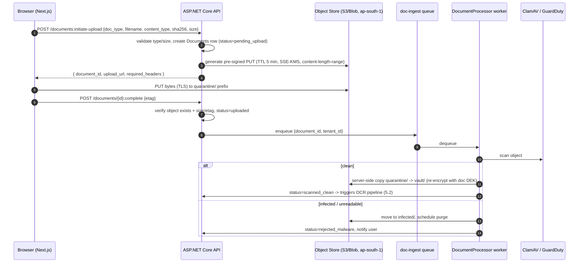
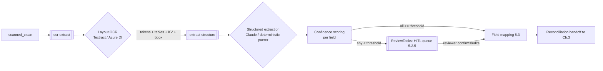
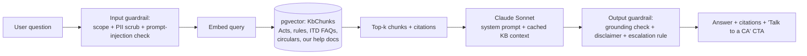

# Chapter 5 — AI, OCR & Document Processing

This chapter specifies how TallyG Tax turns uploaded artefacts (Form 16, 26AS, AIS, TIS, salary slips, bank/capital-gain statements, GST data) into structured, return-ready facts; how the AI assistant answers tax questions safely; and how AI validates, scores, and advises a return before e-filing. It depends on the schema in **Chapter 2**, hands reconciled figures to the computation engine in **Chapter 3**, exposes endpoints registered in **Chapter 4**, and inherits the security/residency posture of **Chapter 6**.

Design north star: **deterministic where money is computed, probabilistic only where it extracts or advises.** OCR/LLM output is *never* trusted directly into a tax calculation — it always passes through confidence gating, schema validation, and (when low-confidence) human review before it becomes an authoritative `IncomeSources`/`Deductions` row.

---

## 5.1 Document Ingestion & Secure Vault

### 5.1.1 Upload flow (pre-signed, direct-to-object-store)

Browsers upload **directly to object storage** via short-lived pre-signed URLs; the API never proxies file bytes.

**Why:** keeps the ASP.NET Core API stateless and cheap (no large multipart buffers, no 100 MB request limits), avoids a bandwidth bottleneck, and means raw PII files transit Client → Object Store over TLS without ever sitting in app memory or app logs. The API only ever sees metadata.



**Upload guardrails enforced server-side at pre-sign time:**
- `content-length-range` on the pre-signed POST policy (reject > 25 MB images, > 50 MB PDFs).
- Allowed MIME allow-list: `application/pdf`, `image/jpeg`, `image/png`, `image/heic`, `text/csv`, `application/json` (for AIS/TIS JSON), `application/vnd.ms-excel`/xlsx (GST, bank statements). No `.exe`/`.zip`/`.html`/SVG.
- Client supplies a SHA-256; worker recomputes and stores it for dedup + tamper baseline.
- TTL 5 minutes on the URL. **Why:** a leaked URL is useless minutes later; also bounds replay.

### 5.1.2 Virus scan & content sanitization

- **ClamAV** running as a sidecar/Lambda on the `quarantine/` prefix; nothing is OCR'd or shown to the user until `scanned_clean`. Optionally cross-check with **AWS GuardDuty Malware Protection for S3** in production.
- PDFs are **flattened/normalized** (re-rendered via Ghostscript/`qpdf --decrypt`) to strip embedded JavaScript, launch actions, and malformed XFA before extraction. **Why:** tax PDFs (especially bank statements) are a classic malicious-PDF vector; rendering to a clean PDF/image neutralizes active content and also fixes the password-protected-PDF case (see 5.1.6).

### 5.1.3 Type detection

Two-stage:
1. **Magic-byte sniff** (not file extension) to confirm the true container type.
2. **Document-class classifier** to confirm the user-declared `doc_type`. v1 = a lightweight Claude Haiku call on the first page's extracted text + a few regex anchors (`"FORM NO. 16"`, `"PART A"`, `"Annual Tax Statement"`/`26AS`, `"Annual Information Statement"`, `"Taxpayer Information Summary"`, IFSC/account-number patterns for bank statements, `GSTIN`). If the detected class contradicts the user's choice, we **warn but proceed with the detected class** and flag it.

**Why a classifier at all:** users mis-tag constantly (upload AIS under "Form 16"). Routing the wrong extractor at a tax document produces garbage that *looks* plausible — far more dangerous than a hard failure.

### 5.1.4 Per-document encryption (envelope / KMS)

- Each document gets its own **Data Encryption Key (DEK)**; DEKs are wrapped by a tenant-scoped Customer Master Key in **AWS KMS / Azure Key Vault**. Objects in `vault/` use SSE-KMS; the wrapped DEK + key ARN live on the `Documents` row.
- PAN, Aadhaar, and bank-account numbers extracted from these documents are stored **encrypted at the column level** (per shared conventions: PAN encrypted, displayed masked `ABCDE****F`) — independent of object encryption.

**Why per-document DEK + tenant CMK:** enables **crypto-shredding** — to honour a DPDP Act erasure request or tenant offboarding, we destroy the key and the ciphertext is irreversibly dead, even in backups, without rewriting petabytes. Tenant-scoped CMK contains blast radius and supports per-tenant BYOK later for enterprise MSME clients.

### 5.1.5 Storage layout

```
s3://tallyg-docs-aps1/
  quarantine/{tenant_id}/{document_id}                 # pre-scan, lifecycle: purge after 24h
  vault/{tenant_id}/{ay}/{tax_return_id}/{document_id}/
        original.{ext}                                 # SSE-KMS, immutable (Object Lock-compliance)
        normalized.pdf                                 # sanitized render used for OCR
        pages/p001.png ... p0NN.png                    # rasterized pages for layout OCR
  derived/{tenant_id}/.../extraction.json              # structured output (also in DB)
  infected/{tenant_id}/{document_id}                   # short-lived, then purged
```

- **Object Lock (compliance mode)** on `vault/original.*` for the retention window. **Why:** filed-return source documents are evidence; we must be able to prove to ITD/CA/auditor that the source was unaltered, and prevent insider deletion.
- Bucket is **private, no public ACLs**, blocked at account level; access only via pre-signed URLs minted by the API after an RBAC check.

### 5.1.6 Access control & lifecycle/expiry

- **Read access** = a fresh pre-signed GET (TTL 2 min) minted *only* after the API authorizes the principal against the document's `tenant_id` + ownership/role (see Chapter 4 RBAC). CAs see a document **only** while an active `CaAssignments` row links them to that `tax_return_id`.
- Every mint writes an `AuditLogs` row (`actor_id`, `document_id`, `action=presign_read`, `ip`, `ua`). **Why:** PAN/26AS access is auditable under DPDP; we need an answer to "who saw this PAN and when."
- **Lifecycle (S3 lifecycle rules + app job):**
  - `quarantine/` → purge 24 h.
  - `vault/` originals → **retain 8 years** post-filing (aligns with the 6-yr ITD reassessment window + margin), then transition Standard → Standard-IA (90 d) → Glacier (1 y) → delete (8 y).
  - Password-protected PDFs: user supplies password once → worker decrypts to `normalized.pdf`, **password never stored**, original kept encrypted.
  - Erasure: a DPDP/right-to-be-forgotten request triggers **crypto-shred of the DEK** + tombstone, except where statute requires retention (then we retain ciphertext-only, access frozen).

---

## 5.2 OCR / Extraction Pipeline (async, queue-based)

### 5.2.1 Topology

A staged pipeline of single-responsibility queues (SQS / Azure Service Bus / RabbitMQ — chosen in Chapter 1) with idempotent workers keyed on `(document_id, stage)`.



**Why async/queue-based:** OCR + LLM latency is seconds-to-minutes and vendor APIs throttle/fail; coupling this to the upload HTTP request would time out and lose work. Queues give retries with exponential backoff, DLQs for poison messages, natural backpressure during peak (the July 31 ITD deadline = massive spikes), and independent scaling of the OCR worker pool vs the API.

### 5.2.2 The core decision: layout OCR vs LLM extraction (use BOTH, in sequence)

We deliberately split **reading pixels** from **understanding meaning**:

| Stage | Tool | Job |
|---|---|---|
| 1. Layout-aware OCR | **AWS Textract** (`AnalyzeDocument` FORMS+TABLES; `AnalyzeExpense` for bank/expense), or **Azure Document Intelligence** prebuilt + custom models | Turn pixels into words, key-value pairs, **tables with cell geometry**, and per-token **bounding boxes + OCR confidence**. |
| 2. Structured extraction | **Claude (Sonnet)** with tool-use / JSON-schema output, OR a deterministic template parser | Map messy KV/tables into our **canonical typed schema**, resolve synonyms, do arithmetic sanity, attach field-level confidence. |

**Decision rules — when each path:**

- **Deterministic template parser (no LLM)** for **AIS/TIS JSON** and ITD-issued machine formats. AIS and TIS are downloadable as **structured JSON** from the e-filing portal; parse them directly. **Why:** it's already structured — running an LLM over it adds cost, latency, and a hallucination surface for *zero* benefit. Same for GST returns pulled as JSON (GSTR-2B/3B).
- **Layout OCR → deterministic field-pull** for **Form 16 / 26AS**, which have a **fixed, government-standard layout**. Textract/Azure DI gives reliable KV pairs; a template keyed on label anchors + known cell positions extracts gross salary, 17(1)/17(2)/17(3), §10 exemptions, Chapter VI-A, TDS, TAN, etc. **Why:** stable layout = deterministic extraction is more accurate and auditable than an LLM, and orders of magnitude cheaper at scale.
- **Layout OCR → Claude structured extraction** for **heterogeneous documents**: salary slips (every employer's template differs), **bank statements** (hundreds of bank formats), **capital-gain statements** (every broker/AMC — Zerodha, Groww, CAMS, KFintech — formats differently). **Why:** templates don't scale to N formats; an LLM with the OCR table + an explicit JSON schema generalizes across layouts and is robust to column-order changes. We feed Claude the **OCR'd text/tables, not the image** (cheaper, and forces grounding on extracted tokens).
- **Pure LLM vision (Claude image input)** only as a **fallback** when layout OCR confidence is poor (low-quality phone photo, handwriting, exotic layout). **Why:** vision LLM is the most expensive and least auditable path; reserve it for the long tail.

**Bottom line / Why this hybrid:** cloud OCR is excellent at *spatial reading* but doesn't know tax semantics; LLMs are excellent at *semantic mapping* but hallucinate numbers and can't reliably read dense tables from images. Chaining them — OCR for geometry, LLM for meaning, deterministic parsers wherever the format is fixed — gives the best accuracy-per-rupee and keeps the money-bearing fields auditable to a source bounding box.

### 5.2.3 Per-document extractor targets

| Document | Primary path | Key fields extracted |
|---|---|---|
| **Form 16 Part A** | Textract/Azure DI → template | TAN, deductor, PAN, quarterly TDS deposited, BSR/challan refs, period |
| **Form 16 Part B** | Textract/Azure DI → template | Gross salary, §17(1)/(2)/(3), §10 exemptions (HRA, LTA), standard deduction, professional tax, Chapter VI-A (80C/80D/80CCD(1B)/80G…), taxable income, tax paid |
| **26AS** | Textract → template | TDS by deductor (Part A), TCS (Part B), advance/self-assessment tax (Part C), refunds, SFT high-value txns |
| **AIS** | **JSON parser** (no OCR) | SFT, TDS/TCS, interest, dividend, securities/MF sale, foreign remittance, GST turnover |
| **TIS** | **JSON parser** (no OCR) | Aggregated category-wise processed/derived values |
| **Salary slips** | Textract → Claude | Basic, HRA, allowances, deductions, employer PF, monthly net — to corroborate/derive Form 16 when Form 16 absent |
| **Bank statements** | Textract `AnalyzeExpense`/DI → Claude | SB interest credits, FD interest, opening/closing, narration-classified inflows (for ITR-3/4 receipts) |
| **Capital-gain statements** | Textract → Claude | Per-scrip: buy/sell date & value, STT, STCG/LTCG split, grandfathering (FMV 31-Jan-2018), §111A/112A buckets |
| **GST data** | **JSON/API parser** | GSTIN-wise turnover, GSTR-3B vs books — feeds ITR-3/4 turnover reconciliation & MSME track |

### 5.2.4 Confidence scoring (the gate)

Each extracted field carries a composite confidence in `ExtractionFields`:

```
field_confidence = f(ocr_token_confidence, structural_match, cross_check)
```
- **`ocr_token_confidence`** — from Textract/DI per token (0–1).
- **`structural_match`** — did the value land in the expected place / pass a format regex (PAN `[A-Z]{5}[0-9]{4}[A-Z]`, IFSC, date, ₹ amount)?
- **`cross_check`** — does it reconcile? e.g. Form 16 `gross = Σ(17(1)+17(2)+17(3))`; sum of quarterly TDS in Part A == Part B TDS; 26AS TDS == Form 16 TDS.

**Gating policy (opinionated defaults, calibrated on a golden set):**

| Outcome | Condition | Action |
|---|---|---|
| **Auto-accept** | `field_confidence ≥ 0.92` AND cross-checks pass | promote to mapping (5.3) |
| **Auto-accept w/ soft flag** | `0.80 ≤ conf < 0.92` on a non-money field | accept, surface in UI as "please confirm" |
| **Human review** | money field < 0.92, OR any cross-check fails, OR format invalid | create `ReviewTasks` row → HITL queue |
| **Hard fail** | OCR unreadable / wrong doc class | reject, ask re-upload |

**Why 0.92 for money:** a single wrong digit in salary/TDS/capital-gain directly mis-states tax liability or refund — a regulatory and trust catastrophe. We bias hard toward review on anything that touches the computation.

### 5.2.5 Human-in-the-loop (HITL) review queue

- Low-confidence fields generate `ReviewTasks` consumed by an **internal Ops/CA reviewer console**. The reviewer sees the **field side-by-side with a crop of the source page (bounding box highlighted)** and the proposed value, and confirms or corrects.
- Corrections are **persisted as labelled training data** to continuously improve template/Claude prompts and to recalibrate thresholds.
- SLA-tracked (e.g., review within 30 min during filing season) and load-balanced; spillover to the assigned CA (Chapter 4 `CaAssignments`).

**Why HITL is non-negotiable:** OCR/LLM will never be 100%; the cost of an undetected error on a *filed* return (notice, penalty, reputational hit) vastly exceeds the marginal cost of a 20-second human confirmation on the small fraction of low-confidence fields. This is the core accuracy/cost lever.

### 5.2.6 PII minimization before any LLM call

Before any document content is sent to Claude (extraction, classification, or chat):
1. **Strip irrelevant pages/regions** — send only the table/region needed.
2. **Mask hard identifiers** the model doesn't need to do its job: full PAN → `ABCDE****F`, Aadhaar → `XXXX XXXX 1234`, full bank a/c → last 4. Re-hydration happens locally via a token map the LLM never sees.
3. **No customer name + PAN + full income in the same prompt** unless the task requires it.
4. **Zero-retention vendor settings** — Anthropic API set to no-training/no-retention; Textract/DI configured to not persist inputs.

**Why:** DPDP Act 2023 data-minimization + purpose-limitation; we should not export raw national IDs to any third party when a masked token suffices. (Full residency/processor-agreement controls are in Chapter 6.)

---

## 5.3 Field Mapping → Return Sections & Reconciliation Handoff (to Ch. 3)

Extraction produces **canonical facts**; mapping turns canonical facts into **`IncomeSources` / `Deductions` rows** scoped to a `tax_return_id` and `ay`. Mapping is a **deterministic rule table**, versioned per AY (tax law changes yearly).

**Why deterministic, not AI, for mapping:** the mapping from "Form 16 §80D = ₹25,000" to "Deduction row, section=80D" is a *legal* rule, not a judgement call. Encoding it as data (not a model) makes it auditable, testable, and instantly patchable when a Budget changes a limit.

| Canonical field | → Return target | Notes |
|---|---|---|
| Form 16 §17(1) salary | `IncomeSources(type=salary)` | head: Salaries |
| §10(13A) HRA exempt | salary exemption | capped per HRA rules (Ch.3) |
| §80C / 80D / 80CCD(1B) / 80G | `Deductions(section=…)` | statutory caps applied by Ch.3 |
| 26AS / AIS TDS per deductor | TDS credit ledger | feeds tax-paid in computation |
| Bank/AIS SB + FD interest | `IncomeSources(type=other_sources)` | 80TTA/80TTB eligibility computed by Ch.3 |
| Capital-gain rows (§111A/112A/STCG/LTCG) | `IncomeSources(type=capital_gains)` | grandfathering & ₹1.25L LTCG exemption in Ch.3 |
| GST/bank receipts | `IncomeSources(type=business)` for ITR-3/4 | turnover, presumptive 44AD/44ADA in Ch.3 |

**Reconciliation handoff:** mapping emits a normalized fact set; **Chapter 3's `ReconciliationService`** is the single owner of "AIS vs Form 16 vs 26AS vs user-declared" diffing, regime comparison, and final liability. This chapter's job ends at *"here are confidence-gated, source-linked facts"*; it must **not** re-implement tax math. Every fact carries `source_document_id` + bounding-box ref so Chapter 3 can show the user "this ₹ came from page 2 of your Form 16."

---

## 5.4 AI Tax Assistant (RAG Chatbot)

### 5.4.1 Architecture

A **retrieval-augmented** assistant over a **curated Indian-tax knowledge base** — *not* an open-ended LLM.



- **KB corpus (`KbDocuments` → chunked `KbChunks`):** Income-tax Act sections, Finance Act/Budget changes per AY, ITD FAQs, official circulars/notifications, ITR instruction booklets, and our own product help. Chunked, embedded, stored in **pgvector** (PostgreSQL is already primary — Chapter 2 — so no new datastore).
- **Model:** **Claude Sonnet** for chat (good reasoning at low latency); **Haiku** for classification/guardrail sub-calls.

**Why RAG over fine-tuning or raw LLM:** Indian tax law changes every Budget; RAG lets us update the KB the next morning with **zero retraining**, and every answer is grounded in a citable source — essential for trust and for not giving wrong tax advice. Fine-tuning would bake in this-year's law and decay.

### 5.4.2 Prompt caching (cost)

The large, stable system prompt + KB scaffolding + the curated high-frequency context is sent with **Anthropic prompt caching** (cache the system/policy block and pinned KB primer; vary only the retrieved chunks + user turn).

**Why:** the policy/disclaimer/system block is large and identical across millions of chats; caching it cuts input-token cost on cache hits by ~90% and reduces latency — material at filing-season volume.

### 5.4.3 Guardrails & mandatory disclaimers

- **Scope guard:** answers **only** Indian personal/MSME income-tax topics; refuses investment tips, legal opinions, other countries' tax, and anything outside the KB. **Why:** bounds liability and hallucination.
- **Grounding/abstention:** if retrieval returns nothing relevant above a similarity floor, the assistant says it doesn't know and **escalates** rather than guessing. No ungrounded numeric tax claims.
- **Prompt-injection defense:** user/document text is treated as data, never instructions; an input classifier (Haiku) flags jailbreak/injection attempts.
- **PII scrub** on every turn (5.2.6) before the message reaches the model.
- **Mandatory disclaimer**, shown with every substantive answer:
  > *"This is general information based on current Indian income-tax provisions for the selected assessment year, not personalized tax or legal advice. Please verify against your documents or consult a qualified Chartered Accountant before filing."*
- **No commitments:** the bot never says "you will definitely get ₹X refund" — only "based on the figures provided…".

### 5.4.4 Escalation to a human CA

- Triggers: explicit user request, low-confidence/abstention, detected complexity (foreign income, ESOP/RSU, presumptive-vs-regular choice, capital-gains edge cases, notices), or any **risk flag** (5.6).
- On escalation, a **structured handoff** is created (sanitized conversation summary + the return context) and routed to the CA workflow (`CaAssignments`/`Tickets`, Chapter 4). Conversation transcripts persisted in `ChatMessages` (PII-masked at rest) for the CA and for audit.

---

## 5.5 AI Pre-Submission Validation & Pre-Filing Checklist

Before e-filing, the return runs through a **`ValidationRuns`** pass that mixes **deterministic rules** (authoritative) with **AI anomaly detection** (advisory). Output = `ValidationFindings` (blocker / warning / info).

**Why deterministic-first:** anything that can be expressed as a rule (caps, mandatory fields, arithmetic) must be a rule — it's exact and explainable. AI is layered on top only to catch the "this looks weird" cases that rules miss.

### 5.5.1 Check categories

1. **Completeness** — required fields per chosen ITR (e.g., ITR-2 needs Schedule CG if capital gains exist; bank account for refund; all employers if multiple Form 16s).
2. **Internal consistency** — gross = Σ heads; deductions ≤ statutory caps (80C ≤ ₹1.5L, 80D age-based, 80CCD(1B) ≤ ₹50k); TDS claimed ≤ TDS available; regime-specific disallowances applied.
3. **AIS/26AS mismatch** — every income in AIS/26AS is reflected (or consciously dismissed with reason); declared TDS == 26AS TDS. This is the **single highest-value check** (mismatches are the #1 cause of ITD notices). Delegated to Chapter 3's reconciliation, surfaced here.
4. **Anomaly / AI checks (advisory)** — deductions implausibly high vs income; refund disproportionate to TDS; income drop vs prior-year baseline; ITR-type mismatch (capital gains present but ITR-1 chosen → must upgrade to ITR-2).

### 5.5.2 Concrete pre-filing checklist (rendered to the user, blockers gate submission)

- [ ] PAN valid & **linked to Aadhaar** (mandatory; else return invalid).
- [ ] Correct **ITR form** for the income profile (no capital gains/business in ITR-1; presumptive ⇒ ITR-4).
- [ ] **Assessment year** correct (AY 2025-26 for FY 2024-25).
- [ ] All **Form 16s / employers** entered; gross salary reconciles to slips/26AS.
- [ ] **All AIS/26AS income captured**: salary, interest (SB+FD), dividend, capital gains, other — each present or dismissed-with-reason.  ⛔ *blocker if unexplained AIS income exists.*
- [ ] **TDS/TCS claimed == 26AS/AIS**; advance/self-assessment tax entered.  ⛔ *blocker on TDS mismatch.*
- [ ] **Deductions within statutory caps** and supported by documents.  ⛔ *blocker if over cap.*
- [ ] **Regime selected** after old-vs-new comparison (Chapter 3); §115BAC opt-in noted; default = new regime for AY 2025-26.
- [ ] **Bank account** (for refund) pre-validated & EVC-capable; IFSC valid.
- [ ] Capital gains: holding-period/grandfathering applied; §112A LTCG exemption (₹1.25L) considered.
- [ ] Tax **payable == 0** (self-assessment tax paid if due) before filing.
- [ ] **Risk flags** (5.6) all resolved or CA-reviewed.
- [ ] **Verification method** chosen (Aadhaar OTP / net-banking EVC / DSC); reminder that **return must be e-verified within 30 days**.

---

## 5.6 Fraud / Risk Flagging

A **`RiskEngine`** scores every return (and account) and routes high-risk cases to a review queue **before** filing/payout. Hybrid rules + ML, producing `RiskFlags` and a `RiskScores` row.

**Why:** filing fraud (fabricated deductions, identity/PAN misuse, doctored documents, refund scams) is a real liability for an ERI; ITD penalizes the intermediary, and chargebacks/abuse hit the business. We must catch it pre-submission, not after.

### 5.6.1 Signals

| Category | Signals |
|---|---|
| **Income/refund anomalies** | Refund ≫ historical TDS; sudden income drop YoY; deductions implausible vs income (e.g., 80G = 40% of salary); presumptive margin outliers |
| **Identity / PAN** | **Duplicate PAN** across distinct accounts; PAN↔name mismatch on KYC verify; one device/IP filing many unrelated PANs (refund-mill pattern); velocity spikes |
| **Document tampering** | Re-encoded/edited PDF metadata (`ModDate ≠ CreationDate`, non-bank producer), font/kerning inconsistency in numbers, ELA/image-forensics on photographed Form 16, Form 16 TDS ≠ 26AS TDS, mismatched TAN |
| **Behavioral** | Disposable email/VOIP phone, impossible-travel logins, bulk uploads of near-identical docs |

### 5.6.2 Scoring & queue

- Weighted **rule score** + an **anomaly model** (e.g., Isolation Forest on the income/deduction/refund feature vector) → `risk_score ∈ [0,100]` with reason codes.
- **Bands:** `< 30` auto-proceed; `30–70` soft-warn + extra checklist; `≥ 70` **hard-hold** → mandatory **CA/Ops review** before e-file or before any wallet refund payout.
- Every flag is **explainable** (reason codes shown to the reviewer), persisted to `AuditLogs`. **Why explainability:** we must justify holding a user's filing/refund and avoid opaque false-positive lockouts.

---

## 5.7 Personalized Tax-Saving Recommendation Engine

A **`RecommendationEngine`** that, post-extraction/computation, tells the user **how to legally pay less tax** — a major conversion and retention driver.

**Why rules + LLM-explanation (not pure LLM):** eligibility and limits are deterministic law (must be exact); the LLM only renders the *explanation* in plain language. This prevents the model from inventing fake deductions while keeping the UX friendly.

- **Inputs:** computed income/regime (Chapter 3), used vs available deduction headroom, age, employment type.
- **Rule-based opportunities:** unused **80C** headroom (ELSS/PPF/insurance/principal); **80CCD(1B)** extra ₹50k via NPS; **80D** health insurance (self/parents, senior limits); **80TTA/80TTB** interest; HRA optimization; home-loan §24(b)/§80EEA; donations §80G; for MSMEs — **44AD/44ADA presumptive** vs regular, advance-tax scheduling.
- **Regime nudge:** quantified old-vs-new delta from Chapter 3 ("New regime saves you ₹X this year"; or "investing ₹Y in 80C makes Old regime better by ₹Z").
- **Output:** ranked `SavingRecommendations` with **₹ tax saved**, action, eligibility, and the mandatory disclaimer. **Forward-looking** nudges for next FY (e.g., "start NPS in April to spread it out").
- Every recommendation links to a KB citation (5.4) and is regime/AY-aware.

---

## 5.8 Suggested Third-Party APIs / Services

| Capability | Recommended | Why / notes |
|---|---|---|
| **Layout OCR (forms/tables)** | **AWS Textract** (FORMS/TABLES/EXPENSE) **or Azure Document Intelligence** | DI has India (Central India) region + custom-model training; Textract is strongest on tables/expense but **region/residency** must be confirmed (Chapter 6) — may force DI for data-residency. |
| **Cloud OCR (alt)** | Google Document AI | Strong specialized parsers; use if benchmarks beat the above on Indian docs. |
| **Structured extraction / chat / validation explanations** | **Anthropic Claude** (Sonnet primary, Haiku for classify/guardrail) | Strong JSON/tool-use reliability + prompt caching; zero-retention setting. |
| **PAN verification / KYC** | **NSDL/Protean** PAN verification API, or aggregators (**Karza/Perfios/Signzy/Cashfree Verification/Surepass**) | Verify PAN↔name, PAN–Aadhaar link status, bank-account penny-drop for refund validation. |
| **E-filing** | **ITD ERI / registered-intermediary APIs** | Per shared conventions — file & fetch status via ERI; AIS/TIS consumed as JSON (upload-based in v1). |
| **GST** | **GSP/ASP APIs** (e.g., ClearTax GSP, Masters India) | GSTR-2B/3B turnover for ITR-3/4 + MSME track. |
| **SMS / WhatsApp / Email** | **MSG91 / Gupshup / Twilio** (WhatsApp), **Amazon SES / SendGrid** (email) | OTP (Chapter 4) + filing-status/notice alerts; WhatsApp for status nudges. |
| **Payments** | Razorpay / Cashfree | Decided stack; see Chapter 4/7. |
| **Object store / KMS / queue** | S3 + KMS + SQS (or Azure Blob + Key Vault + Service Bus) | ap-south-1 / Central India for residency. |

---

## 5.9 Cost & Accuracy Trade-offs (summary of the operating philosophy)

| Lever | Cheaper / less accurate | Costlier / more accurate | Our choice |
|---|---|---|---|
| Read step | Pure LLM-vision on the image | OCR + deterministic parse | **OCR + parse for fixed-layout, OCR+LLM for variable**; vision only as fallback |
| Structured docs (AIS/TIS/GST) | Run LLM anyway | **Direct JSON parse** | Direct parse — free & exact |
| Trust | Auto-accept all extractions | Human review on everything | **Confidence-gated HITL** — review only low-confidence/money fields (`< 0.92`) |
| Chat | Big context every call | RAG + prompt caching | **RAG + Anthropic prompt caching** (~90% input savings on cache hit) |
| Tax math/eligibility | Let the LLM compute | Deterministic engine | **Deterministic (Ch.3)**; LLM never computes liability |
| PII | Send raw docs to LLM | Mask + minimize | **Mask PAN/Aadhaar/account, send only needed region** |

**Guiding rule:** spend money (cloud OCR, human review) precisely where a wrong number causes a wrong *filing*; spend nothing where the data is already structured or the rule is deterministic. This keeps per-return AI/OCR cost low while protecting the one thing that cannot be cheap — **the correctness of a filed tax return.**

---

### Schema additions introduced by this chapter (for Chapter 2 consistency)
`Documents` (extends shared), `DocumentPages`, `OcrJobs`, `Extractions`, `ExtractionFields` (value, confidence, bbox, source_page), `ReviewTasks` (HITL), `ChatSessions`, `ChatMessages`, `KbDocuments`, `KbChunks` (pgvector embedding), `ValidationRuns`, `ValidationFindings`, `RiskScores`, `RiskFlags`, `SavingRecommendations`. All carry `tenant_id`, uuid PKs, `created_at/updated_at` timestamptz, soft-delete `deleted_at`; money columns `NUMERIC(14,2)`; document-derived PAN/account values stored encrypted.