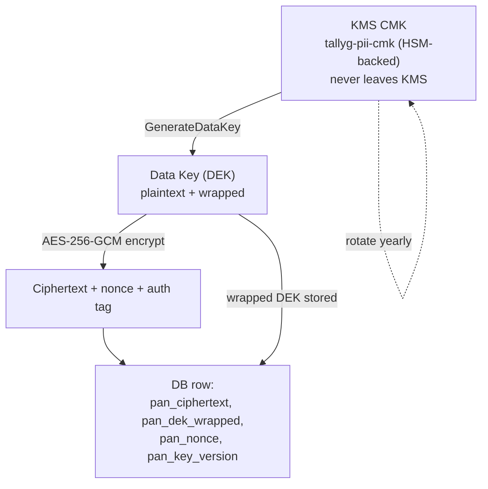
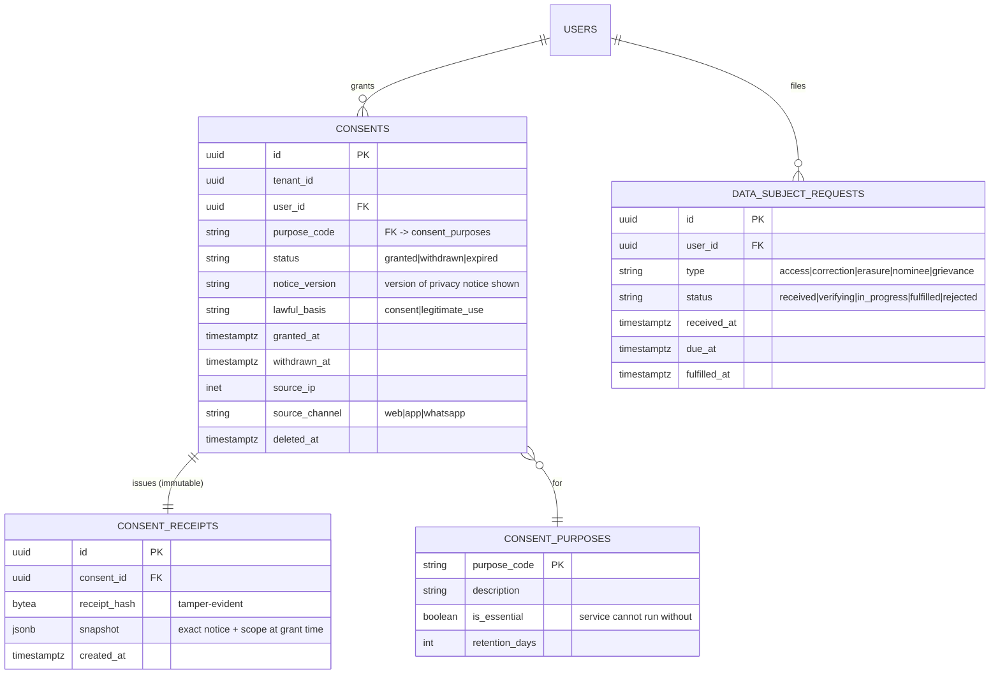
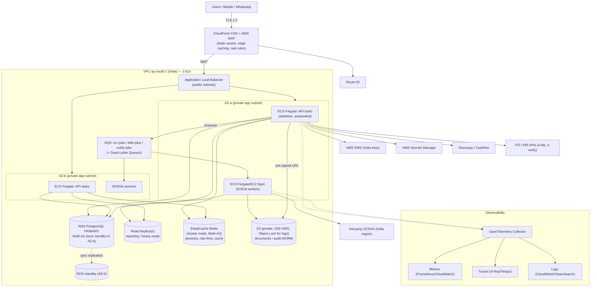
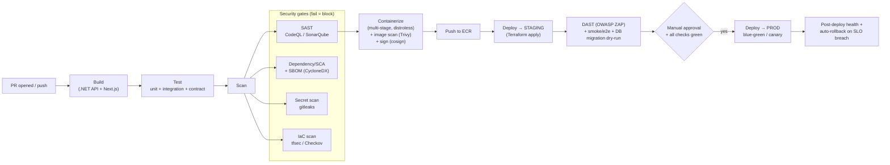
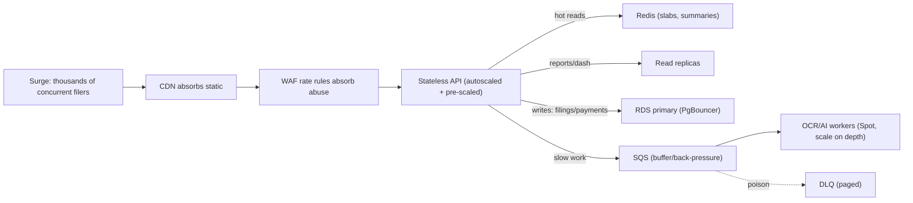

# Chapter 6 — Security, Compliance, DevOps & Scalability

This chapter defines how TallyG Tax Portal protects taxpayer data, satisfies Indian regulatory obligations, ships safely, observes itself in production, and survives the July/September filing-season surge at 1 lakh+ users. It builds on the architecture in Chapter 1, the schema in Chapter 2, and the AuthN/Z primitives in Chapter 4.

> Threat model in one line: we hold PAN, Aadhaar (transiently), bank details, salary data, and source documents (Form 16/AIS/26AS) for hundreds of thousands of Indian taxpayers. A breach is both a DPDP Act penalty event (up to ₹250 crore) and a reputational extinction event. Security is therefore a P0 product feature, not an afterthought.

---

## 6.1 Data Protection

### 6.1.1 Classification first

Every column and object is tagged at design time. Controls follow the class, not the developer's discretion.

| Class | Examples | At-rest control | Masking | Logged on access? |
|---|---|---|---|---|
| **C1 — Critical PII** | PAN, Aadhaar, bank account no., IFSC-linked account | Column-level envelope encryption (KMS) | Always masked in UI/logs (`ABCDE****F`) | Yes — `pii_access_logs` |
| **C2 — Sensitive financial** | salary figures, capital gains, deduction amounts, tax computed | Storage-level encryption (RDS/S3) + row tenant isolation | Not masked to owner; masked in support views | Yes for support/CA reads |
| **C3 — Documents** | Form 16, AIS, 26AS, bank PDFs | S3 SSE-KMS per-object + app-layer pre-encryption | Signed-URL, time-boxed | Yes — download events |
| **C4 — Operational** | tickets, coupons, audit logs | Storage-level encryption | N/A | Standard app log |

**Why:** A blanket "encrypt everything" sounds safe but kills queryability and adds latency uniformly. Tiering lets us spend the expensive control (column-level envelope encryption + access logging) only on C1, where the regulatory and harm cost is highest, while leaning on cheap, transparent storage encryption for the rest.

### 6.1.2 Encryption at rest — envelope encryption for C1

We do **not** put PAN/Aadhaar/bank numbers in plaintext columns and we do **not** rely solely on transparent disk encryption (which protects against a stolen disk, not against a compromised DB connection or a SQL-injection dump).

**Scheme — envelope encryption with AWS KMS:**

1. A KMS **Customer Master Key (CMK)** `tallyg-pii-cmk` exists per environment, **per tenant-class** (see key hierarchy below). It never leaves KMS.
2. The app requests a **Data Encryption Key (DEK)** via `GenerateDataKey`. KMS returns the DEK in plaintext (used in-memory) and the DEK wrapped under the CMK.
3. The app encrypts the field with the plaintext DEK using **AES-256-GCM** (authenticated encryption — gives us tamper detection + an auth tag), then discards the plaintext DEK.
4. Stored alongside the ciphertext: the **wrapped DEK**, the **GCM nonce/IV**, the **auth tag**, and a **key version**.
5. DEKs are cached in-process (encrypted-at-rest in memory is impractical; we minimize lifetime and pin to a short LRU) to avoid a KMS round-trip per row. **Why cache:** during peak we encrypt millions of fields; an uncached KMS call per field would both blow the KMS request quota (default ~5,500 `Decrypt`/s in ap-south-1) and add 10–30 ms latency each. We cache the plaintext DEK for a bounded TTL (≤5 min) and a bounded count.



**Column convention (extends Chapter 2):** a logically-encrypted field `pan` materializes as physical columns:
```
pan_ciphertext   BYTEA
pan_dek_wrapped  BYTEA
pan_nonce        BYTEA
pan_key_version  SMALLINT
pan_last4        VARCHAR(4)   -- the masking suffix, plaintext, for display only
pan_hmac         BYTEA        -- HMAC-SHA256(pan) under a separate KMS-managed HMAC key, for equality search
```

**Why store `pan_hmac`:** we frequently need "does a return already exist for this PAN?" without decrypting. A deterministic, keyed HMAC gives us blind equality lookups (indexed) without exposing plaintext and without the weakness of an unkeyed hash (which is brute-forceable across a 10-char PAN space). **Why not deterministic encryption for search:** deterministic encryption leaks equality globally and is harder to rotate; a separate HMAC key keeps the search index decoupled from the encryption key so we can rotate one without re-indexing the other.

**Key hierarchy & rotation:**

| Key | Scope | Rotation | Mechanism |
|---|---|---|---|
| CMK (PII) | per env | **Automatic yearly** (KMS) + manual on incident | KMS key rotation keeps old versions for decrypt; new writes use new version |
| DEK | per write batch | Per use (ephemeral) | New `GenerateDataKey` each batch |
| HMAC key | per env | Manual, ~2 yrs, with reindex job | Stored as KMS key, used for blind index |
| App signing/JWT keys | per env | 90 days, overlapping | See Chapter 4; rotated via Secrets Manager |

**Why automatic yearly CMK rotation but ephemeral DEKs:** KMS auto-rotation re-keys the CMK while retaining the ability to unwrap older DEKs, so we get cryptographic hygiene with zero data migration. Ephemeral DEKs limit blast radius — a leaked DEK from memory decrypts only the rows of one batch, not the whole column. A full **key-version bump + background re-encryption job** is run only on suspected key compromise; `pan_key_version` lets re-encryption proceed row-by-row online without downtime.

### 6.1.3 Encryption in transit

- **TLS 1.3** (TLS 1.2 minimum) terminated at CloudFront/ALB; HSTS `max-age=63072000; includeSubDomains; preload`.
- **Internal traffic** (ALB→ECS, ECS→RDS, ECS→ElastiCache) inside the VPC also uses TLS: RDS `rds.force_ssl=1`, ElastiCache in-transit encryption on, ECS service-to-service over TLS. **Why encrypt inside the VPC:** DPDP "reasonable security safeguards" and a defense-in-depth posture assume the network can be hostile (a compromised sidecar, a misconfigured SG). Intra-VPC plaintext is a common audit finding; we close it.
- Certificates via **AWS Certificate Manager**, auto-renewed. mTLS for ERI/ITD partner callbacks where the partner supports it.

### 6.1.4 Document encryption

Documents are doubly protected:
1. **App-layer pre-encryption** (AES-256-GCM with a per-document DEK, same envelope scheme) before the bytes ever reach S3, for C1-bearing docs (Form 16, bank statements). 
2. **S3 SSE-KMS** as the transparent baseline for the bucket.

Access is **only** via short-lived (default 120 s) pre-signed URLs minted after an authorization check; the bucket itself is private with `BlockPublicAccess` fully on and a bucket policy denying any non-TLS request. **Why pre-encrypt on top of SSE-KMS:** SSE-KMS protects against someone reading the raw S3 disk, but a leaked AWS credential with `s3:GetObject` would still hand over plaintext. App-layer pre-encryption means even AWS-side or credential-theft access yields ciphertext whose DEK lives behind our CMK and authorization logic.

### 6.1.5 PAN/Aadhaar masking

- **Display:** PAN → `ABCDE****F`; Aadhaar → `XXXX XXXX 1234`; bank → `XXXXXX7890`. Masking is enforced in a serialization layer (a `[MaskedPii]` attribute on DTO fields), not per-endpoint, so a developer cannot accidentally leak it. **Why centralize masking:** the most common PII leak is an over-broad API response or a debug log line. A single serializer choke-point + a unit test that fails the build if a C1 field is returned unmasked is far more reliable than reviewer vigilance.
- **Logs:** a log redaction filter scrubs anything matching PAN/Aadhaar/account regexes before write, as a backstop.

---

## 6.2 Indian Compliance

### 6.2.1 DPDP Act 2023 — we are a Data Fiduciary

TallyG determines the purpose and means of processing taxpayer data → we are a **Data Fiduciary** under the Digital Personal Data Protection Act, 2023. Our CA partners and ERI processors are **Data Processors** bound by contract. The user is the **Data Principal**.

**Consent-based collection model (tied to a `consents` table — see Chapter 2 schema):**

Every collection of personal data is gated by an explicit, purpose-bound, revocable consent. We never collect "just in case."



**Purpose catalog (`consent_purposes`) — examples:**

| purpose_code | Description | Essential? | Retention |
|---|---|---|---|
| `itr_filing_core` | Process & e-file your ITR | Yes (legitimate use, can't withdraw mid-filing) | 8 yrs |
| `doc_ocr_extraction` | AI/OCR extraction from uploaded docs | Yes for filing | tied to filing |
| `ca_review_sharing` | Share return with assigned CA | No (opt-in) | until withdrawn / filing close |
| `marketing_comms` | Tax-saving tips, renewal reminders | No | until withdrawn |
| `product_analytics` | Anonymized usage analytics | No | 13 months |

**Why a `consent_receipts` table separate from `consents`:** the DPDP "notice" obligation requires us to prove *what exactly the user agreed to and when*. The live `consents` row can change status; the receipt is an immutable hashed snapshot of the privacy notice version + scope + timestamp at the moment of grant — that is the evidentiary artifact in a dispute or Data Protection Board inquiry.

**Data Principal rights — implemented as API + workflow (endpoints owned here, surfaced in Chapter 4/8):**

| Right (DPDP §11–14) | Endpoint | SLA |
|---|---|---|
| Access / summary of processing | `GET /api/v1/me/data` (machine-readable export bundle) | 7 days |
| Correction & completion | `PATCH /api/v1/me/profile`, `POST /api/v1/dsr` (type=correction) | 7 days |
| Erasure | `DELETE /api/v1/me/account` → soft-delete + scheduled hard purge | 30 days, subject to legal retention |
| Grievance redressal | `POST /api/v1/dsr` (type=grievance) → DPO queue | 30 days |
| Nominate (in case of death/incapacity) | `POST /api/v1/me/nominee` | n/a |

**Erasure vs legal retention conflict:** ITR data must be retained ~8 years (see 6.2.5). So "erasure" performs: (a) immediate deactivation + masking of non-essential PII, (b) withdrawal of all non-essential consents, (c) tombstoning, but (d) **retention of filing records under the IT Act lawful-retention exception** until the statutory window lapses, after which a scheduled job hard-purges. **Why:** DPDP §8(7) permits retention where required by law; blindly deleting filed-return data would itself violate the Income-tax Act. We document this carve-out in the privacy notice so the user is informed up front.

**Data Fiduciary duties we implement:**
- Appointed **DPO** with a published grievance email/route; `data_subject_requests` SLA clock + alerting on breach of `due_at`.
- **Breach notification** workflow: internal target **≤72 h** to notify the Data Protection Board and affected principals (final timeline per notified DPDP Rules). A runbook + `incidents` tracking + templated principal notice.
- **Purpose limitation & data minimization** enforced by the consent gate — code cannot read a field whose purpose consent is withdrawn (a `ConsentGuard` middleware checks active consent before C1/C2 access).
- **Consent withdrawal** must be as easy as granting — one-tap in settings, immediate effect, cascading processor notification.

### 6.2.2 IT Act 2000 & SPDI

- Reasonable security practices per **IT Act §43A / SPDI Rules 2011** (until fully subsumed by DPDP Rules) — our ISO 27001-aligned controls satisfy "reasonable security practices and procedures."
- §65B(4)-style integrity for audit logs (tamper-evidence, see 6.3) supports admissibility if records are ever needed as evidence.

### 6.2.3 ITD / ERI obligations

(E-filing API surface itself is owned by Chapter 4; here we capture the *compliance* obligations.)

- E-filing happens only via **ITD-registered ERI / registered-intermediary APIs**. We either register as a **Type-2 ERI** ourselves or white-label via a partner ERI (open question — see below).
- ERI obligations we honor: **secure credential handling** (taxpayer e-filing credentials never stored in plaintext; used transiently for the e-file/e-verify call and discarded or stored only as KMS-wrapped where the ERI flow demands), **audit of every e-file submission** with ack number + JSON snapshot, **no commingling** of taxpayer data across the ERI boundary, and adherence to ITD's data-handling and uptime norms during the filing window.
- **Aadhaar:** treated as transient where possible — used for e-verification OTP and discarded; if any storage is unavoidable it is C1-encrypted and we treat UIDAI's Aadhaar regulations as additionally binding. (Open question on whether we store it at all.)

### 6.2.4 Data residency

**All personal data and documents reside in India** — AWS **Mumbai `ap-south-1`** (or Azure Central India as the alternate). RDS, S3, ElastiCache, SQS, backups, and **KMS keys** are all India-region. **Why this matters even without a hard DPDP localization mandate:** ITD/ERI norms and customer/government trust strongly favor India residency, and the DPDP framework allows the government to restrict transfers to specified countries; keeping everything in-region is the conservative, defensible default and removes a whole class of cross-border-transfer compliance work. Cross-region replication, if ever used for DR, stays **within India** (e.g., ap-south-1 → a future ap-south-2 Hyderabad), never offshore. Third-party processors (OCR/AI, email/SMS) must offer India-region processing or be replaced.

### 6.2.5 Data retention

A `retention_policies` table (keyed by data class + purpose) drives a nightly purge job.

| Data | Retention | Basis |
|---|---|---|
| Filed ITR records, ack numbers, computation snapshots | **8 years** after AY | Income-tax Act assessment/reassessment windows |
| Source documents (Form 16, 26AS, bank stmts) | 8 years after AY (then purge) | Same |
| OCR intermediate artifacts, raw extraction JSON | 90 days after filing | Minimization |
| Marketing/analytics PII | 13 months / until withdrawal | Consent |
| Audit & PII-access logs | **5 years** (immutable, then archive to Glacier) | Forensics + IT Act |
| Refresh tokens, sessions | Per Chapter 4 (rotating) | Security |

**Why 8 years for tax data specifically:** the Income-tax Act permits reassessment going back several years (the window has shifted with amendments; we use a conservative 8-year horizon). Purging earlier would leave a user unable to respond to a notice and would breach the implicit "required by law" retention.

---

## 6.3 Audit Trails & Activity Logging

Two distinct streams, both append-only:

1. **`audit_logs`** — *business/state changes*: who changed a return, who reassigned a CA, who issued a refund/coupon, who logged in, role changes, consent grants/withdrawals, e-file submissions. The "what happened to the system" record.
2. **`pii_access_logs`** — *who read which PII*: every decryption of a C1 field and every C2/C3 access by support/CA/admin, with actor, subject user, field/document, purpose, and time. The "who looked at whose data" record DPDP/forensics demand.

**`audit_logs` shape (extends Chapter 2):**
```
id              uuid PK
tenant_id       uuid
actor_user_id   uuid        -- null for system
actor_role      text
action          text        -- e.g. 'tax_return.efiled', 'consent.withdrawn'
entity_type     text
entity_id       uuid
before          jsonb       -- redacted diff (no C1 plaintext)
after           jsonb
ip              inet
user_agent      text
request_id      uuid        -- correlates to traces (6.6)
created_at      timestamptz
prev_hash       bytea       -- hash of previous record (chain)
row_hash        bytea       -- HMAC over this record + prev_hash
```

**Tamper-evidence / immutability — how:**
- **Hash chaining:** each row's `row_hash = HMAC-SHA256(canonical(record) || prev_hash)` under a KMS-managed audit key, forming a blockchain-style chain. Any retro edit or deletion breaks the chain and is detectable by a daily verifier job. **Why HMAC-chain over "just trust the DB":** an attacker (or rogue admin) with DB write access can `UPDATE`/`DELETE` rows; a verifiable chain means such tampering is *detectable* even if not *preventable* at the DB layer.
- **Append-only enforcement:** the app role for audit tables has `INSERT, SELECT` only — **no `UPDATE`/`DELETE`** granted at the Postgres role level. A separate, break-glass role is needed to touch them and its use is itself audited.
- **WORM archive:** logs are streamed to **S3 with Object Lock (compliance mode)** + a retention period, giving true write-once-read-many immutability outside the database. **Why both DB chain and S3 WORM:** the DB chain gives fast queryability + tamper *detection*; S3 Object Lock gives tamper *prevention* and the off-database copy auditors trust.
- **Time integrity:** all timestamps UTC from a single NTP-synced source; `created_at` set server-side, never client-supplied.

**What we deliberately do NOT log:** C1 plaintext, full document contents, passwords, OTPs, full tokens. The `before`/`after` diffs store masked/hashed values for C1. **Why:** an audit log that itself contains plaintext PAN becomes the juiciest single target in the system — logs are widely replicated to SIEM, backups, dashboards. Logging *that* PAN was accessed (not its value) is the correct granularity.

---

## 6.4 AuthN/Z Hardening, Sessions, Secrets & Secure SDLC

(Core JWT/refresh/RBAC design lives in Chapter 4; here are the hardening controls and targets.)

**Authentication hardening:**
- Passwords hashed with **Argon2id** (memory-hard) — `m=64MB, t=3, p=2` baseline, tuned per host. **Why Argon2id over bcrypt:** memory-hardness resists GPU/ASIC cracking far better; bcrypt is acceptable but Argon2id is the current OWASP-preferred default.
- **OTP:** 6-digit, 5-min TTL, max 5 attempts then lockout, rate-limited per phone/IP, single-use, constant-time compare. Hashed at rest, never logged.
- **MFA/step-up** required for: CA accounts, admin/back-office, and any e-file submission action. TOTP + optional WebAuthn for staff.
- **Brute-force / credential-stuffing:** progressive lockout + device fingerprint + optional CAPTCHA after N failures; alert on impossible-travel logins.

**Session management:**
- Access token short-lived (≤15 min), **rotating refresh tokens** with reuse-detection (a replayed refresh token invalidates the whole token family — Chapter 4). Tokens are `httpOnly`, `Secure`, `SameSite=Strict` cookies for the web app; bearer for mobile.
- **Idle timeout** 30 min, **absolute session** 12 h for users / 8 h for staff; server-side revocation list in Redis for instant logout-everywhere.

**Secrets management:**
- **AWS Secrets Manager** (DB creds, third-party API keys, JWT signing keys) with automatic rotation; ECS tasks fetch secrets at boot via IAM task roles — **no secrets in env files, images, or git**. **Why Secrets Manager over SSM Parameter Store here:** native rotation + fine-grained IAM + audit via CloudTrail; Parameter Store is fine for non-secret config.
- **Zero long-lived cloud keys in app:** services use **IAM roles** (IRSA/task roles), not access keys.
- Pre-commit + CI secret scanning (**gitleaks/trufflehog**) blocks accidental commits.

**OWASP ASVS targets:**
- Target **ASVS Level 2** across the board (appropriate for an app handling sensitive financial PII), with **selected L3 controls** for the C1/payment/e-file paths (e.g., full audit of crypto operations, stronger session controls, defense-in-depth on the e-file action). **Why L2 baseline, not L1:** L1 is "minimum"; an app holding PAN/Aadhaar/financials clearly warrants L2, and we cherry-pick L3 where the harm is greatest rather than paying L3's full cost everywhere.
- Map to **OWASP API Security Top 10** specifically (BOLA/object-level auth is the #1 risk for a multi-tenant REST API): every resource fetch is tenant- and owner-scoped at the data layer, enforced by a query filter, not just a controller check.

**Rate limiting / WAF:**
- **AWS WAF** on CloudFront/ALB: managed rule sets (OWASP core, SQLi/XSS, bad-bots), geo-rules, and **rate-based rules** (e.g., 2,000 req/5min/IP general; tighter on `/auth/*`, `/otp/*`).
- **App-layer rate limiting** in Redis (token bucket) per user + per endpoint class — coarse WAF + fine app limits. **Why both:** WAF stops volumetric/abusive traffic at the edge cheaply; app-layer limits enforce per-user fairness and business rules (e.g., max 10 OCR uploads/min) the WAF can't see.

**Secure SDLC:**
- Threat modeling (STRIDE) per epic touching C1/payments/e-file; security review gate in PR template.
- Mandatory code review + branch protection; signed commits encouraged.
- **Shift-left scanning** in CI (6.5): SAST, dependency/SCA, secret scan, IaC scan, container scan, DAST in staging.
- Annual **third-party VAPT** + a public **security.txt** / responsible-disclosure channel; bug-bounty consideration post-scale.
- Dependency hygiene: Dependabot/Renovate, SBOM generation (CycloneDX) per build.

---

## 6.5 Deployment Architecture & Cloud Infrastructure

**Decision: AWS Mumbai `ap-south-1`.** (Azure **Central India** is the documented fallback with equivalent service mapping below.) **Why AWS ap-south-1:** mature 3-AZ region in India satisfying residency, deepest managed-service set (RDS/Aurora, KMS with India key storage, S3 Object Lock, SQS, ElastiCache), and strong ecosystem/hiring availability. Azure Central India is a credible alternate (Postgres Flexible Server, Key Vault, Blob+immutability, Service Bus) chosen if a customer/government mandate or existing enterprise agreement favors Azure.

### 6.5.1 Topology



**Network & layout:**
- **VPC** with public subnets (ALB, NAT GW) and **private subnets** (app, workers, data) across **3 AZs**. Data tier has **no internet route**; egress via NAT only where required.
- **Security groups** are least-privilege and reference each other (ALB-SG → API-SG → RDS-SG on 5432 only). No `0.0.0.0/0` ingress except ALB:443.
- **PrivateLink/VPC endpoints** for S3, KMS, Secrets Manager, SQS — keeps that traffic off the public internet. **Why VPC endpoints:** lower latency, no NAT data charges, and the traffic to KMS/S3 never traverses the internet — a residency and security win.

**Service mapping (AWS ↔ Azure Central India):**

| Concern | AWS | Azure |
|---|---|---|
| Compute | ECS Fargate / EC2 | AKS / Container Apps |
| Managed Postgres | RDS PostgreSQL Multi-AZ + read replicas (or Aurora) | Azure DB for PostgreSQL Flexible Server (HA + read replicas) |
| Object store | S3 (SSE-KMS, Object Lock) | Blob Storage (CMK, immutability policies) |
| Cache | ElastiCache Redis | Azure Cache for Redis |
| Queue | SQS (+ DLQ) | Service Bus / Storage Queues |
| Secrets | Secrets Manager | Key Vault |
| KMS | KMS | Key Vault Managed HSM |
| CDN/WAF | CloudFront + WAF | Front Door + WAF |
| DNS | Route 53 | Azure DNS |

### 6.5.2 Compute choice

- **API tier:** **ECS Fargate**, stateless, behind ALB, autoscaled on CPU + request count + p95 latency. **Why Fargate over EKS to start:** the modular monolith (Chapter 1) doesn't yet need Kubernetes' operational weight; Fargate gives us autoscaling and zero node management. We revisit EKS when we split into microservices.
- **Workers (OCR/AI/e-file/notify):** consume SQS; run on **Fargate or EC2 Spot** (Spot for cost — see 6.9). Scale on **queue depth**, not CPU.

---

## 6.6 DevOps — CI/CD Pipeline

**GitHub Actions**, trunk-based with short-lived feature branches; environments **dev → staging → prod**.



**Stages in detail:**

1. **Build** — compile ASP.NET Core API + Next.js; produce versioned artifacts. Cache deps for speed.
2. **Test** — unit (xUnit/Jest), integration against ephemeral Postgres+Redis (Testcontainers), **contract tests** for the public API (Chapter 4), and the **PII-masking unit test** that fails if any C1 field serializes unmasked.
3. **Scan (all blocking on `main`):** **SAST** (CodeQL/SonarQube), **SCA** (dependency CVEs + license check + SBOM), **secret scan** (gitleaks), **IaC scan** (tfsec/Checkov on Terraform). **Why blocking, not advisory:** advisory scans get ignored under deadline pressure; for a fintech-grade app the gate must be hard, with a documented, audited override for genuine false positives.
4. **Containerize** — multi-stage Docker, **distroless/Chainguard** base (small attack surface), **Trivy** image scan, **cosign** signature + provenance attestation. Push to **ECR**.
5. **Deploy → staging** via **Terraform apply** (plan reviewed in PR). Run **DAST (OWASP ZAP)**, e2e smoke, and a **DB migration dry-run**.
6. **Gate → prod** — required reviewers + all checks green; **manual approval** for prod.
7. **Deploy → prod** — **blue-green** (instant cutover + instant rollback) for the API tier; **canary** (5% → 25% → 100% with automated metric checks) for risky releases. Auto-rollback if error rate / p95 breaches SLO within the bake window.

**IaC — Terraform:**
- All infra (VPC, ECS, RDS, S3, IAM, WAF, KMS, SQS, alarms) is **Terraform**, state in S3 + DynamoDB lock, **one workspace per environment**, modules reused. **Why Terraform over CloudFormation/CDK:** multi-cloud portability (our Azure fallback), large module ecosystem, and `plan` as a reviewable security artifact. No manual console changes — drift detection runs nightly and alerts.

**Database migrations:**
- Migrations via **EF Core migrations** (or **Flyway** for raw-SQL control), run as a **gated pipeline step** before the new app version takes traffic.
- **Expand-and-contract** pattern for zero-downtime: (1) additive schema change deployed, (2) new code deployed reading both shapes, (3) backfill, (4) contract/drop old in a later release. **Why expand-contract:** blue-green/canary means old and new app versions run *simultaneously*; a destructive migration would break the old version mid-rollout. Additive-first guarantees both versions work against the same schema.

---

## 6.7 Logging, Monitoring & Observability

**Three pillars, one correlation id.** Every request gets a `request_id` (and W3C `traceparent`) propagated through API → queue → worker → DB log, so a single user action is traceable end-to-end.

- **Structured logs** — JSON, fields `{timestamp, level, service, request_id, trace_id, tenant_id, user_id, action, latency_ms, status}`. PII-redacted at source (6.1.5). Shipped to **CloudWatch Logs / OpenSearch**. **Why structured JSON:** searchable, aggregatable, and parseable; free-text logs are useless at 1-lakh-user volume.
- **Metrics** — RED (Rate/Errors/Duration) per endpoint + USE (Utilization/Saturation/Errors) per resource + **business metrics** (returns started/filed, OCR jobs/min, payment success rate, queue depth). Prometheus/CloudWatch + Grafana/CloudWatch dashboards.
- **Distributed tracing** — **OpenTelemetry** SDK in API + workers, exported to **AWS X-Ray (or Tempo/Jaeger)**. Spans across HTTP → SQS → worker → external ERI call. **Why OpenTelemetry specifically:** vendor-neutral instrumentation means we can switch the backend (X-Ray ↔ Tempo) without re-instrumenting, and it unifies traces/metrics/logs under one context.

**Dashboards (Grafana):** (1) Filing-season war-room (returns/min, queue depth, OCR latency, payment success, error budget burn), (2) Infra health (RDS connections/CPU/replica lag, Redis hit-rate, Fargate scaling), (3) Security (WAF blocks, auth failures, PII-access spikes, DSR SLA), (4) Cost.

**Alerting** (PagerDuty/Opsgenie, severity-tiered): RDS CPU > 80% / replica lag > 30 s, SQS depth > threshold or **DLQ > 0** (always page), p95 latency SLO breach, payment failure spike, **error-budget burn-rate** alerts, KMS throttling, cert expiry, DSR `due_at` approaching, audit-chain verification failure (security page).

**SLOs:**

| Service | SLO |
|---|---|
| API availability | **99.9%** monthly (≈43 min downtime budget) |
| API p95 latency (read) | < 300 ms |
| API p95 latency (write) | < 700 ms |
| OCR extraction (async) | 95% of jobs < 60 s off-peak / < 5 min peak |
| Payment callback processing | p99 < 2 s |
| E-file submission ack | 99% return ack within ITD SLA |

**Why error-budget-based alerting:** paging on every blip causes alert fatigue; burn-rate alerts (fast-burn + slow-burn) page only when we're genuinely at risk of missing the 99.9% target, which is what actually matters.

---

## 6.8 Backup & Disaster Recovery

**Targets:**

| Metric | Target | Rationale |
|---|---|---|
| **RPO** | ≤ 5 min (DB), ≤ near-zero (S3) | PITR + sync standby; we can lose at most ~5 min of writes |
| **RTO** | ≤ 60 min (AZ failure auto < 5 min) | Multi-AZ failover is automatic; full-region rebuild from IaC ≤ 1 h |

**Mechanisms:**
- **RDS PITR** — continuous WAL + automated snapshots, **35-day** retention, restore to any second. **Why 35 days:** covers late-discovered corruption/ransomware and gives forensic headroom.
- **Multi-AZ sync standby** — automatic failover (typically < 60 s) on AZ/primary failure; this is the everyday HA mechanism, not "DR."
- **Read replicas** — promotable in a regional-degradation scenario.
- **S3** — versioning on (recover from overwrite/delete), cross-AZ durability (11 nines) inherent; replication, if used, stays **within India**.
- **Audit-log WORM** copy in S3 Object Lock is itself the durable record.
- **Config/IaC** — entire stack reproducible from Terraform + container images in ECR, enabling **rebuild-from-code DR** if a region is lost (restore to ap-south-2 when available, India-only).

**Restore drills:** **quarterly** game-day — restore prod DB snapshot into an isolated account, run smoke tests, measure actual RTO, restore a sample of encrypted documents and verify decryption with rotated keys. **Why drill, not just configure:** an untested backup is a hypothesis. Drills catch the real failure modes (missing IAM grant for the restored task, KMS key policy gaps, migration ordering) before an incident does. Results feed back into the runbook.

---

## 6.9 Scalability Plan — 1 Lakh+ Users & the Filing-Season Spike

**The shape of the load.** Traffic is *brutally* seasonal: a long quiet base (Apr–Jun, Oct–Mar) and two sharp peaks — **July** (ITR due date for non-audit filers, ~31 Jul) and **September/October** (audit-case + extended deadlines). At peak we can see weeks of 5–10× base traffic and a final-48-hours hockey-stick where a large fraction of procrastinators file at once.

**Working capacity assumptions (sizing basis, tune with real data):**
- 1,00,000+ registered users; assume ~30% file in the peak week → ~30,000 filings/week, heavily back-loaded.
- Final-2-day surge: design for **~2,000–3,000 concurrent active users**, **~150–250 API req/s sustained, ~600 req/s burst**, and an **OCR backlog of 10,000–20,000 documents/day** during the crunch.

**The strategy: keep the API stateless and cheap to clone; push everything slow and bursty onto async workers behind a queue; absorb reads with cache + replicas; isolate hot tables with partitioning.**

### Tactics

1. **Stateless API + horizontal autoscaling.** No session state in the app (all in Redis/JWT — Chapter 4). Fargate service scales on CPU **and** request-count-per-target **and** p95 latency; **scheduled pre-scaling** raises min-capacity ahead of the known 31-Jul/30-Sep dates. **Why scheduled scaling on top of reactive:** reactive autoscaling lags a sudden hockey-stick by minutes; we *know* the dates, so we pre-warm capacity the evening before deadlines and avoid the cold-start cliff. Target-tracking keeps p95 under SLO.

2. **Async OCR/AI workers (the pressure-release valve).** Uploads return immediately with a job id; OCR runs on SQS-fed workers (Chapter 5 owns the pipeline). Workers **autoscale on queue depth** (e.g., scale out when `ApproximateNumberOfMessagesVisible / running_workers > 50`). **Why decouple OCR:** OCR/LLM extraction is the single most expensive, latency-variable operation; coupling it to the request thread would exhaust the API tier and time out users. Behind a queue, a 20k-document backlog drains smoothly while the API stays snappy.

3. **Queue back-pressure & resilience.** SQS provides natural buffering; we set **visibility timeouts** > worst-case processing, **max-receive-count → DLQ** for poison messages, and **producer-side back-pressure** (if queue depth exceeds a ceiling, the UI shows "high demand, your documents are queued" instead of failing). Idempotent consumers (dedup on job id) so retries are safe. **Why back-pressure messaging instead of hard-failing:** during the final-day surge it's far better UX to honestly queue a user than to 500 them; the queue flattens the spike.

4. **Caching (Redis + CDN).** ElastiCache Redis caches hot reads — tax slabs/rates per AY, deduction limits, regime-comparison reference data, user dashboard summaries, rate-limit counters, session/revocation lists. CloudFront caches all static/Next.js assets at the edge. **Why cache tax-reference data aggressively:** slab/deduction tables are read on *every* computation but change only by Finance Act — near-100% cache hit, huge DB offload. Cache-aside with explicit invalidation on AY config change.

5. **Read replicas.** Heavy/read-only workloads (dashboards, reporting, admin search, analytics) hit **read replicas**; only writes hit primary. Add replicas before peak; monitor replica lag (SLO < 30 s) so we never read dangerously stale data for money-affecting paths (those read primary). **Why split reads off:** filing-season dashboards and "where's my refund/status" polling are read-dominant; offloading them protects the primary's write headroom for actual filings/payments.

6. **Table partitioning.** Partition high-volume, time-series-y tables:
   - `documents`, `tax_returns`, `audit_logs`, `pii_access_logs` **by AY (range partition)** — and audit/pii logs additionally by month. **Why partition by AY:** queries are almost always scoped to one AY; partition pruning keeps scans small even as we accumulate 8 years × lakhs of rows, and old-AY partitions can be detached and archived to cold storage cheaply (ties to retention 6.2.5).
   - Indexing: covering indexes on `(tenant_id, user_id, ay)` access patterns; the `pan_hmac` index for blind lookups.

7. **Connection management.** **PgBouncer (transaction pooling)** in front of RDS so a fleet of autoscaled API tasks doesn't exhaust Postgres connections. **Why a pooler:** each Fargate task opening its own pool × N tasks at peak easily blows past RDS `max_connections`; transaction-mode pooling multiplexes thousands of app connections onto a small server-side pool. (Pair with right-sized RDS instance class.)

8. **Bulk-friendly write paths.** Document-heavy flows batch DB writes and encryption (one `GenerateDataKey` per batch — 6.1.2), reducing KMS calls and DB round-trips at peak.

9. **Graceful degradation playbook for the crunch:** under extreme load, shed/queue non-essential work first — defer analytics events, throttle marketing sends, queue OCR more aggressively, serve cached dashboards — while protecting the two sacred paths: **filing** and **payment**. **Why a priority order:** when something has to give, it must be the cosmetic stuff, never a user's ability to file and pay before the deadline.



---

## 6.10 Cost Optimization

The seasonal shape is also the cost story: we must *not* pay peak prices year-round.

| Lever | Approach | Why |
|---|---|---|
| **Compute baseline** | **Compute Savings Plans / Reserved Instances** for the steady base (RDS, ElastiCache, baseline Fargate) | Base load is predictable 12 months/yr; committing buys ~30–50% off vs on-demand. |
| **Spot for workers** | OCR/AI workers on **EC2 Spot** (or Fargate Spot) | Workers are stateless, interruptible, queue-fed — *the* ideal Spot workload. ~60–70% cheaper; SQS visibility timeout + retries make interruptions harmless. |
| **Serverless for spiky OCR** | Burst overflow OCR to **AWS Lambda / Fargate Spot** when queue depth spikes beyond reserved worker capacity | Pay-per-invocation matches the bursty, 2-month-a-year OCR profile better than keeping idle workers; no idle cost in the 10 quiet months. |
| **S3 storage tiers** | **S3 Intelligent-Tiering** for documents; lifecycle: Standard → IA after 30 d → **Glacier** for >1 yr old (still within 8-yr retention) | Source documents are write-once, read-rarely after filing; auto-tiering + Glacier slashes storage cost for the long 8-year tail without manual effort. |
| **Right-sizing** | Continuous right-sizing via Compute Optimizer; scale **min capacity down hard** in off-season (Nov–Jun) | The whole point of autoscaling — run a skeleton crew off-peak, expand only for July/Sept. |
| **Aurora Serverless v2 (option)** | Evaluate Aurora Serverless v2 for the DB to auto-scale ACUs with season | If write/read load is genuinely spiky, ASv2 scales DB capacity up for peak and down off-peak; weigh vs reserved RDS. (Open trade-off.) |
| **Data transfer** | VPC endpoints (no NAT charges for S3/KMS), CDN to cut origin egress | NAT and egress are silent budget leaks at scale; endpoints + CDN remove them. |
| **Log/observability cost** | Sample high-volume traces, tier logs to S3/Glacier after 30 d, retain only aggregates long-term | Full-fidelity traces/logs at peak volume are expensive; sample + tier without losing forensic capability. |

**Guiding principle / Why:** match the *spend curve* to the *load curve*. Commit (reserve) only the always-on floor; rent everything seasonal on Spot/serverless/autoscaling; and push cold data down the storage tiers. This keeps off-season run-rate low (good for an MSME-focused unit economics story — see Chapter 7) while still scaling cleanly into the filing-season peak.

---

### Cross-references
- AuthN/Z, JWT, refresh rotation, RBAC, e-file API surface → **Chapter 4**.
- OCR/AI pipeline internals (the workers we autoscale here) → **Chapter 5**.
- Table definitions for `consents`, `audit_logs`, `pii_access_logs`, partitioning DDL → **Chapter 2**.
- Tax slab/deduction reference data (the cache-heavy config) → **Chapter 3**.
- Unit economics that the cost model feeds → **Chapter 7**.