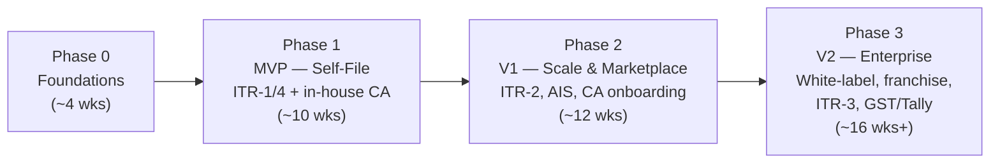
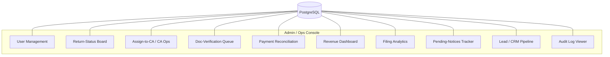
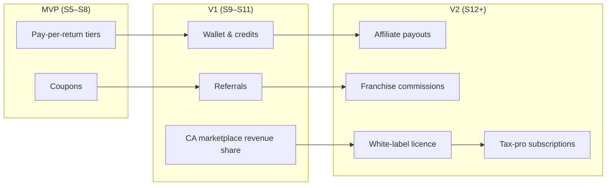

# Chapter 7 — Product Strategy, Roadmap & Business Model

This chapter sequences *what we build, when, with whom, and how we make money*. It is deliberately ruthless about scope: the single biggest risk to an ITR platform is launching late and missing the filing window (the AY filing peak runs ~June–July 31, with the belated/revised tail to Dec 31). Every cut below is justified against that constraint. Architecture is Chapter 1, schema Chapter 2, tax engine Chapter 3, APIs/RBAC Chapter 4, AI/OCR Chapter 5, security/DevOps Chapter 6, and frontend Chapter 8 — referenced, not repeated.

---

## 7.1 Guiding Product Principles

1. **Ship before the filing window, not the perfect product.** A correct ITR-1 filed on time beats a beautiful ITR-3 shipped in August. The MVP scope is anchored to a hard external deadline.
2. **Cover the fat head of the demand curve first.** ITR-1 (salaried) + ITR-4 (presumptive 44AD/44ADA — freelancers, consultants, small traders/MSMEs) are the overwhelming majority of individual filings. They are also the *simplest* to compute and the easiest to OCR (Form 16 + 26AS/AIS). **Why:** maximum addressable users for minimum domain/engineering surface — this is the textbook MVP wedge.
3. **Assist, never silently decide.** OCR and the tax engine (Ch. 3, Ch. 5) propose; the user (or CA) confirms. **Why:** a wrong auto-filed return is a regulatory and trust catastrophe; human-in-the-loop is non-negotiable for a finance product.
4. **Modular monolith now, microservices only when a seam hurts** (per Ch. 1). **Why:** a 4–6 person team cannot operate 12 services; premature decomposition is the most common way early SaaS teams die.
5. **Two-sided from day one in data, one-sided in launch.** The schema carries `tenant_id`, `CaAssignments`, `Wallets`, `Coupons` from the start (Ch. 2), but we launch B2C self-file + a *single in-house CA pool* before opening a true marketplace. **Why:** avoid the cold-start problem — don't recruit external CAs before there's filing volume to feed them.

---

## 7.2 MVP Definition — IN-MVP vs LATER / ENTERPRISE

The MVP is **"A salaried user or small presumptive professional can register, upload Form 16, get an auto-computed old-vs-new comparison, pay, optionally have an in-house CA review, e-file, and track status — for AY 2025-26."**

| Capability | MVP (ship first) | V1 (next) | V2 / Enterprise (later) | Why this cut |
|---|---|---|---|---|
| **ITR forms** | ITR-1, ITR-4 | ITR-2 (capital gains, multiple house property) | ITR-3 (business P&L, books), ITR-5/6 for firms/companies | ITR-1/4 ≈ bulk of individual volume; ITR-3 needs full books-of-account modelling — disproportionate effort. |
| **Auth** | Phone+email OTP, JWT access + rotating refresh (Ch. 4) | Social login (Google), 2FA TOTP | SSO/SAML for enterprise tenants, franchise sub-logins | OTP is mandatory for India + cheapest trusted identity; SSO has zero MVP demand. |
| **OCR / extraction** | Form 16 (Part A+B), 26AS | AIS/TIS, salary slips, bank statement parse | Capital-gain broker statements, GST returns, Tally import | Form 16 covers the salaried head end-to-end; AIS adds reconciliation but isn't blocking for ITR-1. |
| **Tax computation** | Old vs New regime, std deduction, 80C/80D/80TTA/80TTB, 87A rebate, slabs, cess, basic interest 234A/B/C | Full Chapter VI-A, HRA, presumptive 44AD/44ADA auto, AMT preview | Capital-gains engine (111A/112A/indexation), MAT, foreign income/DTAA | The listed deductions cover the salaried/presumptive majority; cap-gains is its own engine (Ch. 3). |
| **e-Filing** | ERI/registered-intermediary submit + ITR-V/ack for ITR-1/4 (Ch. 1) | e-Verify via Aadhaar OTP/net-banking in-flow | Bulk filing, revised/belated automation, defective-return 139(9) flow | Get one clean filing path certified first; bulk/revised are volume optimizations. |
| **Payments** | Razorpay primary, one-time pay-per-return, GST invoice | Cashfree failover, wallet top-up, coupons | Subscriptions, split settlement to CAs/franchises, affiliate payouts | One PSP + one flow de-risks PCI/recon; multi-rail is a scale concern (Ch. 6). |
| **CA review** | Single in-house CA pool, manual assign, review→approve/return-for-fix | CA self-onboarding (limited), CA dashboard, SLA timers | Full CA **marketplace** with ratings, bidding, revenue share, payouts | In-house pool proves the workflow without marketplace liquidity risk. |
| **Documents** | Encrypted document vault, upload/list/download, per-return grouping | Versioning, e-sign of engagement letter, DSC upload | DigiLocker pull, auto-fetch 26AS/AIS via consent | Vault is core trust infra; DigiLocker is a nice-to-have integration. |
| **Status tracking** | Linear `TaxReturns.status` timeline (Draft→…→Filed→Verified) + email/SMS | In-app notifications, push, WhatsApp | Notice/refund tracker synced from ITD, `Notices` workflow | A visible status bar is the #1 anxiety-reducer; deep ITD sync is later. |
| **Admin/CRM** | User mgmt, return-status board, assign-to-CA, payment list, doc-verify queue, audit logs | Revenue dashboard, filing analytics, lead pipeline | Pending-notices tracker, reconciliation automation, franchise console | Ops *must* see/triage from day one; analytics can lag a few sprints. |
| **Multi-tenant / white-label** | Schema `tenant_id` present; single default tenant live | Tenant theming (logo/colour), custom subdomain | Full white-label, franchise hierarchy, per-tenant pricing | Pay the cheap schema cost now; defer the expensive theming/runtime cost. |
| **Notifications** | Transactional email + SMS (OTP, payment, status) | Templated marketing email, WhatsApp BSP | Drip campaigns, segmentation engine | Transactional is mandatory; marketing automation is post-PMF. |

**Explicitly OUT of MVP (anti-overengineering list):** microservices split, Kafka/event-sourcing, GraphQL, multi-region active-active, ML model training pipeline (use hosted OCR + rules first — Ch. 5), in-app chat/video with CA, mobile native apps (responsive web only — Ch. 8), GST/Tally import, capital-gains engine, franchise/white-label runtime, affiliate payouts, subscriptions. **Why:** each adds weeks of build + ops with near-zero MVP-stage ROI; all are scheduled deliberately below.

---

## 7.3 Product Roadmap (Phased)

| Phase | Theme | Primary goals | Exit criteria |
|---|---|---|---|
| **Phase 0 — Foundations** | De-risk the platform | Repo/CI-CD, IaC, PostgreSQL schema (Ch. 2), auth skeleton (Ch. 4), tenant scaffolding, ERI/sandbox access secured, design system (Ch. 8) | A user can register via OTP and log in; CI deploys to staging; ITD/ERI sandbox creds in hand. |
| **Phase 1 — MVP** | First filed return, real money | ITR-1/4 wizard, Form 16/26AS OCR, old-vs-new engine, Razorpay pay, in-house CA review, vault, status, core admin | ≥1 real return e-filed end-to-end in production; payment captured; ack stored. |
| **Phase 2 — V1** | Volume + supply side | ITR-2 + cap-gains, AIS/TIS + reconciliation, CA self-onboarding + dashboards, wallet/coupons, revenue & filing analytics, WhatsApp/push | CA marketplace live with paid revenue share; 5k+ returns/season; <2% support-touch rate. |
| **Phase 3 — V2 / Enterprise** | Platformization & B2B | White-label tenants, franchise hierarchy + console, ITR-3/books, GST + Tally import, subscriptions for tax pros, affiliate payouts, notice tracker, microservice extraction where seams hurt | First white-label/franchise partner live; B2B MRR; multi-tenant isolation audited (Ch. 6). |

---

## 7.4 Sprint-Wise Execution Plan (2-week sprints, Sprint 0 → 12)

Cadence: 2-week sprints, demo + retro each Friday-of-week-2. Sprint 0 is setup; MVP targets a **production e-file by end of Sprint 5**. Sequencing assumes a small cross-functional team (§7.5).

| Sprint | Window | Theme | Key deliverables |
|---|---|---|---|
| **S0** | Wks 1–2 | Foundations | Monorepo + CI/CD pipelines; Postgres provisioned + base migrations (`Tenants`, `Users`, `AuditLogs`); .NET Web API skeleton + Next.js shell; secrets mgmt; ERI/ITD sandbox onboarding kicked off; design tokens. |
| **S1** | Wks 3–4 | Auth & identity | OTP (SMS+email) register/login; JWT access + rotating refresh + revocation (Ch. 4); RBAC roles (User, CA, Admin, Ops); profile + PAN capture (encrypted, masked); rate-limiting. |
| **S2** | Wks 5–6 | Document vault + upload | `Documents` model + encrypted blob storage; upload/list/download UI; virus scan; per-return grouping; KYC doc-verify queue scaffold. |
| **S3** | Wks 7–8 | OCR — Form 16 / 26AS | Hosted OCR integration (Ch. 5); Form 16 Part A/B + 26AS field extraction → structured `IncomeSources`/TDS; confidence flags + human-confirm UI. |
| **S4** | Wks 9–10 | Tax engine + regime compare | ITR-1/4 computation (slabs, std deduction, 80C/80D/80TTA/TTB, 87A, cess, 234A/B/C); old-vs-new side-by-side; auto-prefill from OCR; draft `TaxReturns`. |
| **S5** | Wks 11–12 | **Payments + e-File (MVP launch)** | Razorpay order/capture + GST invoice; `Payments` recon basics; ERI submit for ITR-1/4; ITR-V/ack storage; status timeline + email/SMS. **→ Soft launch.** |
| **S6** | Wks 13–14 | CA review (in-house) | `CaAssignments`; CA review queue + approve/return-for-fix; SLA timer; user notification on CA action; CA-reviewed filing path. |
| **S7** | Wks 15–16 | Admin & CRM core | Admin user mgmt; return-status board (kanban); assign-to-CA; payment list + manual recon; doc-verify queue live; audit-log viewer. |
| **S8** | Wks 17–18 | Lead mgmt + analytics v1 | `Leads` pipeline (capture→contacted→converted); revenue dashboard (GMV, fees, refunds); filing funnel analytics; coupon engine (`Coupons`). |
| **S9** | Wks 19–20 | Wallet & monetization plumbing | `Wallets` + credits + ledger; pay-per-return tiers config; referral codes; Cashfree failover; pricing/packaging admin. |
| **S10** | Wks 21–22 | ITR-2 + AIS/TIS | AIS/TIS OCR + reconciliation vs 26AS; capital-gains engine (111A/112A/indexation) → ITR-2; multi-house-property. |
| **S11** | Wks 23–24 | CA marketplace v1 | CA self-onboarding + KYC/ICAI verify; CA profile/ratings; revenue-share config + payout ledger; CA dashboard + SLA; assignment auto-routing. |
| **S12** | Wks 25–26 | Notifications, hardening, scale | WhatsApp BSP + push; notice tracker (`Notices`) v1; load test + perf; security review (Ch. 6); white-label theming groundwork. |

> **Reality check:** Sprints 0–5 (≈12 weeks) deliver a *fileable* product. If the calendar collides with the filing peak, S6–S8 (CA + admin polish) can run in parallel with live MVP traffic rather than blocking launch. **Why:** never let internal tooling polish gate external revenue during the only season that matters.

---

## 7.5 Team Structure & Effort Estimate

| Phase | Roles & headcount | Notes |
|---|---|---|
| **Phase 0–1 (MVP)** | 1 Tech Lead/Architect; 2 Backend (.NET); 2 Frontend (Next.js); 1 QA; 0.5 DevOps; 1 Product/PM; **1 Tax-domain SME (CA)** part-time; 1 Designer part-time | **~7.5 FTE.** The CA SME is mandatory — they own computation correctness and ERI conformance. |
| **Phase 2 (V1)** | +1 Backend, +1 Frontend, +1 Data/ML (OCR/AIS), +1 QA, +1 Support/Ops lead, full-time DevOps, +1 CA (review ops) | **~13 FTE.** Supply-side (CA ops) and data quality become first-class. |
| **Phase 3 (V2)** | +1 Backend (integrations: GST/Tally), +1 Solutions/B2B eng, +1 Partnerships/Franchise mgr, +1 Security/Compliance, scale CA pool & support | **~18–20 FTE.** Shift from feature build to platform + partnerships. |

**Rough timeline:** Phase 0 ≈ 1 month · MVP ≈ 2.5 months · V1 ≈ 3 months · V2 ≈ 4+ months. **MVP in production ≈ Month 3–4** from kickoff; first marketplace revenue ≈ Month 6–7. **Why these numbers:** they assume reused hosted OCR + a modular monolith (no infra R&D tax) and a domain SME removing tax-rule ambiguity — the two biggest schedule risks for this product.

---

## 7.6 Admin Panel + CRM + Lead Management

A single internal back-office app (Ch. 8 layout), RBAC-gated (Admin, Ops, CA, Finance, Support — Ch. 4), every state-changing action written to `AuditLogs` (Ch. 2, Ch. 6).

| Module | Requirements |
|---|---|
| **User management** | Search/filter users & tenants; view profile + masked PAN; activate/suspend; reset auth; impersonate (audited, time-boxed); export. |
| **Return-status mgmt** | Kanban across `TaxReturns.status` (Draft→Docs→Computed→Paid→Under-Review→Filed→Verified→Refund); bulk reassign; per-return timeline + activity. |
| **Assign-to-CA** | Manual + rule-based auto-assign to `CaAssignments`; CA capacity/SLA view; reassign on breach; review approve/return-for-fix. |
| **Revenue dashboard** | GMV, net filing revenue, refunds, MRR (post-subscriptions), revenue by stream (self-file / CA / franchise / affiliate), AY-over-AY. |
| **Filing analytics** | Funnel: registered→docs→computed→paid→filed→verified; drop-off per step; ITR-type mix; regime-choice split; OCR auto-fill accuracy. |
| **Pending-notices tracker** | `Notices` queue (139(9) defective, refund, demand); deadline countdown; owner + status; user nudges. |
| **Payment reconciliation** | `Payments` vs PSP settlement match; failed/pending/refund states; coupon/wallet-adjusted amounts; GST invoice register; export for finance. |
| **Document-verification queue** | OCR low-confidence + KYC items needing human review; approve/reject + reason; ties into return readiness. |
| **Lead / CRM pipeline** | `Leads` (source: organic, referral, affiliate, franchise, campaign); stages capture→contacted→qualified→converted→lost; owner assignment; notes; conversion reporting; tie a converted lead to its `TaxReturns`/`Payments`. |
| **Audit logs** | Immutable, queryable view of `AuditLogs`: who/what/when/before-after; export for DPDP compliance (Ch. 6). |

---

## 7.7 Business Model & Pricing

Revenue is **multi-stream and stacked**, monetizing both sides (filers and tax pros) plus distribution partners.

### 7.7.1 Pay-per-return tiers (B2C core)

| Tier | Who | Includes | Indicative price (per return) |
|---|---|---|---|
| **Self-File / Free** | Simple ITR-1, single Form 16, no tax due | Auto-fill, regime compare, e-file | ₹0 (acquisition funnel) |
| **Self-File Plus** | ITR-1/4, multiple incomes, deductions | Full self-file + priority support | ₹499–₹999 |
| **Assisted (CA-reviewed)** | Wants a CA to verify & file | Everything + CA review + revision | ₹1,499–₹2,999 |
| **Expert / Complex** | ITR-2/3, capital gains, business, NRI | Dedicated CA, notice support add-on | ₹2,999–₹7,999+ |

**Why a free tier:** the simple-ITR-1 segment is huge but price-sensitive; free filing is the top-of-funnel that feeds paid upsell (cap gains, CA review) and the CRM pipeline. **Why tiered, not flat:** complexity (and CA time) varies 10×; flat pricing either underprices ITR-3 or overprices ITR-1.

### 7.7.2 CA marketplace — onboarding + revenue share

- **Onboarding:** CA self-signup → ICAI membership-number + PAN verification → KYC → profile/specialization → goes into auto-routing pool.
- **Revenue share:** platform takes a **take-rate (~20–30%)** of the assisted/expert fee; remainder settles to the CA via payout ledger. Split-settlement automated in V2 (Cashfree route).
- **Why marketplace, not just employees:** scales review capacity elastically through the seasonal peak without fixed payroll, and turns CAs into a supply moat + their own client referrers.

### 7.7.3 Franchise model

- Local operators (accountants, tax shops in tier-2/3 towns) onboard clients under their **franchise tenant**; they earn a margin on each filing, platform earns a platform fee + optional setup/licence fee.
- Franchise console: client list, filing status, commission ledger, branded receipts. **Why:** India's offline tax-filing market is intermediary-heavy; franchises convert that distribution rather than fighting it.

### 7.7.4 White-label (B2B)

- Banks, fintechs, payroll/HR-tech, MSME platforms embed TallyG under their brand (logo, colours, subdomain — built on `tenant_id` isolation, Ch. 2/6).
- Pricing: **setup fee + per-return wholesale rate or monthly platform licence + usage.** **Why:** highest-margin, lowest-CAC channel — partner owns acquisition; we own the engine.

### 7.7.5 Affiliate commissions

- Bloggers, influencers, finance communities get referral links; commission per paid filing (fixed ₹ or % of fee), tracked via attribution → `Leads.source=affiliate` → payout ledger. **Why:** performance-based CAC, switched on once the paid funnel converts predictably.

### 7.7.6 Wallet & credits

- `Wallets` hold prepaid credits (top-up, refunds, referral rewards, promo credits) usable against any fee. **Why:** improves cash-flow (prepaid float), boosts retention, and is the settlement rail for referrals/affiliates/cashbacks.

### 7.7.7 Subscription for tax pros (B2B2C)

- CAs/franchises/small firms subscribe (monthly/annual) for a **multi-client workspace**: bulk client mgmt, bulk filing, white-label receipts, priority ERI throughput, analytics. Tiered by client volume. **Why:** converts power-users from per-return to predictable recurring MRR — the metric investors and unit economics reward.

### 7.7.8 Referral & coupon system

- **Referral:** existing user shares code → referrer + referee get wallet credit on referee's first paid filing. Tracked end-to-end into CRM.
- **Coupons (`Coupons`):** %/flat discounts, seasonal (early-bird before July peak), partner-specific, single/multi-use, expiry & usage caps; enforced at payment.
- **Why:** referrals are the cheapest acquisition in a once-a-year-purchase category; early-bird coupons pull filings *forward*, smoothing the brutal July load (Ch. 6 scaling).

---

## 7.8 Monetization Roadmap — when each stream switches on

| Stream | Switches on | Rationale |
|---|---|---|
| Pay-per-return + coupons | **MVP** | The only revenue that needs to exist at launch; coupons drive early-bird volume. |
| Wallet/credits + referrals | **V1** | Need a paying base + ledger before prepaid float and referral rewards make sense. |
| CA marketplace revenue share | **V1** | Activates once external CA onboarding + payout ledger exist. |
| Affiliate payouts | **V2** | Turn on after paid-funnel conversion is proven (don't pay CAC on a leaky funnel). |
| Franchise commissions | **V2** | Requires franchise tenant hierarchy + commission ledger. |
| White-label licence | **V2** | Requires hardened multi-tenant isolation + theming runtime. |
| Tax-pro subscriptions | **V2** | Convert power CAs/firms from per-return to recurring once bulk tooling ships. |

**Why this sequence:** each stream depends on infrastructure built one phase earlier (ledger → wallet → affiliate; tenant_id → white-label → franchise). Turning a stream on before its plumbing exists creates payout leakage and reconciliation pain — exactly what the recon module (§7.6) is meant to prevent.

---

## 7.9 Success Metrics / KPIs

**North-Star:** **Returns successfully e-filed per season** (volume × correctness × on-time). Everything else is a driver.

| Category | KPI | Target intent |
|---|---|---|
| **Acquisition** | Signups, CAC by channel, lead→paid conversion | Falling blended CAC season-over-season; referral/affiliate share rising. |
| **Activation/Funnel** | Register→Filed conversion; step drop-off; time-to-file | Lift filed-conversion each AY; cut median time-to-file. |
| **Product quality** | OCR auto-fill accuracy; manual-correction rate; e-file success rate; ITR rejection/defective (139(9)) rate | OCR accuracy ↑, rejection rate near-zero — the trust metric. |
| **Revenue** | GMV, net revenue, ARPU, paid-mix %, MRR (post-subscriptions), revenue-per-stream | Grow ARPU via assisted/expert upsell; build MRR from subscriptions. |
| **Marketplace** | Active CAs, returns/CA, CA SLA adherence, CA NPS, take-rate realized | Healthy two-sided liquidity; SLA breaches low. |
| **Retention** | YoY repeat-filer rate; wallet re-use; referral coefficient (K) | Repeat-filing is the lifetime-value engine for an annual product. |
| **Ops/Support** | Support-touch rate per filing; doc-verify queue SLA; payment recon match % | Self-serve majority; >99% auto-reconciled payments. |
| **Reliability** | Uptime during peak; p95 latency; failed-payment rate | Peak-season uptime is existential (Ch. 6). |

**Why these:** in a once-a-year purchase, **repeat-filer rate** and **K-factor** are the real long-term value levers, while **e-file success / defective-return rate** is the trust metric that makes repeat and referral possible. Vanity metrics (raw signups) are explicitly subordinated to *filed* and *correct*.