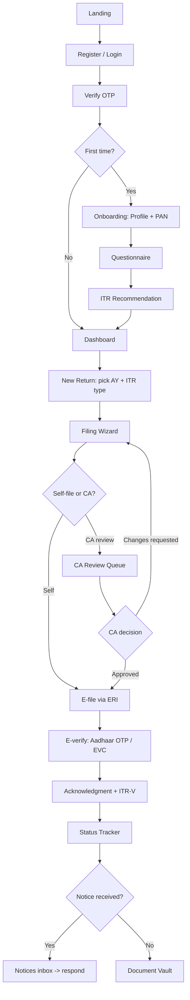
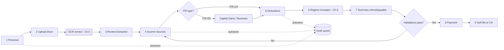

# Chapter 8 — Frontend, UX & Folder Structure

This chapter specifies the client application: how it looks, how the user moves through filing, the reusable component system, internationalization, client-side data/state architecture, and the concrete Next.js folder layout. API contracts, auth token semantics and RBAC roles are defined in **Chapter 4**; tax computation outputs (refund/payable, regime numbers) come from the engine in **Chapter 3**; OCR extraction fields and confidence scores come from **Chapter 5**. This chapter consumes those, it does not redefine them.

---

## 8.1 UX Principles

The product sells **trust** (people hand us their PAN, salary, bank data) and **simplicity** (most users file once a year and are not accountants). Every UX decision serves one of those two.

| Principle | Concrete implementation |
|---|---|
| **Guided, not a blank form** | Filing is a linear **WizardStepper** with one decision per screen. We never show a 60-field ITR form. The user answers plain-language questions; we map them to ITR schema fields behind the scenes. |
| **Mobile-first** | Designed at 360px first, enhanced to desktop. Primary CTA is always a full-width sticky bottom button on mobile (thumb zone). Tailwind breakpoints `sm/md/lg/xl`; layouts are single-column until `md`. |
| **Dashboard-driven** | After login the home is a **dashboard** (returns in progress, AY status, refund tracker, document vault, deadlines), not a marketing page. Returning users resume in one tap. |
| **Always show progress** | Persistent stepper + percentage ("Step 4 of 8 · 50%") + autosave indicator ("Saved 2s ago"). The user must always know where they are and that nothing is lost. |
| **Trust-building visuals** | Security badges (256-bit encryption, "Data stored in India", DPDP-compliant), ERI/registered-intermediary mention, masked PAN (`ABCDE****F`), CA-verified seal, Razorpay/Cashfree logos at the payment step, real acknowledgment number after e-file. |
| **Plain-language money** | Indian numbering (lakh/crore grouping: `₹12,34,567`), never raw `1234567`. Every tax term has an inline tooltip ("What is 80C?"). Refund shown in green, payable in amber, with a one-line "why". |
| **Forgiving** | Autosave every field (debounced); resume later; "Back" never loses data; OCR results are editable, never silently trusted (see Chapter 5 confidence flags surfaced as warning chips). |
| **Accessibility = WCAG 2.1 AA** | Treated as a requirement, not a nice-to-have — DPDP/government-facing product. Full checklist in §8.9. |

**Why fintech-wizard over a single long form:** ClearTax/TaxBuddy data and our own MSME persona research show drop-off spikes on dense forms. A wizard lets us (a) skip irrelevant sections (a salaried ITR-1 user never sees business P&L), (b) inject AI suggestions contextually (deduction nudges), and (c) checkpoint/autosave so a user can file across multiple sessions and devices — critical when they must go fetch a Form 16 or bank statement.

**Why mobile-first specifically:** the MSME/freelancer/pensioner segments in India are predominantly mobile-primary. Designing desktop-first and shrinking produces unusable mobile flows; the reverse degrades gracefully.

---

## 8.2 Screen Inventory & User Flow

### 8.2.1 Screen inventory

Grouped by route segment (see folder structure §8.8). Routes use the `/api/v1`-style versioning only on the API; UI routes are clean paths.

**Public / Auth (`(auth)` group)**
- `/` Landing (value prop, pricing, trust, "Start filing" CTA)
- `/login`, `/register` — phone/email + password or OTP-first
- `/verify-otp` — **OtpInput** (6-digit), resend timer, channel switch (SMS/email)
- `/forgot-password`, `/reset-password`

**Onboarding (`(onboarding)` group, post-auth, pre-dashboard for first-time users)**
- `/onboarding/profile` — name, PAN (encrypted on submit), DOB, residential status
- `/onboarding/questionnaire` — plain-language Q&A that determines ITR type
- `/onboarding/itr-recommendation` — "We recommend ITR-1" with override

**App shell (`(app)` group — authenticated, has sidebar/topbar)**
- `/dashboard` — home (returns, refund tracker, deadlines, vault shortcut)
- `/returns` — list of all TaxReturns across AYs (**DataTable**)
- `/returns/new` — AY + ITR-type selection → launches wizard
- `/returns/[returnId]/file/[step]` — **the filing wizard** (steps below)
- `/returns/[returnId]/summary` — computed summary, refund/payable
- `/returns/[returnId]/acknowledgment` — ITR-V / acknowledgment number, downloads
- `/documents` — Document Vault (uploaded + generated artifacts)
- `/payments` — payment history, invoices, **Wallet**/**Coupons**
- `/ca-review` — (CA persona) review queue + per-return review panel
- `/notices` — ITD **Notices** inbox + response workflow
- `/tickets` — support **Tickets**
- `/settings` — profile, security (sessions/refresh), language, notifications

**Admin (`(admin)` group — RBAC: tenant_admin / platform_admin per Chapter 4)**
- `/admin` — ops dashboard (filings funnel, revenue, CA load, error rates)
- `/admin/tenants`, `/admin/users`, `/admin/returns`, `/admin/cas`, `/admin/coupons`, `/admin/audit` (**AuditLogs** viewer)

### 8.2.2 Filing wizard steps

The wizard is the heart of the app. Steps for the **superset** (ITR-3/4); ITR-1 hides business/capital-gain steps dynamically.

1. **Personal & Contact** (prefilled from profile)
2. **Document Upload** — Form 16, AIS, TIS, 26AS, bank/capital-gain/GST (→ OCR, Chapter 5)
3. **Review Extracted Data** — salary, TDS, interest auto-filled with confidence chips; user confirms/edits
4. **Income Sources** — salary (auto), house property, capital gains, business/profession (ITR-3/4), other
5. **Deductions** — 80C/80D/80CCD(1B)/80G/80TTA etc. with **DeductionSuggestionCard** nudges
6. **Regime Comparison** — old vs new, side-by-side, recommended pick (Chapter 3 numbers)
7. **Summary** — total income, tax, TDS paid, **refund or payable**, validations
8. **Payment** — filing fee (Razorpay/Cashfree), coupon/wallet
9. **Choose Path** — self-file (e-verify) **or** route to CA review
10. **E-file / Acknowledgment** — submit to ERI, get acknowledgment number, e-verify (Aadhaar OTP/EVC), tracking

### 8.2.3 End-to-end flow



### 8.2.4 Filing wizard internal flow (with autosave + branching)



**Why a `[returnId]/file/[step]` URL (route per step) instead of client-only step state:** deep-linkable, browser-back works naturally, autosave drafts map to a resumable URL, and CA "changes requested" can link the user straight to the offending step. The step is validated server-side on transition (Chapter 4) so you cannot URL-jump past required data.

---

## 8.3 Wireframes (described layouts)

ASCII sketches describe structure/hierarchy, not pixels. Mobile collapses multi-column to single-column stacks.

### 8.3.1 Dashboard
```
┌───────────────────────────────────────────────────────────┐
│ [Logo]  TallyG Tax            🔔   EN|HI   [Avatar ▾]       │
├───────────┬───────────────────────────────────────────────┤
│ SIDEBAR   │  Welcome back, Komal    AY 2025-26  ⏳ 31 Jul   │
│ Dashboard │  ┌──────────────┐ ┌──────────────┐ ┌─────────┐ │
│ Returns   │  │ Resume return │ │ Refund status │ │ Vault   │ │
│ Documents │  │ ITR-4 · 60%   │ │ ₹12,340 ⏳     │ │ 7 files │ │
│ Payments  │  │ [Continue →]  │ │ [Track →]     │ │ [Open →]│ │
│ Notices   │  └──────────────┘ └──────────────┘ └─────────┘ │
│ Tickets   │  Your returns                      [+ New ITR]  │
│ Settings  │  ┌─────────────────────────────────────────┐   │
│           │  │ AY 2025-26 · ITR-4 · Draft · 60% [Open] │   │
│           │  │ AY 2024-25 · ITR-1 · Filed ✓     [View] │   │
│           │  └─────────────────────────────────────────┘   │
│           │  Deadlines • Tips (DeductionSuggestionCard)     │
└───────────┴───────────────────────────────────────────────┘
```
Cards = **StatCard**/**ProgressCard**; list = **DataTable** (compact) with **StatusBadge**. Empty first-time state uses **EmptyState** ("File your first return").

### 8.3.2 Filing-wizard step (e.g., Deductions)
```
┌───────────────────────────────────────────────────────────┐
│  ● Personal ─ ● Docs ─ ● Review ─ ● Income ─ ◉ Deductions ─ ○ Regime … │  ← WizardStepper (sticky)
│                                              Step 5 of 8 · 62% · Saved │
├───────────────────────────────────────────────────────────┤
│  Deductions (Chapter VI-A)                                  │
│  ┌─────────────────────────────────────────────────────┐   │
│  │ 80C  Investments (max ₹1,50,000)             ⓘ      │   │
│  │ [ ₹ 1,20,000        ] CurrencyInput   used 80% ▓▓▓▓░ │   │
│  ├─────────────────────────────────────────────────────┤   │
│  │ 💡 You uploaded an LIC receipt — add ₹18,000 to 80C? │   │  ← DeductionSuggestionCard
│  │                                  [Add]   [Dismiss]   │   │
│  ├─────────────────────────────────────────────────────┤   │
│  │ 80D Health insurance  [ ₹ 25,000 ]            ⓘ      │   │
│  │ 80CCD(1B) NPS         [ ₹ 50,000 ]            ⓘ      │   │
│  └─────────────────────────────────────────────────────┘   │
│  Note: deductions mainly benefit the OLD regime (see next). │
├───────────────────────────────────────────────────────────┤
│           [ ← Back ]                 [ Continue → ]  (sticky)│
└───────────────────────────────────────────────────────────┘
```

### 8.3.3 Document upload
```
┌───────────────────────────────────────────────────────────┐
│  Upload your documents          Step 2 of 8 · 25% · Saving…│
├───────────────────────────────────────────────────────────┤
│  ┌───────────────────────────────────────────────────┐     │
│  │            ⬆  Drag & drop or browse                │     │  ← FileDropzone
│  │     PDF, JPG, PNG · max 10 MB · encrypted          │     │
│  └───────────────────────────────────────────────────┘     │
│  Suggested for ITR-4: Form 16, AIS, 26AS, Bank stmt, GST    │
│  ┌─────────────────────────────────────────────────────┐   │
│  │ Form16_2025.pdf   ▓▓▓▓▓▓ 100%  ✓ Extracted   [View] │   │
│  │ AIS.pdf           ▓▓▓░░░ 48% uploading…             │   │
│  │ bank.pdf          ⚠ Extraction low-confidence  [Fix]│   │  ← confidence flag (Ch.5)
│  └─────────────────────────────────────────────────────┘   │
│           [ ← Back ]                 [ Continue → ]          │
└───────────────────────────────────────────────────────────┘
```

### 8.3.4 Regime comparison
```
┌───────────────────────────────────────────────────────────┐
│  Old vs New Tax Regime — AY 2025-26                         │
│  ┌──────────────────────────┐  ┌──────────────────────────┐│
│  │ OLD REGIME               │  │ NEW REGIME   ★ Recommended ││  ← RegimeCompareCard ×2
│  │ Gross income  ₹12,00,000 │  │ Gross income  ₹12,00,000 ││
│  │ Deductions    ₹2,25,000  │  │ Deductions    ₹75,000*   ││
│  │ Taxable       ₹9,75,000  │  │ Taxable       ₹11,25,000 ││
│  │ Tax + cess    ₹1,09,200  │  │ Tax + cess    ₹93,600    ││
│  │ ─────────────            │  │ ─────────────            ││
│  │ Take-home calc           │  │ You save ₹15,600  ✅      ││
│  │ [ Choose Old ]           │  │ [ Choose New ]           ││
│  └──────────────────────────┘  └──────────────────────────┘│
│  ⓘ Numbers from the computation engine (Chapter 3).         │
│  [ Why these differ? ]  (expand explanation drawer)         │
└───────────────────────────────────────────────────────────┘
```
Recommended card has elevated border + star. On mobile the two cards stack with a sticky "You save ₹X" banner.

### 8.3.5 Payment
```
┌───────────────────────────────────────────────────────────┐
│  Pay filing fee                                             │
│  Plan: Self-file ITR-4               ₹ 499                  │
│  Coupon [ NEW50 ] [Apply]            − ₹ 50                 │
│  Wallet credit                       − ₹ 49                 │
│  ─────────────────────────────────────────                 │
│  Payable                             ₹ 400  (incl. 18% GST) │
│  [ Pay securely with Razorpay ]   🔒  [ Cashfree ]          │
│  🔒 PCI-DSS · We never store card details                   │
└───────────────────────────────────────────────────────────┘
```

### 8.3.6 Status tracker
```
┌───────────────────────────────────────────────────────────┐
│  AY 2025-26 · ITR-4 · Acknowledgment 1234567890123456      │
│  ● Drafted        12 Jun ✓                                 │  ← StatusTimeline
│  ● Paid           12 Jun ✓                                 │
│  ● E-filed        12 Jun ✓                                 │
│  ● E-verified     13 Jun ✓  (Aadhaar OTP)                  │
│  �◐ Processing at ITD          in progress                  │
│  ○ Refund issued              ₹12,340 expected             │
│  [ Download ITR-V ]  [ Download computation ]              │
└───────────────────────────────────────────────────────────┘
```

### 8.3.7 CA review panel (CA persona)
```
┌───────────────────────────────────────────────────────────┐
│ Queue (12) │  Return: Komal · ITR-4 · AY 2025-26           │
│ ▸ Komal    │  ┌───────── Computation ──────┐ ┌─ Docs ────┐ │
│ ▸ Rahul    │  │ Taxable   ₹9,75,000        │ │ Form16 ▣  │ │
│ ▸ Anita    │  │ Tax       ₹1,09,200        │ │ AIS    ▣  │ │
│   …        │  │ Refund    ₹12,340          │ │ 26AS   ▣  │ │
│            │  └────────────────────────────┘ └───────────┘ │
│            │  Checklist: ☑ PAN ☑ TDS match ☐ 80C proof     │
│            │  Comments (threaded) ───────────────          │
│            │  [Approve & e-file]  [Request changes]  [Note] │
└───────────────────────────────────────────────────────────┘
```
Split-pane (queue + detail). Side-by-side computation vs source documents so the CA verifies without app-switching.

### 8.3.8 Admin dashboard
```
┌───────────────────────────────────────────────────────────┐
│ KPIs: Filings 4,210 ↑ │ Revenue ₹18.6L │ CA SLA 92% │ Err 0.4% │
│ Funnel: Register→OTP→Onboard→Draft→Pay→Filed (bar)         │
│ ┌─ Filings over time (line) ─┐ ┌─ ITR-type mix (donut) ──┐ │
│ Tables: Tenants | Failed e-files (retry) | CA load | AuditLogs │
└───────────────────────────────────────────────────────────┘
```

---

## 8.4 Reusable Component Library / Design System

Built on **Tailwind CSS** + **shadcn/ui** (Radix primitives) as the unstyled-accessible base, wrapped in a TallyG theme. Tokens (color/spacing/radii/typography) live in `tailwind.config.ts` + CSS variables for light/dark. Documented in **Storybook**.

**Why shadcn/ui + Radix over a heavy kit (MUI/AntD):** Radix gives us WCAG-correct focus management, keyboard nav and ARIA out of the box (huge for our AA requirement), while shadcn copies components into our repo so we own/theme them and ship less JS than a monolithic kit — directly helping Core Web Vitals (§8.9).

### Foundational / form
| Component | Purpose / notes |
|---|---|
| `Button`, `IconButton` | variants: primary/secondary/ghost/destructive; loading state |
| `Input`, `Textarea`, `Select`, `Combobox`, `Checkbox`, `Radio`, `Switch` | RHF-bound; error/disabled states |
| **`CurrencyInput`** | ₹ Indian grouping (`1,23,456`), parses to `number` (engine wants paise-safe decimals); stores aligned to `NUMERIC(14,2)` |
| **`OtpInput`** | 6 segmented boxes, auto-advance, paste-fill, resend countdown, SMS/email channel toggle |
| `DatePicker` | AY/FY aware; `dd MMM yyyy`; disallows future where invalid |
| `PanInput` | masks display to `ABCDE****F`, validates `[A-Z]{5}[0-9]{4}[A-Z]` client-side, sends raw for server-side encryption |
| `FormField` | label + control + helper + error + tooltip wrapper (the i18n + a11y contract lives here) |

### Domain components
| Component | Purpose |
|---|---|
| **`WizardStepper`** | horizontal (desktop) / compact dots + "Step n of m" (mobile); shows done/active/locked; sticky |
| **`WizardLayout`** | shell: stepper top, content, sticky Back/Continue, autosave indicator |
| **`FileDropzone`** | drag-drop + browse, type/size validation, per-file progress, OCR status + confidence chip, retry |
| **`DocumentCard`** | uploaded artifact: thumbnail, status, view/download/delete |
| **`RegimeCompareCard`** | one regime's breakdown; `recommended` flag adds star/elevated border |
| **`DeductionSuggestionCard`** | AI nudge ("Add ₹X to 80C?") with Add/Dismiss; sourced from extracted docs (Ch.5) |
| **`TaxSummaryPanel`** | total income → tax → TDS → refund/payable, color-coded (green/amber) |
| **`StatusTimeline`** | vertical stepper for filing lifecycle (drafted→filed→verified→processed→refund) |
| **`RefundTrackerCard`** | dashboard widget: amount + ETA + ITD status |
| **`CaReviewPanel`**, **`CommentThread`**, **`ReviewChecklist`** | CA workspace pieces |
| **`NoticeCard`** | ITD notice summary + due date + respond CTA |

### Data / feedback / layout
| Component | Purpose |
|---|---|
| **`DataTable`** | TanStack Table: sort/filter/paginate/column-visibility; server-side for admin lists |
| **`StatusBadge`** | Draft/Paid/Filed/Verified/Processing/Refunded — consistent color map |
| **`EmptyState`** | illustration + message + CTA (no returns, no documents, empty queue) |
| `Skeleton` | per-component loading placeholders (used by Suspense, §8.5) |
| `Toast` (sonner), `Dialog`, `Drawer`, `Tooltip`, `Tabs`, `Accordion`, `Popover` | Radix-backed |
| `CurrencyDisplay`, `MaskedValue`, `Trans` | read-only formatters; `Trans` wraps next-intl rich text |
| `AppShell`, `Sidebar`, `Topbar`, `LanguageSwitcher`, `Breadcrumbs` | authenticated chrome |
| `ErrorBoundary`, `RouteError` | maps API problem-details (Chapter 4) to friendly messages |

**Why a `CurrencyInput`/`CurrencyDisplay` as first-class components:** Indian lakh/crore grouping is non-trivial (`Intl.NumberFormat('en-IN')`), money correctness is legally sensitive, and the engine (Ch.3) expects clean decimals aligned to `NUMERIC(14,2)`. Centralizing parsing/formatting in two components prevents subtle rounding/format bugs scattered across forms.

---

## 8.5 Client Architecture (state, data, forms, auth)

### 8.5.1 Server state — TanStack Query (React Query)
- **All server data** (returns, documents, payments, computations, notices) is fetched/cached via TanStack Query. Query keys are structured: `['returns', returnId]`, `['returns', returnId, 'computation']`.
- A thin typed **API client** (`lib/api/client.ts`) wraps `fetch`, injects the access token, handles refresh, and parses RFC 7807 problem-details (Chapter 4) into typed errors.
- Mutations (`useMutation`) invalidate the relevant query keys; wizard "save & continue" is a mutation that optimistically updates the draft.
- `staleTime` tuned per resource (computation results short; profile long).

**Why TanStack Query instead of Redux for server data:** filing data is *server state* (remote, async, cached, needs revalidation), not client UI state. Query gives caching, dedup, background refetch, retry and loading/error states for free; Redux would mean hand-rolling all of that. We keep a tiny **Zustand** store only for genuine client/UI state (wizard transient flags, language preference, toasts) — not for server data.

### 8.5.2 Forms — React Hook Form + zod
- Every wizard step is a **React Hook Form** form with a **zod** schema via `@hookform/resolvers/zod`.
- **The zod schema is the single source of truth** and is **shared with the server** in a `packages/schemas` (or `lib/schemas`) module, so client and ASP.NET-bound DTOs validate against identical rules (e.g., 80C ≤ ₹1,50,000, PAN regex, AY format). For .NET we generate matching validation/contracts (or validate via the BFF) — the schema is exported and kept in lockstep with Chapter 4 request models.
- Uncontrolled inputs (RHF) = minimal re-renders → snappy on low-end mobile.

**Why RHF + zod over Formik/yup:** RHF's uncontrolled model is materially faster on large forms/low-end devices; zod gives end-to-end TypeScript inference (`z.infer`) so form types, API types and validation never drift — essential for a tax form where a wrong cap is a compliance bug.

### 8.5.3 Auth handling on the client
- Login returns a **short-lived JWT access token** + **rotating refresh token** (Chapter 4).
- **Refresh token** is stored in an **HttpOnly, Secure, SameSite=Strict cookie** set by the server — JS cannot read it (XSS-resistant). **Access token** kept in memory (Zustand/React state), re-acquired on load via a silent `/auth/refresh` call.
- A `middleware.ts` (Edge) guards `(app)`/`(admin)` route groups, redirecting unauthenticated users to `/login` and enforcing RBAC role gates (CA-only, admin-only) per Chapter 4 claims.
- 401 from the API → API client attempts one silent refresh → on failure, clears state and redirects to login (with `?next=` to resume).
- RBAC in UI: a `useAuth()` hook exposes `roles`/`permissions`; components gate via `<Can permission="ca.review">`. UI gating is **convenience only**; the server is the authority (Chapter 4).

**Why refresh-in-HttpOnly-cookie + access-in-memory (not localStorage):** localStorage tokens are readable by any injected script (XSS → full account takeover). HttpOnly cookies block that; keeping the short-lived access token in memory limits blast radius and avoids CSRF on the access path (it's a Bearer header, not a cookie). The refresh cookie is `SameSite=Strict` + CSRF-protected on its single endpoint.

### 8.5.4 Optimistic UI — where it matters (and where it must not)
- **Optimistic:** wizard field autosave, deduction add/dismiss, document delete, toggling regime selection, dashboard reorder, marking a notice read — fast, low-risk, easily rolled back on error.
- **Never optimistic:** **payment confirmation, e-file submission, e-verification, refund status.** These are money/legal events — we show explicit pending states and only advance the **StatusTimeline** on confirmed server/webhook responses (Razorpay/Cashfree + ERI). Showing "Filed" before ITD confirms would be a trust-destroying lie.

**Why split it this way:** optimistic UI trades correctness for perceived speed. That trade is fine for reversible drafts but unacceptable for irreversible financial/legal state where a wrong optimistic flash erodes the exact trust the product depends on.

### 8.5.5 Rendering strategy (App Router)
- **Server Components by default**; client components (`'use client'`) only where interactivity is needed (forms, wizard, charts).
- Marketing/landing = **static** (SSG/ISR) for speed + SEO. Authenticated app = dynamic, client-fetched via Query (data is per-user, not cacheable at CDN).
- **Streaming + Suspense** with `loading.tsx` skeletons so the shell paints instantly while data streams.

---

## 8.6 Internationalization (English / Hindi)

- **Library: `next-intl`** (App Router-native). Locale is a route segment: `/[locale]/dashboard` with `en` and `hi`; middleware negotiates from cookie → `Accept-Language` → default `en`.
- **Content-key strategy:** namespaced dot keys mirroring features — `wizard.deductions.title`, `regime.compare.recommended`, `errors.pan.invalid`. Messages live in `messages/en.json` / `messages/hi.json`. Keys are **semantic, never English text as the key**, so copy edits don't churn keys and Hindi never falls back to a stale English string.
- **Pluralization & interpolation** via ICU MessageFormat (`{count, plural, one {# return} other {# returns}}`), so Hindi grammar/plural rules are handled per-locale.
- **Number/currency/date formatting** uses `Intl` through next-intl formatters, **locale `en-IN` for both languages** (Indian grouping is the same; only the script/words differ): currency `₹1,23,456.00` (`NUMBER` with `currency: 'INR'`), dates `31 मई 2026` / `31 May 2026`. **Tax data is never machine-translated** — ITR section labels (80C, 26AS) stay canonical; only surrounding UI copy is translated.
- **Why next-intl over react-i18next:** it's purpose-built for the App Router (works in Server Components, supports static rendering of translated pages, type-safe keys), avoiding the client-only hydration friction react-i18next has with RSC.
- **Why English/Hindi first, architected for more:** the message-catalog + ICU structure makes adding regional languages (Tamil, Telugu, Marathi, Gujarati — relevant for MSME reach) a content task, not a code change.

---

## 8.7 (folded into 8.5/8.6) — see above

---

## 8.8 Suggested Next.js Folder Structure (App Router, feature-first)

Organized **by feature**, not by file-type, so everything for "filing" or "ca-review" lives together and chapters/teams can own a slice.

```text
tallyg-web/
├─ app/
│  ├─ [locale]/                      # i18n segment (en | hi)
│  │  ├─ (auth)/
│  │  │  ├─ login/page.tsx
│  │  │  ├─ register/page.tsx
│  │  │  ├─ verify-otp/page.tsx
│  │  │  └─ layout.tsx               # minimal centered auth shell
│  │  ├─ (onboarding)/
│  │  │  ├─ profile/page.tsx
│  │  │  ├─ questionnaire/page.tsx
│  │  │  └─ itr-recommendation/page.tsx
│  │  ├─ (app)/                      # authenticated app shell
│  │  │  ├─ layout.tsx               # AppShell: Sidebar + Topbar
│  │  │  ├─ dashboard/page.tsx
│  │  │  ├─ returns/
│  │  │  │  ├─ page.tsx              # list (DataTable)
│  │  │  │  ├─ new/page.tsx          # AY + ITR-type select
│  │  │  │  └─ [returnId]/
│  │  │  │     ├─ file/[step]/page.tsx   # the wizard
│  │  │  │     ├─ summary/page.tsx
│  │  │  │     └─ acknowledgment/page.tsx
│  │  │  ├─ documents/page.tsx       # Vault
│  │  │  ├─ payments/page.tsx
│  │  │  ├─ ca-review/…              # (RBAC: ca)
│  │  │  ├─ notices/…
│  │  │  ├─ tickets/…
│  │  │  └─ settings/…
│  │  ├─ (admin)/admin/…             # (RBAC: admin)
│  │  ├─ layout.tsx                  # locale provider + fonts + theme
│  │  ├─ loading.tsx                 # streaming skeleton
│  │  ├─ error.tsx                   # route error boundary
│  │  └─ not-found.tsx
│  └─ globals.css
├─ features/                         # feature-first domain logic + UI
│  ├─ auth/        { components/ hooks/ api/ schemas.ts }
│  ├─ filing/      { components/ wizard/ steps/ hooks/ api/ schemas.ts }
│  ├─ documents/   { FileDropzone, DocumentCard, api, hooks }
│  ├─ tax/         { RegimeCompareCard, TaxSummaryPanel, DeductionSuggestionCard }
│  ├─ payments/    { components/ api/ razorpay.ts cashfree.ts }
│  ├─ ca-review/   { CaReviewPanel, CommentThread, ReviewChecklist }
│  ├─ notices/  •  tickets/  •  dashboard/  •  admin/
├─ components/ui/                    # design system (shadcn-based, themed)
│  ├─ button.tsx input.tsx currency-input.tsx otp-input.tsx
│  ├─ wizard-stepper.tsx file-dropzone.tsx status-timeline.tsx
│  ├─ data-table.tsx empty-state.tsx status-badge.tsx …
├─ lib/
│  ├─ api/         { client.ts (fetch+auth+refresh), problem-details.ts }
│  ├─ auth/        { useAuth.ts, Can.tsx, middleware helpers }
│  ├─ query/       { queryClient.ts, keys.ts }
│  ├─ format/      { currency.ts (en-IN), date.ts, pan-mask.ts }
│  ├─ validation/  { zod refinements: pan, ay, deduction caps }   # shared w/ server
│  └─ utils.ts
├─ stores/                          # Zustand (UI-only state)
├─ messages/      { en.json, hi.json }     # next-intl catalogs
├─ i18n/          { request.ts, routing.ts }
├─ hooks/         # cross-feature hooks (useMediaQuery, useDebounce…)
├─ types/         # shared TS types / z.infer re-exports
├─ tests/         { unit (vitest), e2e (playwright) }
├─ .storybook/
├─ middleware.ts                    # auth + RBAC + locale negotiation
├─ tailwind.config.ts  next.config.mjs  tsconfig.json
└─ package.json
```

**Why feature-first + route groups:** route groups `(auth)/(app)/(admin)` let each area have its own `layout.tsx` (different chrome, different RBAC guard) without affecting the URL. Co-locating components/hooks/api/schemas under `features/<x>` keeps a feature's surface area in one place — a developer touching "filing" rarely leaves `features/filing`, and the design-system in `components/ui` stays generic and reusable. The `[returnId]/file/[step]` dynamic segments make the wizard deep-linkable and resumable (§8.2.4).

---

## 8.9 Accessibility (WCAG 2.1 AA) & Performance Checklists

### 8.9.1 Accessibility — WCAG 2.1 AA
- [ ] **Semantic HTML + landmarks** (`<nav><main><header>`), one `<h1>` per page, logical heading order.
- [ ] **Keyboard-complete:** every action (wizard nav, dropzone, dialogs, stepper) operable without a mouse; visible focus rings (never `outline:none` without replacement).
- [ ] **Focus management:** dialogs/drawers trap focus and restore on close (Radix handles); on wizard step change, focus moves to the step heading.
- [ ] **Contrast ≥ 4.5:1** text / 3:1 large text & UI; verified in both light/dark and Hindi.
- [ ] **Forms:** every input has a programmatic `<label>`; errors linked via `aria-describedby`; error summary announced via `aria-live="assertive"`; autosave status via `aria-live="polite"`.
- [ ] **Color not sole signal:** refund/payable use icon + text, not just green/amber; status badges have text labels.
- [ ] **Images/icons:** meaningful images have `alt`; decorative ones `alt=""`; icon-only buttons have `aria-label`.
- [ ] **Targets ≥ 44×44px**, adequate spacing (thumb-friendly mobile).
- [ ] **Reduced motion:** honor `prefers-reduced-motion`; no critical info conveyed only via animation.
- [ ] **Language:** `<html lang>` reflects active locale (en/hi) so screen readers use the right voice.
- [ ] **OTP & timers:** resend countdown announced; no hard time-out that traps users (WCAG 2.2.1).
- [ ] **Tooling:** `eslint-plugin-jsx-a11y` in CI, `axe-core`/`@axe-core/playwright` automated scans, plus manual NVDA/VoiceOver pass on the wizard + payment.

### 8.9.2 Performance — Core Web Vitals targets
| Metric | Target (mobile, p75) |
|---|---|
| **LCP** | ≤ 2.5 s |
| **INP** | ≤ 200 ms |
| **CLS** | ≤ 0.1 |
| TTFB | ≤ 0.8 s |
| Initial route JS | ≤ ~170 KB gzip |

Tactics:
- [ ] **RSC-first** — ship interactivity only where needed; keeps client JS small (helps INP/LCP).
- [ ] **Route-level code splitting** (App Router default) + `next/dynamic` for heavy, below-fold widgets (charts on dashboard/admin, PDF preview).
- [ ] **`next/image`** for all imagery (responsive, AVIF/WebP, lazy) → protects LCP/CLS.
- [ ] **`next/font`** self-hosted (Inter + a Devanagari face for Hindi) with `display: swap`, preloaded → no FOIT, stable CLS.
- [ ] **Reserve space** for async content (skeletons with fixed dimensions) → CLS ≈ 0.
- [ ] **TanStack Query caching + prefetch** the next wizard step on hover/idle → instant transitions.
- [ ] **Debounced autosave** (~600 ms) to avoid mutation storms hurting INP.
- [ ] **Sticky CTAs reserved** in layout so they don't shift content.
- [ ] **Bundle budget in CI** (`@next/bundle-analyzer` + size-limit) fails PRs that regress JS size.
- [ ] **CDN/edge** for static assets + SSG marketing pages; **RUM** via Vercel Analytics / web-vitals beacon to watch field p75, not just lab.

**Why obsess over CWV here:** the target users are mobile-primary, often on mid/low-end Android over patchy networks, filing under deadline pressure. Slow/janky filing = abandonment and lost revenue; Google also ranks on CWV, which matters for organic acquisition (Chapter 7).