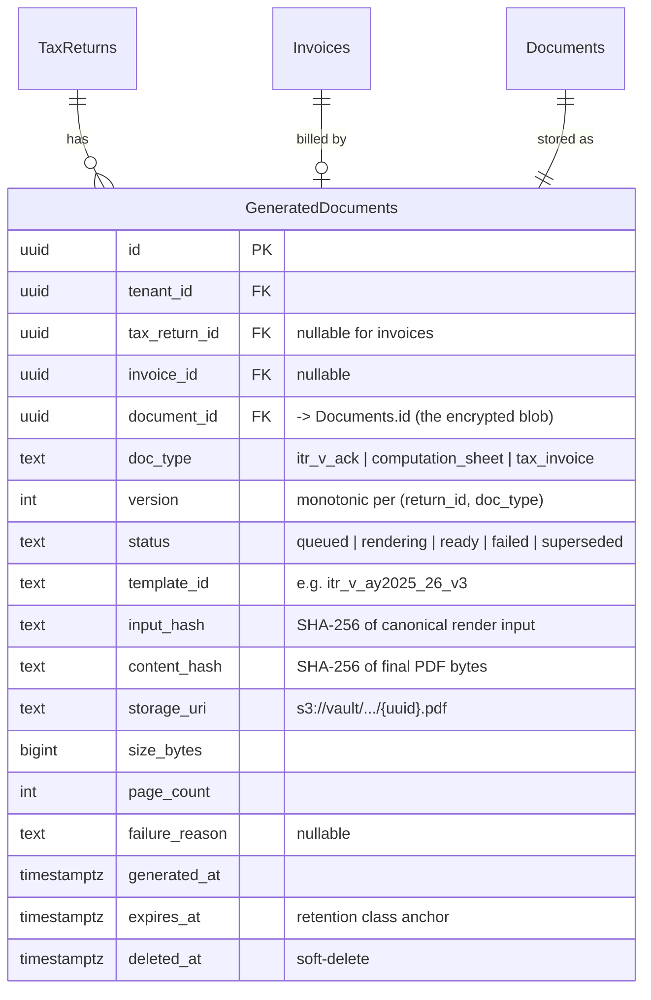
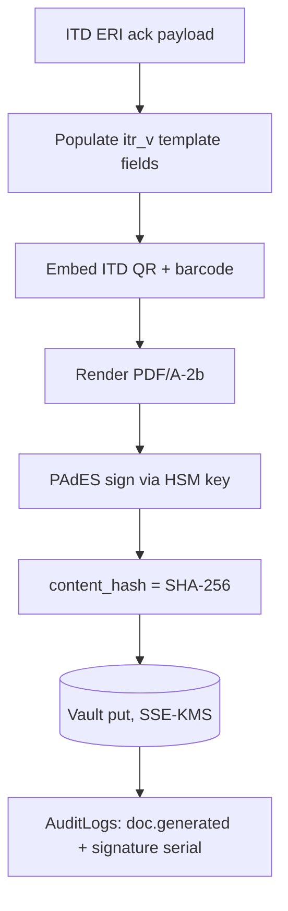
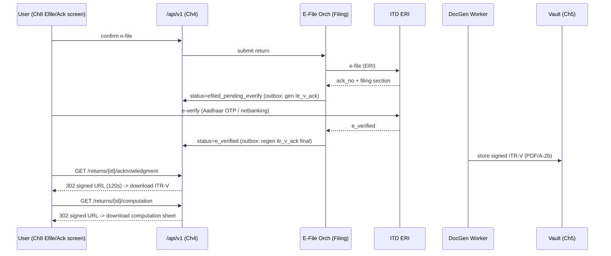

# Chapter 9 (Addendum): Document & Report Generation — ITR-V, Computation Sheet & Tax Invoice PDFs

> **Scope of this addendum.** Closes the gap between Requirement 1 ("download acknowledgment & computation") and the architecture as specified through Ch1–Ch8. Ch3 produces a `ComputationResult` with a line-by-line `trace`; Ch8 renders an Efile/Acknowledgment screen and a `RefundTrackerCard`; Ch2 already has an `Invoices` table; Ch5 owns the S3 document **vault** (ingestion + OCR). **None** of these define a service that *renders* the take-away PDFs. This chapter introduces a **Document & Report Generation (DocGen)** capability — a new sub-module of the **Filing** module (per Ch1) — that renders three first-class artifacts (**ITR-V acknowledgment**, **computation worksheet**, **fee tax-invoice**), stores them in the Ch5 vault under identical encryption/retention, and exposes download endpoints in the Ch4 API surface.

---

## 9.1 Where DocGen lives & why

Ch1 lists nine modules with no reporting/rendering module. Rather than add a tenth top-level module, DocGen is a **service inside the existing Filing module**, with a thin generation library shared with the **Documents** module.

```mermaid
flowchart LR
  subgraph Filing["Filing module (Ch1)"]
    EFILE[E-File Orchestrator]
    DOCGEN[DocGen Service]
  end
  subgraph Tax["Tax Engine (Ch3)"]
    COMP[ComputationResult.trace]
  end
  subgraph Docs["Documents module (Ch5)"]
    VAULT[(S3 Vault + KMS envelope enc.)]
    META[(Documents table)]
  end
  subgraph Bill["Billing (Ch2/Ch7)"]
    INV[(Invoices / Payments)]
  end
  COMP -->|render input| DOCGEN
  INV -->|render input| DOCGEN
  EFILE -->|ITD ack JSON / ITR-V| DOCGEN
  DOCGEN -->|encrypted PDF/A-2b| VAULT
  DOCGEN -->|register| META
  DOCGEN -->|signed URL| API[/api/v1 (Ch4)/]
```

**Why a sub-module, not a tenth top-level module:** the artifacts are 1:1 with a filing or a payment; the render inputs (`ComputationResult`, ITD acknowledgment payload, invoice rows) are owned by Filing/Billing; and the output sink is the Ch5 vault. A separate module would only add a network hop and duplicate the tenant/auth context. **Why a shared library with Documents:** PDF rendering, font embedding, vault upload, and hashing are identical for generated and uploaded files — Documents reuses the `IVaultWriter` + `IPdfRenderer` interfaces so there is one storage/encryption path, not two.

**Why server-side, never client-side:** ITR-V and the computation sheet are quasi-legal documents derived from encrypted PAN and the tax trace. Generating them in the browser would require shipping decrypted PAN and the full trace to the client and would produce non-reproducible, untrusted artifacts. Server-side rendering keeps PII server-bound (Ch6/DPDP), guarantees byte-reproducibility, and lets us hash and audit every output.

---

## 9.2 The three artifacts (Indian-tax-specific)

| Artifact | `doc_type` | Source of truth | When generated | Mandatory contents |
|---|---|---|---|---|
| **ITR-V Acknowledgment** | `itr_v_ack` | ITD ERI response (e-file success) | On `TaxReturns.status = e_verified` **or** `efiled_pending_everify` | Acknowledgment Number (15-digit), filed-u/s code (139(1)/139(4)/139(5)), AY, PAN (masked), name, ITR form no., gross total income, total income, tax payable, total tax & interest paid, **e-filing date**, **e-verification date/mode**, ITD verification **QR code**, ITD barcode string |
| **Computation Worksheet** | `computation_sheet` | Ch3 `ComputationResult.trace` (persisted) | On computation finalize (regime locked) and re-generated on any recompute | Head-wise income (Salary, House Property, PGBP, Capital Gains, Other Sources), Chapter VI-A deductions (80C/80D/80CCD(1B)/80TTA/80TTB…), gross & net total income, regime (old/new u/s 115BAC), slab-wise tax, surcharge, 87A rebate, **4% cess**, TDS/TCS/advance/self-assessment credits, 234A/B/C interest, refund/payable, **old-vs-new comparison** delta |
| **Fee Tax Invoice** | `tax_invoice` | Ch2 `Invoices` + `Payments` | On `Payments.status = captured` | Invoice no. (per-tenant series), invoice date, place of supply, SAC `998231`, taxable value, **CGST+SGST or IGST** split, total, GSTIN of TallyG entity, customer name/state, payment ref (Razorpay/Cashfree), coupon/wallet adjustments |

**Why ITR-V contents are fixed by the ITD, not by us:** the ITR-V is the Income Tax Department's prescribed acknowledgment. We populate exactly the fields the ERI/intermediary API returns (acknowledgment number, filing section, e-verify status, QR/barcode) so the artifact is identical to what the taxpayer would download from the ITD portal — this is what makes it a valid take-away. We do **not** invent layout; we reproduce the ITD ITR-V template.

**Why the computation sheet is *ours*, not the ITD's:** the ITD does not issue a computation PDF. Our computation worksheet is a value-add derived 100% from `ComputationResult.trace` (Ch3). Because Ch3 persists the trace line-by-line, the worksheet is fully reproducible and auditable — every number on the sheet maps to a `trace` node id.

---

## 9.3 Data model additions (Ch2 conventions)

DocGen does **not** create a parallel file store. Generated PDFs are rows in the **existing Ch5 `Documents` table** (so vault encryption, retention, soft-delete, and tenant scoping are inherited for free). We add a small `GeneratedDocuments` projection for render lineage + idempotency, and extend the `documents.source` enum.

**Why reuse `Documents` rather than a new files table:** one storage path means one encryption policy, one retention sweeper, one signed-URL issuer, and no risk of a generated PII PDF escaping the Ch6 controls. `GeneratedDocuments` only holds render *metadata* (inputs hash, template version, status), pointing at the `Documents` row that holds the actual encrypted blob pointer.



**DDL (PostgreSQL, snake_case, uuid PK, timestamptz, soft-delete — per shared conventions):**

```sql
CREATE TYPE generated_doc_type   AS ENUM ('itr_v_ack','computation_sheet','tax_invoice');
CREATE TYPE generated_doc_status AS ENUM ('queued','rendering','ready','failed','superseded');

CREATE TABLE generated_documents (
    id              uuid PRIMARY KEY DEFAULT gen_random_uuid(),
    tenant_id       uuid NOT NULL REFERENCES tenants(id),
    tax_return_id   uuid     REFERENCES tax_returns(id),
    invoice_id      uuid     REFERENCES invoices(id),
    document_id     uuid NOT NULL REFERENCES documents(id),   -- blob lives in Ch5 vault
    doc_type        generated_doc_type   NOT NULL,
    version         int  NOT NULL DEFAULT 1,
    status          generated_doc_status NOT NULL DEFAULT 'queued',
    template_id     text NOT NULL,
    input_hash      char(64) NOT NULL,                        -- SHA-256 hex of canonical input
    content_hash    char(64),                                 -- SHA-256 hex of PDF bytes
    storage_uri     text,
    size_bytes      bigint,
    page_count      int,
    failure_reason  text,
    generated_at    timestamptz,
    expires_at      timestamptz NOT NULL,
    created_at      timestamptz NOT NULL DEFAULT now(),
    updated_at      timestamptz NOT NULL DEFAULT now(),
    deleted_at      timestamptz,
    CHECK (tax_return_id IS NOT NULL OR invoice_id IS NOT NULL)
);

-- Idempotency: at most one *live* version per logical doc + input.
CREATE UNIQUE INDEX uq_gendoc_idem
  ON generated_documents (tenant_id, doc_type, COALESCE(tax_return_id, invoice_id), input_hash)
  WHERE deleted_at IS NULL;

-- Fast "latest ready version" lookup for the download endpoint.
CREATE INDEX ix_gendoc_latest
  ON generated_documents (tax_return_id, doc_type, version DESC)
  WHERE status = 'ready' AND deleted_at IS NULL;

-- Extend Ch5 documents.source so vault knows the provenance.
ALTER TYPE document_source ADD VALUE IF NOT EXISTS 'system_generated';
```

**Why `input_hash` + a partial unique index:** this gives **render idempotency**. If the same return + same finalized trace is requested twice (retry, double-click, webhook replay), we return the existing artifact instead of re-rendering. **Why a separate `content_hash`:** it makes every PDF tamper-evident — the value is logged to `AuditLogs` (Ch4/Ch6) and can be recomputed to prove the downloaded bytes match what we generated. **Why `version` + `superseded`:** a revised return (ITR-U / 139(5)) or a recomputed regime must produce a new computation sheet without deleting the old one (legal trail); the latest `ready` version wins, older ones flip to `superseded` but are retained.

---

## 9.4 Generation pipeline (async, outbox-driven)

Rendering is **never** done inline on the user's HTTP request (a 30-page computation PDF + QR + font embedding can take 300–1500 ms and is CPU-bound). It is dispatched through a transactional **outbox** consumed by a DocGen worker — consistent with the Ch1 modular-monolith + background-worker pattern.

```mermaid
sequenceDiagram
  participant API as Filing API (Ch4)
  participant DB as PostgreSQL
  participant OBX as Outbox
  participant W as DocGen Worker
  participant TX as Tax Engine (Ch3)
  participant R as PdfRenderer
  participant V as Vault (Ch5/S3+KMS)
  participant AUD as AuditLogs

  API->>DB: TaxReturn -> e_verified (or Payment captured)
  API->>OBX: enqueue DocGenRequested{return_id, doc_type}
  Note over API: returns 202 immediately
  W->>OBX: poll
  W->>TX: load ComputationResult.trace (or Invoice rows)
  W->>W: build canonical input model -> input_hash
  W->>DB: SELECT existing live row by input_hash
  alt already ready
    W-->>OBX: ack (idempotent no-op)
  else render
    W->>DB: INSERT generated_documents(status=rendering, version=n)
    W->>R: render(template_id, model) -> PDF/A-2b bytes
    W->>W: content_hash = SHA256(bytes)
    W->>V: putObject (SSE-KMS envelope) -> storage_uri
    W->>DB: UPDATE status=ready, content_hash, size, pages; mark prior version superseded
    W->>AUD: log doc.generated{gendoc_id, content_hash}
  end
```

**Why outbox instead of a direct queue publish:** it removes the dual-write problem — the state transition (`e_verified`) and the "generate this doc" intent commit in the **same DB transaction**, so we never e-verify a return and then silently fail to enqueue its ITR-V. **Why async + 202:** the user gets an instant response; the Ch8 Acknowledgment screen polls `status` (or receives a WebSocket/SSE push) and enables the **Download** button when `ready`. **Why a worker pool, not a serverless function per render:** the renderer needs warm fonts (Devanagari + Latin), the ITR-V template assets, and a headless browser/engine pool — keeping these resident in a long-lived worker avoids cold-start cost on every download.

### 9.4.1 Auto-generation triggers

| Trigger (domain event) | Doc generated |
|---|---|
| `Payments.status -> captured` (Ch2) | `tax_invoice` |
| `TaxReturns.status -> efiled_pending_everify` | `itr_v_ack` (draft ack, pre-everify) |
| `TaxReturns.status -> e_verified` (ITD e-verify success) | `itr_v_ack` (final, supersedes draft) |
| `ComputationResult finalized / regime locked` (Ch3) | `computation_sheet` |
| ITR revised (139(5)) / updated (139(8A) ITR-U) | new `version` of `itr_v_ack` + `computation_sheet` |

---

## 9.5 Rendering engine choice

**Decision: HTML/CSS templates → PDF via headless Chromium (Playwright `page.pdf`), wrapped to PDF/A-2b.** Backend is ASP.NET Core (Ch1); we run a small pool of headless-Chromium render workers behind the DocGen service.

**Why HTML/CSS + Chromium and not a code-drawn library (e.g., QuestPDF/iText drawing):**
- The ITR-V and computation sheet are **table-heavy, multilingual, paginated** documents that change every Assessment Year. HTML/CSS + Razor/Liquid templates let tax analysts edit layout per AY without recompiling C#; the layout engine handles page breaks, repeating table headers, and Devanagari shaping natively.
- **Why versioned templates (`template_id = itr_v_ay2025_26_v3`):** slab rates, surcharge thresholds, and the ITR-V format are AY-specific. Templates are stored as versioned assets; `GeneratedDocuments.template_id` records exactly which template produced a file, so an AY 2024-25 return always re-renders with its original template even in FY 2026.

**Why PDF/A-2b specifically:** PDF/A is the ISO archival profile (embedded fonts, no external deps, deterministic) — appropriate for a document retained 8 years (Ch6 retention). PDF/A-2b also permits the embedded **QR code** and an embedded **digital signature**, both of which we need.

**Determinism guardrails (Why each matters):**
- Force a fixed render date/timezone (UTC, per conventions) injected as data — never `now()` inside the template — so re-rendering the same input yields identical bytes and a stable `content_hash`.
- Embed (subset) all fonts; disable external image/CSS fetches in Chromium (`--disable-remote-fonts`, no network) so a PDF is self-contained and PII never leaks to a font CDN.
- Strip non-deterministic PDF metadata (creation timestamp set from input, fixed producer string).

---

## 9.6 Storage, encryption & retention (reuse Ch5 + Ch6, do not re-specify)

Generated PDFs are written through the **same `IVaultWriter`** that Ch5 uses for uploads:

- **Bucket/prefix:** `s3://tallyg-vault-{region}/generated/{tenant_id}/{tax_return_id}/{doc_type}/{gendoc_id}.pdf` (India region — `ap-south-1` — per data-residency).
- **Encryption:** SSE-KMS with per-tenant data key (envelope encryption) — identical class to uploaded documents. **Why:** a computation sheet contains PAN and full income detail; it is at least as sensitive as the Form 16 it was derived from, so it must not get a weaker encryption class.
- **Retention class:** `tax_filing` (8 years from end of relevant AY, aligning to s.149 reassessment limits) — set via `expires_at`; swept by the Ch6 retention job. Invoices use the `financial_record` class. **Why anchor on the return, not on creation:** a re-rendered v3 of a 2021 computation sheet must still expire on the 2021 return's clock, not 8 years from the re-render.
- **Soft-delete:** `deleted_at` only; physical purge handled by the Ch6 DPDP erasure/retention pipeline (legal-hold aware).

**Why no public/CDN bucket:** these are per-user financial PDFs; they are served exclusively through authenticated, short-lived signed URLs (§9.7), never cached at an edge.

---

## 9.7 API surface (Ch4 — resource-oriented, JWT + RBAC)

All endpoints sit under the Ch4 `/api/v1` base, inherit JWT auth + rotating refresh, enforce **tenant isolation**, and are RBAC-gated.

| Method & Path | Purpose | Returns |
|---|---|---|
| `GET /api/v1/returns/{id}/documents` | List generated artifacts for a return (acks + computation, all versions) | `200` list of `{doc_type, version, status, generated_at, download_url}` |
| `GET /api/v1/returns/{id}/acknowledgment` | Latest **ready** ITR-V | `302` to signed URL, or `202 {status:"rendering"}` if not ready, `409` if return not yet e-filed |
| `GET /api/v1/returns/{id}/computation` | Latest **ready** computation worksheet | `302` to signed URL / `202` / `404` if no finalized computation |
| `GET /api/v1/invoices/{id}/pdf` | Tax-invoice PDF for a captured payment | `302` to signed URL / `202` |
| `POST /api/v1/returns/{id}/documents:regenerate` | Force re-render (admin/CA only; e.g., template patch) | `202 {gendoc_id}` |
| `GET /api/v1/returns/{id}/documents/{gendoc_id}` | Fetch a **specific version** (for legal trail) | `302` to signed URL |

**Download semantics — `302` to a short-lived signed URL (Why):** the API never streams large PDF bytes through the app tier (saves bandwidth, lets S3 do the work) and never returns a permanent URL. The signed URL is **TTL 120 s, single-purpose, response-content-disposition=attachment**, and bound to the requesting tenant's KMS key. A leaked URL expires in two minutes and cannot be re-used to enumerate other tenants. **Why `:download` / `:regenerate` as sub-resource verbs:** Ch4 uses resource-oriented REST; a colon-action keeps "download" and "regenerate" as explicit, auditable operations rather than overloading GET semantics.

**RBAC matrix (extends Ch4 roles):**

| Action | TaxpayerUser (owner) | CA (assigned via `CaAssignments`) | TenantAdmin | SupportAgent |
|---|---|---|---|---|
| Download own ITR-V / computation / invoice | ✅ | ✅ (only assigned returns) | ✅ | ❌ (metadata only) |
| List documents | ✅ | ✅ | ✅ | ✅ (no signed URL) |
| Regenerate | ❌ | ✅ | ✅ | ❌ |
| Download other tenant's docs | ❌ | ❌ | ❌ (tenant-scoped) | ❌ |

**Why CA access is `CaAssignments`-scoped, not role-blanket:** a CA must read the ITR-V/computation of returns routed to *them* (Ch3/Ch7 CA-review flow) but must never enumerate the whole tenant — access is checked against the `CaAssignments` join, logged to `AuditLogs`. **Why SupportAgent gets metadata but no signed URL:** support needs to see "ITR-V generated, v2, ready" to resolve tickets (Ch7 `Tickets`) without ever viewing the taxpayer's PAN/income — a DPDP data-minimization control (Ch6).

---

## 9.8 ITR-V QR code & digital signature

The ITR-V the taxpayer downloads from us must be **verifiable**:

- **QR code:** encode the exact ITD-returned verification payload (acknowledgment number + PAN-hash + AY + filing date), positioned per the ITR-V template. **Why reproduce the ITD QR, not invent our own:** scanning it on the ITD portal/Aadhaar-everify flow must succeed; the QR is the ITD's, we merely render it.
- **Document signature:** apply a **PAdES** digital signature using TallyG's organizational signing certificate (HSM/KMS-held key) over the final PDF. **Why sign:** it proves the PDF was issued by TallyG and was not altered after issuance — combined with `content_hash` in `AuditLogs`, a downloaded ITR-V is tamper-evident in two independent ways (signature + recomputable hash). The signing key never leaves the HSM (Ch6 key-management).



---

## 9.9 Computation worksheet ↔ Ch3 trace mapping

The worksheet is a **pure projection of `ComputationResult.trace`** (Ch3). Each printed line carries the originating `trace` node id (rendered as a footnote ref in a "detailed" mode, hidden in the taxpayer-facing "summary" mode).

| Worksheet section | Ch3 `trace` source |
|---|---|
| Income head subtotals | `trace[head=*].subtotal` |
| Chapter VI-A deductions | `trace[deduction=80C/80D/...]` capped values |
| Gross/Net total income | `trace[node=gti]`, `trace[node=nti]` |
| Slab tax + surcharge + 87A rebate + 4% cess | `trace[node=slab_tax|surcharge|rebate_87a|cess]` |
| TDS/TCS/advance/SA tax credits | `trace[node=prepaid_taxes]` (cross-checks 26AS/AIS from Ch5) |
| 234A/B/C interest | `trace[node=interest_234*]` |
| Old-vs-new regime delta | `trace[scenario=old]` vs `trace[scenario=new]` |
| Refund / tax payable | `trace[node=net_payable_or_refund]` |

**Why bind the sheet to trace node ids:** it makes the worksheet **auditable and reproducible** — if a taxpayer or CA disputes a number, support can point to the exact computation step (Ch3) that produced it, and a re-render of the same finalized trace yields the identical PDF (`input_hash` match). It also means Ch3 stays the single source of truth: DocGen contains **zero tax logic**, only presentation. **Why two modes (summary/detailed):** the taxpayer wants a clean one-pager; a reviewing CA (Ch7) wants the full traced derivation. Same data, two templates, selected by RBAC role.

---

## 9.10 Observability, failure handling & SLAs

- **Idempotent retries:** worker failures retry with exponential backoff (max 5); on terminal failure `status='failed'` + `failure_reason`, the Ch8 screen shows "Acknowledgment is being prepared, retry" with a `:regenerate` action. **Why surface, not hide:** a missing ITR-V blocks the user's Requirement-1 takeaway, so failure must be visible and self-serviceable.
- **Metrics (Ch6 observability):** `docgen_render_duration_ms` (p50/p95/p99 per `doc_type`), `docgen_queue_depth`, `docgen_failure_rate`, `docgen_signature_errors`. **SLO:** ITR-V `ready` within **30 s** of e-verify (p95); computation sheet within **15 s** of finalize (p95).
- **Audit (Ch4/Ch6 `AuditLogs`):** every generate, regenerate, and **download** (with `gendoc_id`, `content_hash`, requesting `user_id`, signed-URL issuance) is logged — a download of a PII PDF is itself a DPDP-relevant access event.
- **PAN masking discipline:** the `Documents`/`GeneratedDocuments` *metadata* and any log line render PAN masked (`ABCDE****F`); only the rendered PDF body contains the full PAN, and only inside the encrypted blob. **Why:** keeps the masking rule (shared convention) intact everywhere except the legally-required document body.

---

## 9.11 Sequence: end-to-end take-away (ties Ch3 + Ch4 + Ch5 + Ch8)



---

## 9.12 Summary of decisions

| Decision | Choice | One-line Why |
|---|---|---|
| Module placement | Sub-module of **Filing**, shared lib with **Documents** | 1:1 with filing/payment; reuse one storage+encryption path |
| Render trigger | **Outbox + async worker**, 202 + poll/push | No dual-write; instant UX; CPU-bound work off the request path |
| Engine | **HTML/CSS templates → headless Chromium → PDF/A-2b** | AY-versioned, multilingual, paginated, archival, signable |
| Idempotency | `input_hash` partial-unique index | Re-render is a no-op; double-clicks/replays safe |
| Versioning | Monotonic `version` + `superseded` | Revised/ITR-U filings keep a legal trail |
| Storage | **Ch5 vault, SSE-KMS, ap-south-1**, retention by AY | Same (or stronger) protection as the source docs; data residency |
| Download | **302 → 120 s signed URL**, `attachment` | App tier never streams; leaked links die fast |
| Authz | JWT + RBAC; CA scoped via `CaAssignments` | Tenant isolation + data minimization (DPDP) |
| Trust | **PAdES signature + `content_hash` in AuditLogs** | Two-way tamper evidence on the take-away |
| Tax logic | **Zero in DocGen** — pure projection of Ch3 `trace` | Ch3 remains single source of truth; reproducible |

> **Cross-references (no duplication):** tax math & `ComputationResult.trace` → **Ch3**; auth, RBAC roles, signed-URL issuance pattern, `AuditLogs` → **Ch4**; S3 vault, KMS envelope encryption, `Documents` table → **Ch5**; retention/DPDP erasure, key/HSM management, observability → **Ch6**; `Invoices`/`Payments`/`Coupons`/`Wallets` semantics → **Ch2/Ch7**; Efile/Acknowledgment screen, `RefundTrackerCard`, download buttons → **Ch8**.