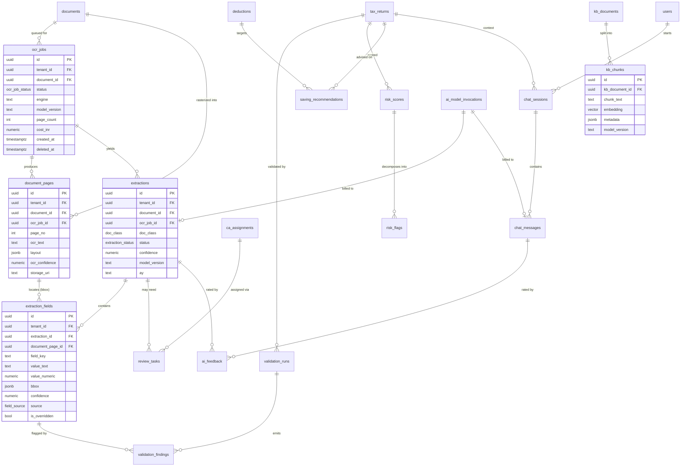
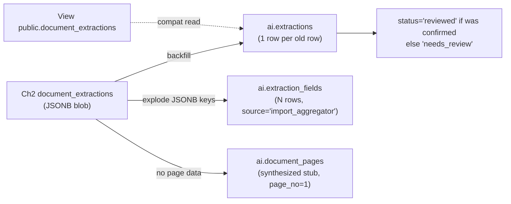

# Addendum 2A — AI/OCR & RAG Persistence Layer

> **Status:** Normative addendum to **Chapter 2 (Database Schema & ERD)**. It is the *single source of truth* for the persistence of every entity introduced in **Chapter 5 (AI, OCR & Document Processing)**.
> **Scope:** Chapter 2 owns *all* tables (one canonical schema, one migration history). Chapter 5 owns the *behaviour* (pipelines, prompts, models, thresholds) and **references these tables by name** rather than redefining them.

---

## 2A.1 Why this addendum exists

Chapter 2 shipped ~45 tables but represented the entire AI surface with a single `document_extractions` table and no vector storage. Chapter 5 specified 14+ logical entities (DocumentPages, Extractions, ExtractionFields, ReviewTasks, OcrJobs, ChatSessions, ChatMessages, KbDocuments, KbChunks, ValidationRuns, ValidationFindings, RiskFlags, RiskScores, SavingRecommendations) plus `pgvector`. The two never reconciled, so an entire chapter had no place to store its state.

This addendum reconciles them with three decisions:

1. **Canonical names & casing.** PascalCase for the logical entity in prose; `snake_case` plural for the physical table (per shared conventions). The table below is binding.
2. **Replace, don't duplicate.** Ch2's `document_extractions` is **superseded** by the `document_pages → extractions → extraction_fields` lineage. A backward-compatible migration (2A.9) preserves existing rows.
3. **Enable `pgvector`** and define the embedding column + index on `kb_chunks` (2A.6).

**Why one schema, not two:** a modular monolith (Ch1) deploys a single PostgreSQL instance with one migration history (EF Core / FluentMigrator). Splitting AI tables into a second logical "schema owned by Ch5" would fork migrations, break foreign keys to `documents`/`tax_returns`/`users`, and prevent transactional consistency between an extraction and the `tax_return` it feeds. We keep referential integrity and split later by `search_path` schema (`ai.*`) only when the AI service is physically extracted into its own microservice.

### Canonical naming map

| Ch5 logical entity (PascalCase) | Canonical table (`snake_case`) | PG schema | Replaces / relates to Ch2 |
|---|---|---|---|
| OcrJobs | `ocr_jobs` | `ai` | new — orchestration root |
| DocumentPages | `document_pages` | `ai` | new — child of `documents` (Ch2) |
| Extractions | `extractions` | `ai` | **supersedes** `document_extractions` |
| ExtractionFields | `extraction_fields` | `ai` | **supersedes** the JSONB blob in `document_extractions` |
| ReviewTasks | `review_tasks` | `ai` | new — links to `ca_assignments` (Ch2) |
| ValidationRuns | `validation_runs` | `ai` | new |
| ValidationFindings | `validation_findings` | `ai` | new |
| RiskScores | `risk_scores` | `ai` | new |
| RiskFlags | `risk_flags` | `ai` | new |
| SavingRecommendations | `saving_recommendations` | `ai` | new — relates to `deductions` (Ch2) |
| ChatSessions | `chat_sessions` | `ai` | new |
| ChatMessages | `chat_messages` | `ai` | new |
| KbDocuments | `kb_documents` | `ai` | new |
| KbChunks | `kb_chunks` | `ai` | new — **needs `pgvector`** |
| AiModelInvocations *(new, see 2A.8)* | `ai_model_invocations` | `ai` | new — cost/audit ledger |
| AiFeedback *(new, see 2A.8)* | `ai_feedback` | `ai` | new — RLHF/eval signal |

> **Why a dedicated `ai` PostgreSQL schema (namespace), still in the same database:** keeps the AI surface visually isolated, lets us grant a narrower DB role to the AI worker (`GRANT USAGE ON SCHEMA ai`), and makes the eventual physical carve-out a `pg_dump --schema=ai` rather than a table-by-table archaeology. Core tables from Ch2 stay in `public`. Cross-schema FKs are fully supported by PostgreSQL.

---

## 2A.2 Conventions inherited (and AI-specific additions)

All shared conventions from the project preamble apply verbatim: `uuid` PKs (`gen_random_uuid()` via `pgcrypto`), `tenant_id uuid NOT NULL` on every tenant-scoped row, `NUMERIC(14,2)` for money, `timestamptz` UTC for time, `deleted_at timestamptz NULL` soft-delete, PAN encrypted-at-rest + masked on display.

AI-specific additions used throughout:

- **`confidence`** — `NUMERIC(5,4)` in `[0,1]` (4 dp → 0.0001 granularity). **Why not `REAL`:** model confidences are compared against hard thresholds (e.g. auto-accept ≥ 0.95); `NUMERIC` avoids float drift in `WHERE confidence >= 0.9500`.
- **`bbox`** — `JSONB` `{x,y,w,h,page}` in normalized `[0,1]` page coordinates. **Why normalized:** survives re-rasterization at different DPI when we re-render a page for the reviewer UI.
- **Status enums** — native PostgreSQL `ENUM` types (e.g. `ocr_job_status`), not `text + CHECK`. **Why ENUM:** 4 bytes on disk, index-friendly, and the type is shared by the C# side via a generated enum; adding a value is `ALTER TYPE ... ADD VALUE` (non-locking in PG 12+).
- **`model_version`** — `TEXT` carrying provider+model+revision (e.g. `azure-docintel:prebuilt-tax.in.form16:2024-11-30`, `gpt-4o-2024-11-20`, `text-embedding-3-large:3072`). **Why store it on the row:** lineage + reproducibility; when we re-tune a prompt or swap models we must know which version produced a number that landed in someone's filed return.
- **`source` provenance enum** — `ocr | llm | rule | user | import_aggregator` on every value that can flow into a tax computation. **Why:** the ITD and a CA both need to know whether a figure came from OCR of a Form 16 or a human override.

---

## 2A.3 Sub-ERD: AI/OCR & RAG



> **Why `document_pages` hangs off both `documents` and `ocr_jobs`:** a document can be re-OCR'd (engine upgrade, user re-upload of a clearer scan). Pages are therefore versioned *per job*; the `documents` FK gives the stable parent, the `ocr_job_id` FK gives the version.

---

## 2A.4 Enumerated types (create first)

```sql
-- run inside the ai schema search_path
CREATE TYPE ai.ocr_job_status      AS ENUM ('queued','running','succeeded','partial','failed','cancelled');
CREATE TYPE ai.extraction_status   AS ENUM ('pending','auto_accepted','needs_review','reviewed','rejected','superseded');
CREATE TYPE ai.field_source        AS ENUM ('ocr','llm','rule','user','import_aggregator');
CREATE TYPE ai.doc_class           AS ENUM (
    'form16','form16a','form26as','ais','tis','salary_slip','bank_statement',
    'capital_gains_stmt','pnl_statement','balance_sheet','gst_return','rent_receipt',
    'home_loan_cert','80c_proof','80d_proof','interest_cert','unknown');
CREATE TYPE ai.review_status       AS ENUM ('open','in_progress','resolved','escalated','auto_closed');
CREATE TYPE ai.finding_severity    AS ENUM ('info','warning','error','blocker');
CREATE TYPE ai.risk_band           AS ENUM ('low','medium','high','critical');
CREATE TYPE ai.chat_role           AS ENUM ('system','user','assistant','tool');
CREATE TYPE ai.reco_status         AS ENUM ('suggested','accepted','dismissed','applied','expired');
```

> **Why a `doc_class` enum that includes Indian artefacts (`form16`, `ais`, `tis`, `form26as`):** the extraction pipeline (Ch5) branches on document class to pick the right prebuilt model and the right validation rule pack. Storing the class as a typed column (not free text) makes "show me all AIS docs whose interest income disagrees with 26AS" a clean indexed query. `superseded` in `extraction_status` is what a re-run flips the old row to, preserving history.

---

## 2A.5 Core extraction lineage (supersedes `document_extractions`)

### `ai.ocr_jobs`

```sql
CREATE TABLE ai.ocr_jobs (
    id              uuid PRIMARY KEY DEFAULT gen_random_uuid(),
    tenant_id       uuid NOT NULL REFERENCES public.tenants(id),
    document_id     uuid NOT NULL REFERENCES public.documents(id),
    status          ai.ocr_job_status NOT NULL DEFAULT 'queued',
    engine          text NOT NULL,                 -- 'azure-doc-intelligence' | 'aws-textract' | 'tesseract-fallback'
    model_version   text NOT NULL,
    page_count      int  NOT NULL DEFAULT 0,
    started_at      timestamptz,
    finished_at     timestamptz,
    duration_ms     int GENERATED ALWAYS AS (
                        CASE WHEN finished_at IS NOT NULL AND started_at IS NOT NULL
                             THEN (EXTRACT(EPOCH FROM (finished_at - started_at)) * 1000)::int END) STORED,
    cost_inr        numeric(14,2) NOT NULL DEFAULT 0,
    error_code      text,
    error_detail    jsonb,
    idempotency_key text NOT NULL,                  -- hash(document_id || file_sha256 || engine || model_version)
    created_at      timestamptz NOT NULL DEFAULT now(),
    updated_at      timestamptz NOT NULL DEFAULT now(),
    deleted_at      timestamptz,
    CONSTRAINT uq_ocr_idempotency UNIQUE (idempotency_key)
);
CREATE INDEX ix_ocr_jobs_tenant_status ON ai.ocr_jobs (tenant_id, status) WHERE deleted_at IS NULL;
CREATE INDEX ix_ocr_jobs_document      ON ai.ocr_jobs (document_id);
```

> **Why an `idempotency_key` (hash of file content + engine + model):** OCR is the single most expensive step (per-page billing on Azure Document Intelligence / Textract). If a worker crashes and the message is redelivered, we must not re-bill. The unique constraint makes the queue consumer naturally exactly-once.
> **Why `cost_inr` on the job:** Ch6/Ch7 need per-tenant COGS for unit-economics; OCR cost is metered per page and attributed here, then rolled up.

### `ai.document_pages`

```sql
CREATE TABLE ai.document_pages (
    id              uuid PRIMARY KEY DEFAULT gen_random_uuid(),
    tenant_id       uuid NOT NULL REFERENCES public.tenants(id),
    document_id     uuid NOT NULL REFERENCES public.documents(id),
    ocr_job_id      uuid NOT NULL REFERENCES ai.ocr_jobs(id),
    page_no         int  NOT NULL,                  -- 1-based
    ocr_text        text,                           -- full page text (also feeds RAG over user's own docs)
    layout          jsonb,                          -- words/lines/tables w/ bbox from the OCR engine
    ocr_confidence  numeric(5,4),
    storage_uri     text NOT NULL,                  -- s3/blob key of the rasterized page PNG (for reviewer UI)
    created_at      timestamptz NOT NULL DEFAULT now(),
    deleted_at      timestamptz,
    CONSTRAINT uq_page_per_job UNIQUE (ocr_job_id, page_no)
);
CREATE INDEX ix_pages_document ON ai.document_pages (document_id);
```

> **Why persist full `ocr_text` per page and not just extracted fields:** (1) the reviewer UI highlights the source span; (2) a user can ask the chatbot "what's my employer's TAN on page 2 of my Form 16?" — answered by RAG over the user's *own* `document_pages`, no re-OCR. **Data-residency note (DPDP, Ch6):** `ocr_text` of tax documents is personal+financial data; this table inherits the India-region storage and column-level handling defined in Ch6.

### `ai.extractions` (the new head of the lineage)

```sql
CREATE TABLE ai.extractions (
    id              uuid PRIMARY KEY DEFAULT gen_random_uuid(),
    tenant_id       uuid NOT NULL REFERENCES public.tenants(id),
    document_id     uuid NOT NULL REFERENCES public.documents(id),
    ocr_job_id      uuid REFERENCES ai.ocr_jobs(id),
    tax_return_id   uuid REFERENCES public.tax_returns(id),  -- nullable: doc may be uploaded pre-return
    doc_class       ai.doc_class NOT NULL DEFAULT 'unknown',
    ay              text NOT NULL,                  -- 'AY 2025-26'
    status          ai.extraction_status NOT NULL DEFAULT 'pending',
    confidence      numeric(5,4),                   -- aggregate document-level confidence
    model_version   text NOT NULL,                  -- the LLM/structurer that produced fields
    raw_response    jsonb,                          -- full structured model output (audit)
    supersedes_id   uuid REFERENCES ai.extractions(id),  -- re-run chain
    created_at      timestamptz NOT NULL DEFAULT now(),
    updated_at      timestamptz NOT NULL DEFAULT now(),
    deleted_at      timestamptz
);
CREATE INDEX ix_extractions_return   ON ai.extractions (tax_return_id) WHERE deleted_at IS NULL;
CREATE INDEX ix_extractions_doc      ON ai.extractions (document_id);
CREATE INDEX ix_extractions_class_ay ON ai.extractions (tenant_id, doc_class, ay);
```

### `ai.extraction_fields` (replaces the JSONB blob)

```sql
CREATE TABLE ai.extraction_fields (
    id               uuid PRIMARY KEY DEFAULT gen_random_uuid(),
    tenant_id        uuid NOT NULL REFERENCES public.tenants(id),
    extraction_id    uuid NOT NULL REFERENCES ai.extractions(id) ON DELETE CASCADE,
    document_page_id uuid REFERENCES ai.document_pages(id),
    field_key        text NOT NULL,                 -- canonical key, see 2A.5.1
    value_text       text,
    value_numeric    numeric(14,2),                 -- money/quantity when applicable
    value_date       date,
    unit             text,                          -- 'INR','%','count'
    bbox             jsonb,                          -- {x,y,w,h,page} normalized
    confidence       numeric(5,4),
    source           ai.field_source NOT NULL DEFAULT 'ocr',
    is_overridden    boolean NOT NULL DEFAULT false,
    overridden_by    uuid REFERENCES public.users(id),
    overridden_at    timestamptz,
    prev_value_text  text,                          -- value before human override (audit)
    created_at       timestamptz NOT NULL DEFAULT now(),
    deleted_at       timestamptz,
    CONSTRAINT uq_field_per_extraction UNIQUE (extraction_id, field_key)
);
CREATE INDEX ix_fields_extraction ON ai.extraction_fields (extraction_id);
CREATE INDEX ix_fields_key        ON ai.extraction_fields (tenant_id, field_key);
```

> **Why split fields into rows instead of one JSONB document (the Ch2 approach):** (1) **per-field confidence + bbox** — the reviewer UI must show *which* number is shaky and where it sits on the page; a blob can't be indexed or partially overridden. (2) **per-field provenance & override audit** — DPDP/ITD require we prove who changed a filed figure; `is_overridden/overridden_by/prev_value_text` give a column-level trail. (3) **validation joins** — `validation_findings` FK directly to a field. We still keep `extractions.raw_response` as the immutable blob for full audit, so nothing is lost.

#### 2A.5.1 Canonical `field_key` registry (excerpt — Indian tax)

`field_key` is a controlled vocabulary so downstream computation (Ch3) maps deterministically. Examples:

| `field_key` | Source doc | Maps to (Ch3) |
|---|---|---|
| `form16.part_b.gross_salary_17_1` | Form 16 | Salary income head |
| `form16.part_b.std_deduction_16ia` | Form 16 | Standard deduction (₹50,000 / ₹75,000 new regime) |
| `form16.part_b.tds_total` | Form 16 | TDS credit |
| `form26as.tds_salary` | 26AS | TDS reconciliation |
| `ais.interest_savings_bank` | AIS | 80TTA/80TTB |
| `ais.dividend_income` | AIS | Income from other sources |
| `ais.sft_mutual_fund_redemption` | AIS | Capital gains trigger |
| `capgain.equity_stcg_111a` | Broker P&L | STCG @ 15% (20% post-Jul'24 if applicable per AY) |
| `capgain.equity_ltcg_112a` | Broker P&L | LTCG @ 10%/12.5% over ₹1L/₹1.25L exemption |
| `80c.lic_premium` | 80C proof | Chapter VI-A 80C (cap ₹1.5L) |
| `80d.health_premium_self` | 80D proof | 80D |

> **Why a registry, not free-form keys:** the AI can hallucinate a label ("Total Salary" vs "Gross Salary"); pinning to a controlled key set is what makes auto-population into the ITR deterministic and lets Ch3's engine consume fields without string-guessing. Unknown extractions land under `unknown.*` and route to review.

---

## 2A.6 RAG / knowledge base with `pgvector`

### Enable the extension

```sql
CREATE EXTENSION IF NOT EXISTS vector;     -- pgvector >= 0.7 (HNSW + halfvec)
```

> **Why `pgvector` and not a separate vector DB (Pinecone/Weaviate/Qdrant):** our corpus is small and slow-moving — Income Tax Act sections, CBDT circulars, ITR instruction PDFs, our own help-centre + the user's own parsed documents — order 10⁴–10⁵ chunks per tenant-shared KB, not 10⁹. `pgvector` keeps embeddings *transactionally consistent* with `kb_documents`, removes a network hop and a second data-residency surface to audit under DPDP (Ch6), and lets us `JOIN` chunks to tenant/ACL rows in one query. We revisit a dedicated store only past ~5M vectors or sub-10ms p99 requirements.

### `ai.kb_documents` and `ai.kb_chunks`

```sql
CREATE TABLE ai.kb_documents (
    id            uuid PRIMARY KEY DEFAULT gen_random_uuid(),
    tenant_id     uuid REFERENCES public.tenants(id),  -- NULL = global/shared KB (tax law)
    scope         text NOT NULL DEFAULT 'global',      -- 'global' | 'tenant' | 'user_docs'
    source_type   text NOT NULL,                       -- 'income_tax_act','cbdt_circular','itr_instructions','help_center','user_document'
    title         text NOT NULL,
    citation      text,                                -- e.g. 'Sec 80C, Income-tax Act 1961' / 'CBDT Circular 04/2025'
    ay            text,                                -- law is AY-versioned; NULL if evergreen
    uri           text,
    content_hash  text NOT NULL,
    effective_from date,
    effective_to   date,                               -- law supersession window
    created_at    timestamptz NOT NULL DEFAULT now(),
    deleted_at    timestamptz,
    CONSTRAINT uq_kbdoc_hash UNIQUE (content_hash)
);

CREATE TABLE ai.kb_chunks (
    id             uuid PRIMARY KEY DEFAULT gen_random_uuid(),
    kb_document_id uuid NOT NULL REFERENCES ai.kb_documents(id) ON DELETE CASCADE,
    tenant_id      uuid,                               -- denormalized from parent for ACL filtering
    scope          text NOT NULL,                      -- denormalized for the index predicate
    chunk_index    int  NOT NULL,
    chunk_text     text NOT NULL,
    token_count    int,
    embedding      vector(3072),                       -- text-embedding-3-large
    model_version  text NOT NULL,                      -- 'text-embedding-3-large:3072'
    metadata       jsonb,                              -- {section, ay, heading_path}
    created_at     timestamptz NOT NULL DEFAULT now(),
    deleted_at     timestamptz,
    CONSTRAINT uq_chunk UNIQUE (kb_document_id, chunk_index)
);
```

### Vector index

```sql
-- HNSW (graph) index — best recall/latency for our read-heavy, rarely-rebuilt corpus.
CREATE INDEX ix_kb_chunks_embedding_hnsw
    ON ai.kb_chunks
    USING hnsw (embedding vector_cosine_ops)
    WITH (m = 16, ef_construction = 64);

-- Partial b-tree to make the ACL/scope filter cheap before the vector scan:
CREATE INDEX ix_kb_chunks_scope ON ai.kb_chunks (scope, tenant_id) WHERE deleted_at IS NULL;
```

> **Why HNSW over IVFFlat:** IVFFlat needs a representative training set and re-clustering as data grows; our KB is appended in bursts (new circular, new AY) and queried constantly, so HNSW's build-once/high-recall profile fits. `m=16, ef_construction=64` are the pgvector-recommended starting values for corpora this size; query-time recall is tuned with `SET hnsw.ef_search`.
> **Why `vector(3072)` (text-embedding-3-large):** tax law hinges on fine distinctions (e.g. 80C vs 80CCC vs 80CCD(1B)); the larger model measurably improves retrieval of the *correct* section. If storage/latency bites, pgvector `halfvec(3072)` halves index size with negligible recall loss — a 2-line migration, no schema redesign.
> **Why denormalize `tenant_id`/`scope` onto chunks:** retrieval must filter ACL *before* the ANN search (a user's own-document chunks must never leak across tenants). Keeping the predicate columns on the indexed table avoids a join inside the hot path.

### Retrieval query shape (used by Ch5's chatbot)

```sql
-- $1 = query embedding, $2 = tenant_id, $3 = AY
SET LOCAL hnsw.ef_search = 100;
SELECT c.id, c.chunk_text, d.citation, d.title,
       1 - (c.embedding <=> $1) AS cosine_similarity
FROM ai.kb_chunks c
JOIN ai.kb_documents d ON d.id = c.kb_document_id
WHERE c.deleted_at IS NULL
  AND (c.scope = 'global'
       OR (c.scope IN ('tenant','user_docs') AND c.tenant_id = $2))
  AND (d.ay IS NULL OR d.ay = $3)               -- AY-correct law only
ORDER BY c.embedding <=> $1                      -- cosine distance
LIMIT 8;
```

> **Why the `d.ay` filter is non-negotiable:** answering an AY 2025-26 query with a superseded AY 2023-24 slab is a *compliance* error, not just a wrong answer. AY-versioning the KB and filtering at retrieval is how we keep the bot legally current.

---

## 2A.7 Validation, risk, recommendations, chat

### Review & validation

```sql
CREATE TABLE ai.review_tasks (
    id              uuid PRIMARY KEY DEFAULT gen_random_uuid(),
    tenant_id       uuid NOT NULL REFERENCES public.tenants(id),
    extraction_id   uuid NOT NULL REFERENCES ai.extractions(id),
    ca_assignment_id uuid REFERENCES public.ca_assignments(id),   -- link to Ch2 CA routing
    assigned_to     uuid REFERENCES public.users(id),
    status          ai.review_status NOT NULL DEFAULT 'open',
    reason          text NOT NULL,             -- 'low_confidence' | 'cross_doc_mismatch' | 'high_value'
    sla_due_at      timestamptz,
    resolved_at     timestamptz,
    created_at      timestamptz NOT NULL DEFAULT now(),
    deleted_at      timestamptz
);
CREATE INDEX ix_review_open ON ai.review_tasks (tenant_id, status) WHERE status IN ('open','in_progress');

CREATE TABLE ai.validation_runs (
    id            uuid PRIMARY KEY DEFAULT gen_random_uuid(),
    tenant_id     uuid NOT NULL REFERENCES public.tenants(id),
    tax_return_id uuid NOT NULL REFERENCES public.tax_returns(id),
    rule_pack     text NOT NULL,               -- 'itr1.ay2025-26.v3'
    passed        boolean,
    finding_count int NOT NULL DEFAULT 0,
    created_at    timestamptz NOT NULL DEFAULT now(),
    deleted_at    timestamptz
);

CREATE TABLE ai.validation_findings (
    id                 uuid PRIMARY KEY DEFAULT gen_random_uuid(),
    tenant_id          uuid NOT NULL REFERENCES public.tenants(id),
    validation_run_id  uuid NOT NULL REFERENCES ai.validation_runs(id) ON DELETE CASCADE,
    extraction_field_id uuid REFERENCES ai.extraction_fields(id),   -- field-level pinpoint
    rule_code          text NOT NULL,          -- '26AS_TDS_MISMATCH','80C_OVER_LIMIT','GROSS_SALARY_VS_AIS'
    severity           ai.finding_severity NOT NULL,
    message            text NOT NULL,
    expected_value     text,
    actual_value       text,
    created_at         timestamptz NOT NULL DEFAULT now(),
    deleted_at         timestamptz
);
CREATE INDEX ix_findings_run ON ai.validation_findings (validation_run_id);
```

> **Why `validation_runs` is versioned by `rule_pack` and separate from the engine (Ch3):** the *rules* (e.g. "Form 16 TDS must reconcile with 26AS within ₹1") are AY- and ITR-specific and change yearly; storing the run + pack version lets us re-validate a return after a rule update and prove which rule version cleared a filing. `validation_findings.extraction_field_id` is what powers "fix this number" deep-links in the UI.

### Risk scoring

```sql
CREATE TABLE ai.risk_scores (
    id            uuid PRIMARY KEY DEFAULT gen_random_uuid(),
    tenant_id     uuid NOT NULL REFERENCES public.tenants(id),
    tax_return_id uuid NOT NULL REFERENCES public.tax_returns(id),
    score         numeric(5,2) NOT NULL,       -- 0.00–100.00
    band          ai.risk_band NOT NULL,
    model_version text NOT NULL,
    computed_at   timestamptz NOT NULL DEFAULT now(),
    deleted_at    timestamptz
);
CREATE INDEX ix_risk_return ON ai.risk_scores (tax_return_id, computed_at DESC);

CREATE TABLE ai.risk_flags (
    id            uuid PRIMARY KEY DEFAULT gen_random_uuid(),
    tenant_id     uuid NOT NULL REFERENCES public.tenants(id),
    risk_score_id uuid NOT NULL REFERENCES ai.risk_scores(id) ON DELETE CASCADE,
    flag_code     text NOT NULL,   -- 'HIGH_REFUND_RATIO','CASH_DEPOSIT_SPIKE','MISMATCH_26AS','BOGUS_DEDUCTION_PATTERN'
    weight        numeric(5,2) NOT NULL,
    detail        jsonb,
    created_at    timestamptz NOT NULL DEFAULT now()
);
```

> **Why separate `risk_scores` (the number) from `risk_flags` (the reasons):** the score is what we display and gate CA-review routing on; the flags are the *explanation* (scrutiny-likelihood drivers: abnormal refund ratio, 26AS mismatch, deduction patterns ITD is known to scrutinize). Keeping them split lets us re-weight the model (`model_version`) and recompute scores without losing the historical flag breakdown — important when a return is later picked for scrutiny and we must reconstruct what we knew at filing time.

### Saving recommendations

```sql
CREATE TABLE ai.saving_recommendations (
    id              uuid PRIMARY KEY DEFAULT gen_random_uuid(),
    tenant_id       uuid NOT NULL REFERENCES public.tenants(id),
    tax_return_id   uuid NOT NULL REFERENCES public.tax_returns(id),
    deduction_id    uuid REFERENCES public.deductions(id),   -- link to Ch2 deductions
    reco_code       text NOT NULL,           -- 'MAXOUT_80C','OPT_80CCD1B','SWITCH_TO_NEW_REGIME','CLAIM_80D_PARENTS'
    headline        text NOT NULL,
    rationale       text NOT NULL,
    est_tax_saving_inr numeric(14,2) NOT NULL,
    regime          text,                    -- 'old' | 'new' | 'either'
    status          ai.reco_status NOT NULL DEFAULT 'suggested',
    model_version   text NOT NULL,
    created_at      timestamptz NOT NULL DEFAULT now(),
    deleted_at      timestamptz
);
CREATE INDEX ix_reco_return ON ai.saving_recommendations (tax_return_id, status);
```

> **Why `est_tax_saving_inr` is materialized and `deduction_id` links back to Ch2:** the recommendation card ("Invest ₹50,000 more in 80C to save ₹15,600") must show a concrete rupee figure computed by Ch3's engine and, on "apply", write straight into the `deductions` row it targets. `regime` is stored because a suggestion's validity flips between old/new regime.

### Chat (chatbot + CA copilot)

```sql
CREATE TABLE ai.chat_sessions (
    id            uuid PRIMARY KEY DEFAULT gen_random_uuid(),
    tenant_id     uuid NOT NULL REFERENCES public.tenants(id),
    user_id       uuid NOT NULL REFERENCES public.users(id),
    tax_return_id uuid REFERENCES public.tax_returns(id),   -- grounding context
    channel       text NOT NULL DEFAULT 'web',              -- 'web'|'whatsapp'|'ca_console'
    title         text,
    created_at    timestamptz NOT NULL DEFAULT now(),
    last_msg_at   timestamptz,
    deleted_at    timestamptz
);

CREATE TABLE ai.chat_messages (
    id             uuid PRIMARY KEY DEFAULT gen_random_uuid(),
    tenant_id      uuid NOT NULL REFERENCES public.tenants(id),
    chat_session_id uuid NOT NULL REFERENCES ai.chat_sessions(id) ON DELETE CASCADE,
    role           ai.chat_role NOT NULL,
    content        text NOT NULL,
    retrieved_chunk_ids uuid[],          -- kb_chunks cited (RAG provenance)
    tool_name      text,                 -- when role='tool'
    tool_payload   jsonb,
    prompt_tokens  int,
    completion_tokens int,
    model_version  text,
    created_at     timestamptz NOT NULL DEFAULT now(),
    deleted_at     timestamptz
);
CREATE INDEX ix_chat_msgs_session ON ai.chat_messages (chat_session_id, created_at);
```

> **Why store `retrieved_chunk_ids` on each assistant message:** auditable, citable answers. When the bot says "you can claim 80D up to ₹25,000", we can show the exact KB chunk + `citation` it grounded on, and during eval we can detect retrieval drift. **Why token counts here:** these roll up into `ai_model_invocations` for cost.

---

## 2A.8 Two tables Ch5 implied but never named (added here)

### `ai.ai_model_invocations` — cost & audit ledger

```sql
CREATE TABLE ai.ai_model_invocations (
    id             uuid PRIMARY KEY DEFAULT gen_random_uuid(),
    tenant_id      uuid NOT NULL REFERENCES public.tenants(id),
    feature        text NOT NULL,        -- 'extraction'|'chat'|'risk'|'recommendation'|'embedding'
    provider       text NOT NULL,        -- 'azure-openai'|'openai'|'aws-textract'|'azure-doc-intel'
    model_version  text NOT NULL,
    extraction_id  uuid REFERENCES ai.extractions(id),
    chat_message_id uuid REFERENCES ai.chat_messages(id),
    prompt_tokens  int,
    completion_tokens int,
    pages          int,
    cost_inr       numeric(14,2) NOT NULL DEFAULT 0,
    latency_ms     int,
    created_at     timestamptz NOT NULL DEFAULT now()
);
CREATE INDEX ix_invocations_tenant_day ON ai.ai_model_invocations (tenant_id, created_at);
```

> **Why a dedicated ledger:** AI is variable COGS. Ch7's unit economics and Ch6's per-tenant rate-limiting/abuse controls both need "₹ of model spend per tenant per day". Scattering this across each feature table would make the rollup a 6-way UNION. One append-only ledger, indexed by `(tenant_id, created_at)`, answers it directly and feeds a daily materialized view.

### `ai.ai_feedback` — quality signal

```sql
CREATE TABLE ai.ai_feedback (
    id              uuid PRIMARY KEY DEFAULT gen_random_uuid(),
    tenant_id       uuid NOT NULL REFERENCES public.tenants(id),
    user_id         uuid REFERENCES public.users(id),
    chat_message_id uuid REFERENCES ai.chat_messages(id),
    extraction_id   uuid REFERENCES ai.extractions(id),
    rating          smallint,            -- -1 / +1, or 1..5
    label           text,                -- 'wrong_number','hallucinated_law','great'
    comment         text,
    created_at      timestamptz NOT NULL DEFAULT now()
);
```

> **Why capture feedback in the schema, not just analytics:** thumbs-down on a chat answer or a corrected extraction field is the training/eval signal for Ch5's model iteration and the trigger for prompt-regression tests. Storing it relationally (FK to the exact message/extraction) makes "show all hallucinated-law complaints for the AY2025-26 prompt" a query, not a log-scrape.

---

## 2A.9 Migration plan from Ch2's `document_extractions`

Ch2's original `document_extractions` (single table, JSONB payload) is **deprecated**, not dropped on day one.



Steps (idempotent, run as one EF Core / FluentMigrator migration `M2A_Ai_Schema`):

1. `CREATE SCHEMA ai;` + `CREATE EXTENSION vector;` + create all enums (2A.4) and tables (2A.5–2A.8).
2. **Backfill:** for each `document_extractions` row → insert one `ai.extractions` (carry `document_id`, `tax_return_id`, set `model_version='legacy:import'`, `status` mapped from the old confirmed flag).
3. **Explode JSONB:** each top-level key in the old payload → one `ai.extraction_fields` row, `source='import_aggregator'`, `confidence=NULL`, `field_key` mapped through the 2A.5.1 registry (unmapped → `unknown.<key>`).
4. **Compatibility view** so any not-yet-migrated Ch4 endpoint keeps reading:
   ```sql
   CREATE VIEW public.document_extractions AS
   SELECT e.id, e.document_id, e.tax_return_id, e.status::text AS status,
          jsonb_object_agg(f.field_key, COALESCE(f.value_text, f.value_numeric::text)) AS payload,
          e.created_at
   FROM ai.extractions e
   LEFT JOIN ai.extraction_fields f ON f.extraction_id = e.id
   WHERE e.deleted_at IS NULL
   GROUP BY e.id;
   ```
5. After all callers migrate (tracked in Ch4), `DROP VIEW` and `DROP TABLE public.document_extractions` in a later release.

> **Why a view bridge instead of a hard cutover:** keeps Ch4's API contract alive during the transition and lets us deploy the schema change ahead of the application change — zero-downtime, reversible.

---

## 2A.10 Cross-chapter contract (so other chapters stay consistent)

- **Ch2:** absorb 2A.4–2A.8 into the canonical migration set; the ERD master diagram should reference this sub-ERD. `document_extractions` is marked deprecated.
- **Ch3 (computation):** consumes `ai.extraction_fields` keyed by the 2A.5.1 registry; writes `ai.validation_findings`, `ai.risk_scores`, and the rupee figure on `ai.saving_recommendations`.
- **Ch4 (API/RBAC):** exposes `/api/v1/documents/{id}/extractions`, `/extractions/{id}/fields/{fieldId}` (PATCH = override → sets `is_overridden`), `/tax-returns/{id}/validations`, `/risk`, `/recommendations`, `/chat/sessions|messages`. RBAC: a CA role reads `review_tasks` scoped to its `ca_assignments`; vector/KB-admin is staff-only.
- **Ch5:** owns engines, prompts, thresholds (auto-accept ≥ 0.95, review 0.70–0.95, reject < 0.70), rule packs, embedding model choice — and **stores all state in these tables**.
- **Ch6 (security/DevOps):** `ai_model_invocations` feeds rate-limits & cost alerts; `ocr_text`/`chat_messages`/`extraction_fields` are India-resident financial PII; the AI worker gets a DB role limited to `GRANT ON SCHEMA ai`.
- **Ch7:** AI COGS rollup from `ai_model_invocations`.
- **Ch8:** reviewer UI renders `document_pages.storage_uri` + `extraction_fields.bbox` overlays; recommendation/risk cards bind to 2A.7 tables.

---

## 2A.11 Summary of decisions

| Decision | Choice | Why (1-line) |
|---|---|---|
| Ownership | Ch2 owns tables, Ch5 owns behaviour | one migration history, intact FKs |
| Namespace | `ai.*` schema, same DB | isolation now, clean carve-out later |
| `document_extractions` | replaced by pages→extractions→fields, view bridge | per-field confidence/bbox/override + audit |
| Vector store | `pgvector` HNSW, `vector(3072)` | small AY-versioned corpus, transactional, India-resident |
| Confidence type | `NUMERIC(5,4)` | exact threshold comparisons |
| Field keys | controlled registry (2A.5.1) | deterministic auto-fill into ITR |
| Cost/quality | new `ai_model_invocations` + `ai_feedback` | COGS, rate-limit, eval signal |